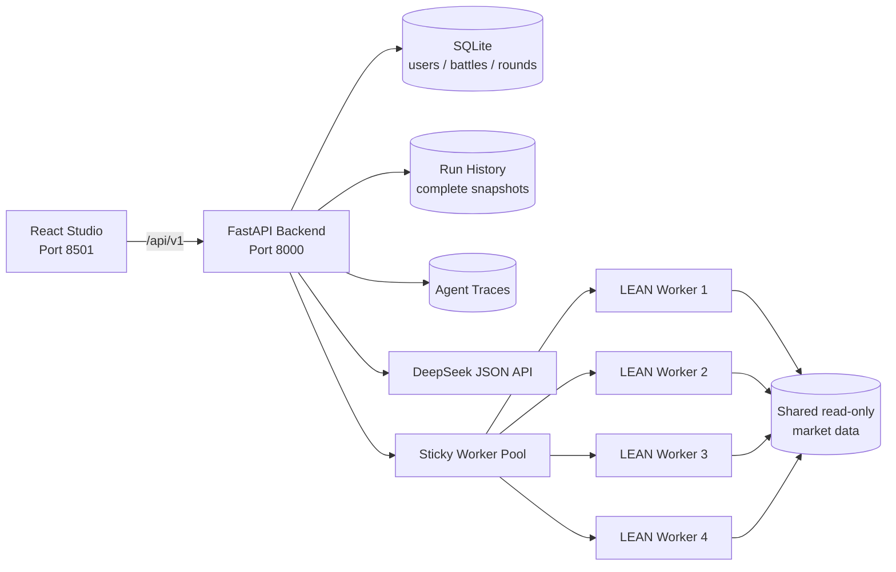

# AlphaForge

> An education-first, risk-aware Human vs AI quantitative strategy arena.

| 项目属性 | 说明 |
|---|---|
| 课程 | SWS3022 — AI/ML in Financial Services |
| 项目类型 | AI Financial Innovation Project / Financial Education Serious Game |
| 当前阶段 | 可本地部署的课程 MVP |
| 默认分支 | `main` |
| 主要界面 | React Strategy Studio |
| 核心服务 | FastAPI、Multi-Agent LLM、QuantConnect LEAN、SQLite |
| 部署方式 | Docker Compose，四个隔离 LEAN Worker |

## Team Contributions and Accountability

| 团队成员 | 主要职责 | 已完成工作 |
|---|---|---|
| **成员 A — `Zihan Zhou`** | 传统基线、基线教学与项目进度协调，PPT制作 | 传统策略比较框架、基线教学边界和风险评价；PPT制作 |
| **成员 B — `Zhanlin Chen`** | 数据、ML/Hybrid 基线与策略研究 | 提交 AlphaForge v1.0 数据目录；优化 ML 与 Hybrid 策略的推理稳定性、摩擦控制和组合执行。 |
| **成员 C — `Zetong Li`** | Backend、LEAN、Docker、系统集成与主要产品流程 | 集成本地 LEAN Runtime；实现 Guided/Custom Human Strategy；加固 Agent 与确定性验收；加入鲁棒性实验；将 AI Forge 重构为参数模板；实现四 Worker 并行、五局三胜 SQLite 对战、Run 恢复、结果 UX 与架构文档 |
| **成员 D — `Jingze Liu`** | Agent 主链、前端架构、运行证据与分支集成 | 构建 Agent 回测循环；将 Streamlit 原型替换为 React Strategy Studio；实现可重放 Agent traces；改进自主策略执行循环和 gap-safe 调仓；完成 ai-forge-v2 分支合并 |

## Executive Summary

AlphaForge 是面向金融学习者的本地量化策略竞技平台。用户独立设计自己的策略，AI 在看不到用户代码、参数和结果的前提下，分别沿 Traditional、Machine Learning和 Hybrid 三条路线生成参数化候选。所有策略使用同一实验合同，在QuantConnect LEAN 中回测，再由确定性评分器裁决，并把结果转化为可解释的教学反馈。

项目对应课程对金融领域知识、AI/ML、软件工程、研究创新、用户体验和实验评价的综合要求，具体覆盖：

- 金融教育平台与 Serious Game；
- Multi-Agent LLM + Machine Learning；
- 可复现的真实 LEAN 实验；
- 风险、成本和过拟合意识；
- React、FastAPI、SQLite 与 Docker Compose 的完整软件工程实现。

> **Risk Disclaimer:** 本项目仅用于课程、研究和教育演示，不构成投资建议。
> 历史回测、评分和鲁棒性实验均不代表未来收益。

## Documentation Map

- [Problem Statement and Innovation](#1-problem-statement-and-innovation)
- [Implemented Scope](#2-implemented-scope)
- [System Architecture](#3-system-architecture)
- [AI Information Boundary](#4-ai-information-boundary)
- [Evaluation Protocol](#5-evaluation-protocol)
- [Technology Stack](#6-technology-stack)
- [Repository Structure](#7-repository-structure)
- [Deployment](#8-deployment)
- [Demonstration Workflow](#9-demonstration-workflow)
- [API Overview](#10-api-overview)
- [Testing](#11-testing)
- [Research Alignment](#12-research-alignment)
- [Git-based Project Evolution](#13-git-based-project-evolution)
- [Limitations and Roadmap](#14-limitations-and-roadmap)
- [Development Governance](#15-development-governance)
- [Further Documentation](#16-further-documentation)
- [Academic Integrity](#17-academic-integrity)

---

## 1. Problem Statement and Innovation

传统量化教学通常存在三个问题：

1. **只看收益，不理解风险。** 初学者容易只追逐 CAGR，忽视 Sharpe、回撤、换手和费用。
2. **AI 优化过程不可见。** 生成式模型给出一段策略代码，却没有可靠的执行边界、实验谱系和失败证据。
3. **人机比较不公平。** 如果 AI 先读取用户策略和结果再针对性优化，“AI 获胜”没有研究意义。

AlphaForge 的核心创新是把策略学习设计成一场有信息边界的比赛：

```text
Human 独立设计 ───────────────┐
                              ├─ 同一 Experiment Contract ─ LEAN ─ Judge ─ Learning Review
Public Baselines ─ AI 独立进化 ┘
```

AI Designer、Critic 和跨轮 Coach 不读取 Human 代码、参数、指标、订单或个性化建议。
双方策略完成并冻结后，结果才进入确定性比较和用户侧教学。

---

## 2. Implemented Scope

### 2.1 用户与比赛

- SQLite 用户注册、登录和会话管理；
- 历史 Battle 查看、继续和整场删除；
- 每场最多五轮，任一方先取得三胜即结束；
- R1–R5 独立切换，显示每轮比分、指标、AI 冠军和教学记录；
- 第一轮冻结股票池、日期、资金、Benchmark、费用和滑点；
- 同一场 Battle 的后续轮次复用第一轮四基线结果，不重复消耗 Worker。

### 2.2 Human Strategy

- **Basic Guided Template**：适合初次体验；
- **Advanced Multi-factor Template**：可调整信号、窗口、权重、Top-K、组合配置和风险控制；
- **Complete Python Code**：允许提交完整 QuantConnect/LEAN Python；
- 下一轮自动带入上一轮策略，并展示“当前值 → 推荐值”、目标指标和调整原因；
- 策略源码带语法高亮，并支持一键复制。

### 2.3 四个公共基线

1. Momentum Rank；
2. Mean Reversion；
3. Gradient Boosting；
4. Hybrid ML + Minimum Variance。

基线与 Human/AI 使用相同的股票池、时间窗口、资金、Benchmark、费用和滑点。
Baseline Classroom 解释各策略的原理、优点、局限及风险收益权衡。

### 2.4 参数型 Multi-Agent AI Forge

AI 不再自由生成或修复大段 Python，而只返回受约束的 `StrategyTemplateSpec` JSON。
后端将合法参数注入固定、版本化的 `template-v1`，确定性生成 LEAN Python。

每条 AI 赛道最多进行三次真实回测：

```text
Designer parameters
        ↓
Pydantic schema validation
        ↓
Fixed template compilation + SHA-256
        ↓
LEAN backtest
        ↓
Performance Critic
        ↓
Designer rewrites the complete parameter set
```

Traditional、ML、Hybrid 三条赛道并行；单条赛道内部保持
LEAN → Critic → Designer 的因果顺序。三次试验结束后，后端依次按更高 Sharpe、
更高 CAGR、较低 Maximum Drawdown 保留该赛道的本轮最佳结果。

同一场 Battle 中，每条 AI 赛道还拥有跨轮冠军。新一轮的最佳挑战者如果没有超过
历史冠军，系统继续保留旧冠军的参数、代码、指标和真实迭代谱系。

### 2.5 Judge、教学和鲁棒性

- 确定性评分卡，不由 LLM 主观决定胜负；
- Results 展示实际股票池、日期、资金、Benchmark、费用和滑点；
- Strategy Comparison、权益曲线、回撤曲线、风险收益图和成本表；
- Learning Review 展示 Strategy DNA、三次试验演化、最优策略解释和 Quant Concept；
- Teaching Explainer 异步生成教学内容，失败时使用确定性 fallback，不影响胜负；
- AI Coach 在每轮结束后只复盘 AI 自身，选择：
  - `refine_parameters`
  - `rotate_mechanism`
  - `rebuild_track`
- 鲁棒性页面对时间切片、起始日期、双倍摩擦和股票池扰动进行敏感性测试。

---

## 3. System Architecture



### 并发模型

- FastAPI 进程按顺序编排顶层 Forge Run，避免共享状态乱序；
- 单个 Run 内，四个公共基线可并行；
- 三个 Designer 请求可并行，同时独立执行 Human 回测；
- Traditional、ML、Hybrid 三条候选流水线可并行；
- 每个 LEAN Worker 容器内部只运行一个任务，隔离 Launcher 配置、锁、模型和结果目录；
- Worker Pool 使用 least-active + round-robin tie-break，并通过虚拟 Run ID 保持后续轮询粘性。

### 持久化模型

- SQLite：用户、会话、Battle、Round、比分、教学摘要和 Coach 记忆；
- `backend/workspace/run_history/`：曲线、源码、候选试验、评分和冠军谱系；
- `backend/workspace/forge_traces/`：可重放的 Agent 输入清单、输出和错误；
- `lean_worker/workspace/`：本地行情、任务、日志、模型和 LEAN 结果。

Run 快照使用锁和临时文件替换写入。后端重启后，完整 JSON 快照提供曲线、代码和
候选证据；SQLite 中较新的终态教学和轮次信息会覆盖旧的异步状态。

---

## 4. AI Information Boundary

| 上下文 | 可以读取 | 明确禁止 |
|---|---|---|
| Designer | Experiment Contract、公共基线、模板 DSL、当前 AI 赛道历史、AI Coach 指令 | Human 代码、参数、指标、订单、教学建议 |
| Critic | 当前 AI 参数、LEAN 指标、执行证据、公共基线、该赛道先前试验 | Human 信息、替代参数、Python 代码 |
| AI Coach | 四基线、三条 AI 赛道的跨轮证据、Critic 诊断 | Human 结果、PK 胜负推断、Education 输出 |
| Deterministic Judge | 已冻结且标准化的 Human/AI/基线结果 | LLM 主观判断 |
| Teaching Explainer | 赛后冻结证据、评分、参数和鲁棒性结果 | 修改冠军、分数或下一轮 AI 上下文 |

隔离依赖后端显式构建的 DTO/allowlist，而不是只在 Prompt 中要求模型“忽略”用户信息。

---

## 5. Evaluation Protocol

只有状态和核心指标完整、执行敞口符合要求的策略才进入可比集合。当前确定性评分 v2：

| 评分项 | 权重 |
|---|---:|
| Sharpe Ratio | 35% |
| CAGR | 30% |
| 最大回撤控制 | 15% |
| 波动率控制 | 5% |
| 成本效率 | 5% |
| 执行证据 | 5% |
| 可解释性 | 5% |

各项先在同一场实验的合格策略中归一化，再形成 0–100 分评分卡。AI 阵营先选出
得分最高的冠军，再与 Human 比较。结果页可使用两分 Draw band 表达“没有明显优势”；
五局三胜的回合记录仍需要一个确定胜方，分数相同时使用 Sharpe 作为决胜依据。

这套权重是课程演示中的透明评价协议，不是行业统一标准，也不证明样本外有效性。

---

## 6. Technology Stack

| 层 | 技术 |
|---|---|
| Frontend | React 18、Vite 6、Recharts、Lucide React |
| Backend | FastAPI、Pydantic v2、Uvicorn、Requests |
| Agent | DeepSeek/OpenAI-compatible JSON API、Designer、Critic、Coach、Teaching Explainer |
| ML | scikit-learn、pandas、NumPy（固定策略模板与基线） |
| Backtest | QuantConnect LEAN、Python 3.11、.NET Runtime |
| Persistence | SQLite WAL、JSON Run Snapshots、Agent Trace Files |
| Infrastructure | Docker Compose、4 isolated linux/amd64 LEAN Workers |
| Testing | pytest、Vitest、Testing Library |
| Data | Tiingo EOD OHLCV，30 只冻结美股 + SPY/QQQ 依赖 |

---

## 7. Repository Structure

```text
.
├─ agent/                 # Parameter Designer、Critic、Coach、Educator
├─ backend/
│  ├─ app/
│  │  ├─ repositories/    # SQLite 持久化
│  │  ├─ schemas/         # Experiment、Battle、Agent、Template 合同
│  │  ├─ services/        # Forge 编排、Worker Pool、模板编译
│  │  └─ templates/       # 固定参数化 LEAN 模板
│  ├─ tests/
│  └─ workspace/          # 本地 traces、run history、database（不入 Git）
├─ frontend/              # React 单页应用
├─ lean_worker/           # LEAN API、运行器、四公共基线与数据工具
├─ data_catalog/          # 数据目录元信息
├─ docs/                  # 架构、Agent、Battle、鲁棒性、研究材料
├─ qc_strategies/         # 策略来源与贡献记录
├─ compose.yaml
└─ .env.example
```

---

## 8. Deployment

### 8.1 前置条件

- Docker Desktop；
- Git；
- DeepSeek 或兼容 OpenAI JSON API 的密钥；
- Tiingo API Token，以及符合使用场景的数据许可；
- Windows/macOS 使用 Docker 的 `linux/amd64` 兼容能力。

### 8.2 配置环境变量

PowerShell：

```powershell
Copy-Item .env.example .env
notepad .env
```

至少填写：

```dotenv
ALPHAFORGE_API_TOKEN=replace-with-a-local-secret
TIINGO_API_TOKEN=your-tiingo-token
API_KEY=your-llm-api-key
BASE_URL=https://api.deepseek.com
MODEL=your-json-capable-model
```

`.env`、市场数据、数据库、Run 快照和 Agent traces 均被 `.gitignore` 排除。

### 8.3 准备市场数据

如果 `lean_worker/workspace/data/lean/` 已存在质量检查通过的数据，可以跳过。
首次同步建议停止 Worker 后执行：

```powershell
docker compose stop lean-worker lean-worker-2 lean-worker-3 lean-worker-4
docker compose run --rm --no-deps --entrypoint python lean-worker `
  /app/tools/sync_tiingo_data.py `
  --universe /app/config/universe_whitelist_v1.0.json `
  --data-root /data/lean `
  --start 2014-01-01 `
  --full
```

数据同步包括 30 只冻结股票及 SPY、QQQ。请阅读
[数据来源、复权和许可说明](lean_worker/docs/DATA_SOURCE_AND_LICENSE_zh.md)。

### 8.4 启动完整系统

```powershell
docker compose up -d --build
docker compose ps
docker compose logs -f backend frontend
```

访问：

- Web UI：<http://localhost:8501>
- FastAPI：<http://localhost:8000>
- Worker 1：<http://localhost:18081>

只修改根目录 `.env` 后，通常可以快速重建 Backend：

```powershell
docker compose up -d --force-recreate backend
```

如果修改了代码或 Dockerfile：

```powershell
docker compose up -d --build
```

---

## 9. Demonstration Workflow

1. 注册或登录；
2. 在 Battle Lobby 新建一场比赛；
3. 选择 5–30 只股票并确认日期、资金、Benchmark、费用和滑点；
4. 在 Guided Setup 选择 Basic 或 Advanced，也可提交完整 Python；
5. 启动 Round 1；
6. 在 Results 查看实验合同、基线、Human 和三条 AI 赛道；
7. 在 AI Forge 展开三次参数试验、Critic 反馈和保留冠军；
8. 在 Learning Review 查看最优策略解释、参数建议和量化概念；
9. 可选运行 Robustness Test；
10. 返回 Battle Lobby，应用建议并开始下一轮；
11. 在 PK Arena 切换 R1–R5，观察 Human 与 AI 的跨轮演化。

---

## 10. API Overview

| 方法 | 路径 | 用途 |
|---|---|---|
| GET | `/v1/health` | Backend、Agent 和 Worker Pool 健康状态 |
| POST | `/v1/auth/register` | 注册 |
| POST | `/v1/auth/login` | 登录 |
| GET | `/v1/battles` | 当前用户的历史对战 |
| POST | `/v1/battles` | 创建对战 |
| GET | `/v1/battles/{battle_id}` | 对战和 R1–R5 详情 |
| DELETE | `/v1/battles/{battle_id}` | 删除已停止的整场对战 |
| POST | `/v1/forge-runs` | 创建 standalone Run 或下一轮 |
| GET | `/v1/forge-runs/{run_id}` | 轮询/恢复完整 Run |
| POST | `/v1/forge-runs/{run_id}/robustness` | 启动鲁棒性实验 |
| GET | `/v1/forge-history` | 最近 Run 快照 |
| GET | `/v1/forge-runs/{run_id}/trace` | 审计 Agent trace |

FastAPI Swagger：<http://localhost:8000/docs>

---

## 11. Testing

Backend：

```powershell
$env:PYTHONPATH='.;backend'
.\.venv\Scripts\python.exe -m pytest -q backend/tests
```

LEAN Worker：

```powershell
$env:PYTHONPATH='.;lean_worker'
.\.venv\Scripts\python.exe -m pytest -q lean_worker/tests
```

Frontend：

```powershell
cd frontend
npm.cmd ci
npm.cmd test -- --run
npm.cmd run build
```

Windows 上高频并发读取临时文件时，`test_atomic_write_never_exposes_partial_json`
可能受到文件占用语义影响；Docker/Linux 才是 LEAN Worker 的目标运行环境。
静态测试不能替代真实 Tiingo 数据下的 LEAN 端到端回测。

---

## 12. Research Alignment

课程评分重点为：

- Novel Idea & Research：45%；
- AI Strategy & Technical Implementation：40%；
- AI Application, UX & Demonstration：15%。

AlphaForge 对应的研究/创新要点包括：

- 风险感知的金融教育 Serious Game；
- 公平信息隔离的人机策略竞赛；
- LLM 参数设计 + ML/Hybrid 策略 + 确定性 Compiler；
- 三赛道、三试验、跨轮冠军的可审计演化；
- LLM 只解释冻结证据，胜负和鲁棒性由确定性模块计算；
- 真实 LEAN、交易成本、订单证据和敏感性实验。

研究库当前包含 9 篇论文，其中 7 篇发表于 2023–2025，并包含至少两篇 Survey，
覆盖资产定价 ML、时间序列预测、可解释股票预测、金融 LLM Agent 和多 Agent
生成/测试。详见 [Research Library](docs/research/README.md)。

---

## 13. Git-based Project Evolution

下表来自本仓库 `main` 分支的真实提交，而不是事后虚构的路线图：

| 日期 | Commit | 里程碑 |
|---|---|---|
| 2026-07-21 | `956b54a` | 集成本地 Docker LEAN Runtime |
| 2026-07-21 | `0d3617f` | 加入 AlphaForge v1.0 数据目录 |
| 2026-07-21 | `0ed69a5` | 首版 Guided Strategy Challenge |
| 2026-07-22 | `5cd096f` | Experiment Contract + 四基线流程 |
| 2026-07-22 | `f927738` | Guided 与自定义 Human Strategy |
| 2026-07-23 | `cb489be` | Agent 回测迭代主链 |
| 2026-07-23 | `5a7d8c9` | 前端由 Streamlit 替换为 React Studio |
| 2026-07-23 | `10fb078` | 可重放 Agent traces |
| 2026-07-23 | `cc444ae` | Agent 稳定性强化与五轮 PK Arena |
| 2026-07-24 | `805fe67` | 鲁棒性实验与 Agent workflow 加固 |
| 2026-07-24 | `6fd8201` | 从生成代码重构为参数模板迭代 |
| 2026-07-24 | `0d17a76` | 修复嵌套策略参数合同 |
| 2026-07-25 | `e54ee2b` | 四 Worker 并行与 Learning Review |
| 2026-07-25 | `67e36bb` | SQLite 持久化五局三胜对战 |
| 2026-07-25 | `50ddf42` | AI Forge 页面与真实运行阶段对齐 |
| 2026-07-26 | `2460caa` | Run 状态持久化与 Results UX |
| 2026-07-26 | `0c09885` | 架构文档和工程边界注释 |

这段历史体现了项目的关键设计变化：从“Agent 生成/修复 Python”，逐步转向
“Agent 只提出合法参数，固定模板负责可运行性”，并从单次结果页发展为可持久化、
可复盘、具有教学反馈的完整对战产品。

---

## 14. Limitations and Roadmap

以下内容在团队 v2.0 设计中提出，但当前版本尚未完全实现，不应在演示中描述为已完成：

- 严格保留、只在冠军锁定后揭示的 Final Blind Challenge；
- 训练/验证/最终盲测三段式数据合同；
- Human 自定义 Python 的完整 AST、依赖/API allowlist 与独立 Smoke-Test 准入报告；
- “领取 AI 策略”为 Human 新 lineage 的正式复制接口；
- Strategy/Report 一键下载与哈希链导出；
- 用户学习效果研究、排行榜、成就系统和云端部署；
- PostgreSQL/Redis 级多实例生产部署。

当前 Robustness 页面属于历史敏感性测试，不是严格样本外证明。固定的 30 股白名单
还存在 survivorship selection，且兼容 map/factor 文件不等同于完整历史
Security Master。任何策略改进都应结合新的时间窗口、数据和交易假设继续验证。

---

## 15. Development Governance

- `main` 保存可演示版本；功能开发应使用独立分支并通过可审查的 commit 合并；
- Commit message 应说明功能、修复、重构或文档范围，避免把无关变更混在同一提交；
- 修改 Agent 信息边界时，必须同时检查 DTO、Prompt、trace manifest 和测试，不能只修改提示词；
- 修改 `StrategyTemplateSpec` 时，Schema、Compiler、固定模板、前端展示和测试必须同步；
- `.env`、密钥、真实市场数据、SQLite 数据库、Run History 和 Agent Trace 不得提交；
- 实验结果必须保留 Run ID、参数、源码、SHA-256、Worker 结果及必要的限制说明；
- 提交前应保留其他成员尚未提交的工作区改动，并执行与改动范围相称的测试；
- 架构或流程发生变化时，应同步维护根 README 与 `docs/` 中的专题文档。

---

## 16. Further Documentation

- [团队运行与开发对齐](TEAM_PROJECT_GUIDE_zh.md)
- [项目架构（中文）](docs/PROJECT_ARCHITECTURE_zh.md)
- [Project Architecture (English)](docs/PROJECT_ARCHITECTURE_en.md)
- [参数型 Agent 设计](docs/AGENT_PROMPT_ENGINEERING_zh.md)
- [策略模板 DSL](docs/STRATEGY_TEMPLATE_V1_zh.md)
- [对战与跨轮学习](docs/BATTLE_SYSTEM_zh.md)
- [评分与 Learning Review](docs/UX_SCORING_UPDATE_zh.md)
- [鲁棒性测试](docs/ROBUSTNESS_TESTING_V1_zh.md)
- [研究论文库](docs/research/README.md)
- [数据与许可](lean_worker/docs/DATA_SOURCE_AND_LICENSE_zh.md)

---

## 17. Academic Integrity

外部论文、数据源、QuantConnect LEAN、Tiingo 以及使用的 AI/开发工具应在最终报告和
展示材料中适当致谢。团队应能够解释所有提交代码、评分规则、实验限制和 Agent
信息边界，并对最终结果承担责任。
