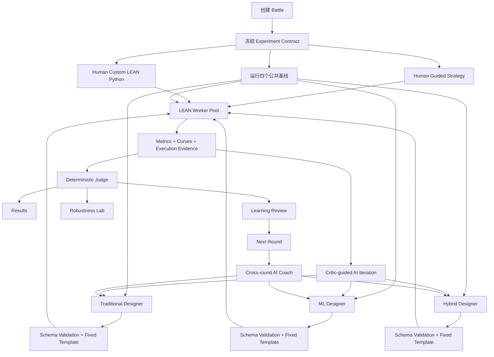
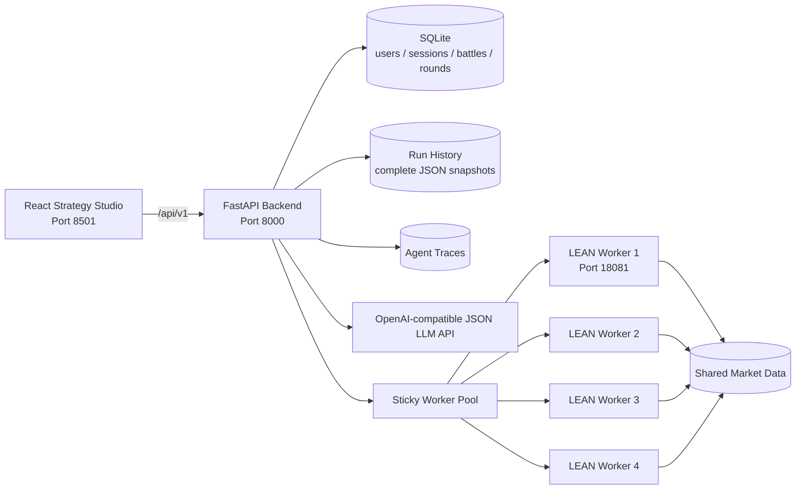
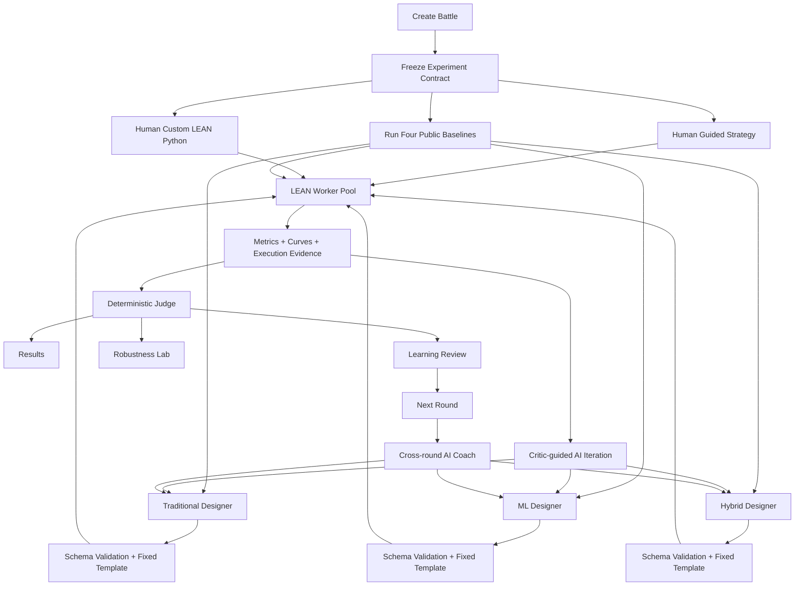

# AlphaForge

> **A Risk-Aware Multi-Agent Platform for Automated Trading Strategy Optimization**  
> An education-first Human-vs-AI quantitative strategy arena powered by real QuantConnect LEAN backtests.

<p align="center">
  <strong>React Strategy Studio · FastAPI · Multi-Agent LLM · QuantConnect LEAN · SQLite · Docker Compose</strong>
</p>


<p align="center">
  <a href="#中文说明">中文</a> · <a href="#english-version">English</a>
</p>


> [!IMPORTANT]
> AlphaForge is developed for coursework, research, and financial education. It does **not** provide investment advice. Historical backtests, scores, and robustness tests do not guarantee future performance.

---

<a id="中文说明"></a>

# 中文说明

## 1. 项目概述

AlphaForge 是一个面向金融学习者的本地量化策略实验与竞技平台。用户可以通过引导式参数表单或完整 QuantConnect/LEAN Python 代码独立构建策略；AI 则在严格的信息隔离下，沿 **Traditional、Machine Learning 和 Hybrid** 三条路线生成并迭代参数化候选策略。

所有 Human 策略、AI 候选和四个公共基线均在相同的实验合同下运行，并统一交由 QuantConnect LEAN 回测。系统随后使用确定性评分器比较风险收益表现，再通过 Learning Review、AI Critic、跨轮 Coach 和鲁棒性实验，将结果转化为可解释、可复盘的学习反馈。

| 项目属性 | 说明                                                         |
| -------- | ------------------------------------------------------------ |
| 课程     | SWS3022 — AI/ML in Financial Services                        |
| 项目类型 | AI Financial Innovation Project / Financial Education Serious Game |
| 当前状态 | 可本地部署的课程 MVP                                         |
| 核心定位 | 风险感知、多智能体、可审计的人机量化策略竞技平台             |
| 前端     | React Strategy Studio                                        |
| 后端     | FastAPI + Pydantic                                           |
| AI 系统  | Parameter Designer、Performance Critic、Cross-round Coach、Teaching Explainer |
| 回测引擎 | QuantConnect LEAN                                            |
| 持久化   | SQLite + JSON Run Snapshots + Agent Traces                   |
| 部署     | Docker Compose + 4 个隔离 LEAN Worker                        |
| 开源协议 | [MIT License](LICENSE)，第三方资产适用各自许可               |

---

## 2. 项目动机

传统量化教学和生成式 AI 策略工具通常存在以下问题：

1. **只关注收益，忽略风险与交易摩擦。** 初学者容易追逐 CAGR，却忽视 Sharpe Ratio、最大回撤、波动率、换手率、手续费和滑点。
2. **AI 优化过程不可见。** 模型直接生成一段代码，但用户无法确认策略为何变化、是否真实执行、失败发生在哪一步，以及最终结果是否可复现。
3. **人机比较缺乏公平性。** 如果 AI 可以读取用户代码、参数和回测结果，再进行针对性优化，那么“AI 战胜 Human”缺少实验意义。
4. **自由生成代码稳定性不足。** LLM 生成的 LEAN Python 容易出现 API 不兼容、数据泄漏、时间顺序错误和运行时失败。
5. **高回测结果容易被误解。** 单一历史区间中的优异表现，可能来自过拟合、多重试验偏差、幸存者偏差或不现实的交易假设。

AlphaForge 将这些问题重新组织为一套有明确边界的教育型实验系统：

```text
Human 独立设计 ─────────────────────┐
                                    ├─ Frozen Experiment Contract
Public Baselines ─ AI 独立优化 ─────┘
                                                ↓
                                      QuantConnect LEAN
                                                ↓
                                     Deterministic Judge
                                                ↓
                              Results · Learning · Robustness
```

---

## 3. 核心创新

### 3.1 公平的信息隔离

AI Designer、Critic 和跨轮 Coach 不读取 Human 的策略代码、参数、回测指标、订单记录或个性化教学建议。Human 与 AI 在各自独立的上下文中完成策略设计，只有双方结果被冻结后，确定性 Judge 才进行比较。

这种隔离不是仅靠 Prompt 中的一句“请忽略用户信息”实现，而是由后端通过显式 DTO、字段白名单和独立上下文构造完成。

### 3.2 参数型 Multi-Agent 优化

AI 不直接生成或修复大段 Python，而是返回受 Pydantic 约束的 `StrategyTemplateSpec` JSON。后端将合法参数注入固定、版本化的 `template-v1`，确定性编译出可运行的 LEAN Python。

这使系统实现了明确的责任划分：

- **Agent 负责策略决策：** 特征、信号方向、模型类型、Top-K、权重方式、调仓频率和风险控制；
- **Schema 负责合法性：** 限制字段、类型、范围和三条赛道的结构要求；
- **Compiler 负责可运行性：** LEAN API、历史数据、训练流程、推理、交易执行和运行证据；
- **LEAN 负责真实执行：** 所有可比较结果必须来自同一回测引擎。

### 3.3 可审计的策略演化

每条 AI 赛道最多进行三次真实回测：

```text
Designer 提交完整参数
        ↓
Pydantic Schema 校验与规范化
        ↓
固定模板编译 + SHA-256 摘要
        ↓
LEAN 回测
        ↓
Performance Critic 诊断
        ↓
Designer 根据证据重写完整参数
```

Traditional、ML 和 Hybrid 三条赛道可以并行执行；单条赛道内部仍保持严格的 `LEAN → Critic → Designer` 因果顺序。系统保存每次参数、源码、摘要、指标、执行证据、Critic 反馈和保留原因。

### 3.4 风险感知的确定性评价

胜负不由 LLM 主观决定。系统使用公开、可解释的评分协议，综合收益、风险、成本、执行证据和可解释性，并额外提供历史敏感性压力测试。

### 3.5 教育优先的 Human-vs-AI Serious Game

AlphaForge 不只展示“谁赢了”，还展示：

- 每个策略为什么这样设计；
- 三次 AI 试验之间改变了什么；
- 哪些指标改善，哪些风险恶化；
- 哪些参数应在下一轮只改变一个变量继续验证；
- 哪个量化概念最能解释当前结果；
- 策略在不同压力情景下是否仍保持基本稳定。

---

## 4. 当前已实现功能

### 4.1 用户、对战与跨轮流程

- SQLite 用户注册、登录、会话和退出登录；
- 创建、查看、继续和删除历史 Battle；
- 每场最多五轮，任一方先取得三胜即结束；
- R1–R5 独立切换，可查看每轮合同、比分、指标、AI 冠军和教学记录；
- Round 1 冻结股票池、日期、初始资金、Benchmark、费用和滑点；
- 同一场 Battle 的后续轮次复用首轮四个公共基线，避免重复消耗 Worker；
- 后端重启后可通过 SQLite 和 Run Snapshot 恢复已完成运行。

### 4.2 Human Strategy

- **Basic Guided Template：** 面向初学者的简化策略配置；
- **Advanced Multi-factor Template：** 支持信号、双窗口、信号权重、Top-K、组合权重、调仓阈值和趋势过滤；
- **Complete Python Code：** 支持提交完整 QuantConnect/LEAN Python；
- 下一轮自动带入上一轮 Human 策略；
- Learning Review 展示“当前值 → 建议值”、目标指标和调整理由；
- 策略源码支持语法高亮与复制。

### 4.3 四个公共基线

| 基线                         | 类型             | 核心思想                                 |
| ---------------------------- | ---------------- | ---------------------------------------- |
| Momentum Rank                | Traditional      | 按中期相对强度排序并持有领先股票         |
| Mean Reversion               | Traditional      | 买入近期落后者，检验短期价格反转         |
| Gradient Boosting            | Machine Learning | 使用滞后市场特征预测未来超额收益并排序   |
| Hybrid ML + Minimum Variance | Hybrid           | 将 ML 预测与协方差感知的最小方差配置结合 |

四个基线与 Human/AI 使用同一股票池、日期、资金、Benchmark、费用和滑点。Baseline Classroom 解释每种方法的原理、优势、限制及风险收益权衡。

### 4.4 三条 AI 赛道

- **Traditional：** 必须包含透明信号，不允许 ML 模型；
- **ML：** 必须包含训练模型，不允许额外透明信号混合；
- **Hybrid：** 必须同时包含透明信号与 ML 模型，并在最终决策中融合。

支持的策略积木包括：

- 收益率、波动率、SMA Gap、相对收益、成交量变化和 RSI 特征；
- Gradient Boosting、Random Forest、Extra Trees 和 Ridge；
- Equal、Inverse Volatility、Score、Minimum Variance 和 Blend Score + Minimum Variance 权重；
- Weekly 或 Monthly 调仓；
- 市场趋势过滤、止损、最大回撤阈值和冷却期。

### 4.5 结果、教学与鲁棒性

- Strategy Comparison 指标表；
- 权益曲线、回撤曲线、风险收益图和成本信息；
- AI Forge 三次参数试验及 Critic 反馈；
- 跨轮 AI Champion 与 Coach 决策；
- Learning Review、Strategy DNA、Quant Concept 和下一轮建议；
- Teaching Explainer 异步生成教学内容，失败时使用确定性 fallback；
- Robustness Lab 支持时间切片、起始日期扰动、双倍摩擦和股票池扰动；
- 完整 Run Snapshot、Agent Trace 和策略源码审计。

---

## 5. 端到端工作流



---

## 6. 系统架构



### 6.1 组件职责

| 组件                  | 职责                                                         |
| --------------------- | ------------------------------------------------------------ |
| React Strategy Studio | Battle、策略配置、AI Forge、Results、Learning Review、Robustness 和 PK Arena |
| FastAPI Backend       | 认证、实验合同、Agent 编排、策略编译、Worker 调度、评分与持久化 |
| Multi-Agent Layer     | Parameter Designer、Performance Critic、Cross-round Coach、Teaching Explainer |
| Strategy Compiler     | 将合法 `StrategyTemplateSpec` 注入固定 LEAN 模板并生成 SHA-256 摘要 |
| LEAN Worker Pool      | 执行公共基线、Human 策略、AI 候选和鲁棒性场景                |
| SQLite                | 用户、会话、Battle、Round、比分、教学摘要和 Coach 记忆       |
| Run History           | 保存曲线、源码、参数、指标、评分、候选谱系和冠军信息         |
| Agent Traces          | 保存 Agent 输入白名单、输出、错误和可重放证据                |

### 6.2 并发与隔离

- 顶层 Forge Run 在单个 FastAPI 进程中按顺序编排，避免共享状态乱序；
- 单个 Run 内，四个公共基线可并行；
- 三个 Designer 请求可并行，同时 Human 策略可独立回测；
- Traditional、ML 和 Hybrid 三条候选流水线可并行；
- 每条赛道内部的三次迭代保持顺序执行；
- 每个 LEAN Worker 同时只执行一个任务；
- 四个 Worker 共享只读行情数据，但任务、结果、锁、模型和运行目录相互隔离；
- Worker Pool 使用 least-active 与 round-robin tie-break，并保持 Run 轮询粘性。

### 6.3 持久化

- `backend/workspace/database/`：SQLite 数据库；
- `backend/workspace/run_history/`：完整 Run JSON 快照；
- `backend/workspace/forge_traces/`：Agent Trace；
- `lean_worker/workspace/`：本地数据、任务、日志、模型和 LEAN 结果。

Run History 使用锁和临时文件替换进行原子写入。异步 Teaching Explainer 和 AI Coach 完成后，SQLite 中较新的终态信息会覆盖较旧快照中的 pending 状态。

---

## 7. AI 信息边界

| 模块                 | 可以读取                                                     | 明确禁止                                  |
| -------------------- | ------------------------------------------------------------ | ----------------------------------------- |
| Parameter Designer   | Experiment Contract、公共基线、模板 DSL、当前 AI 赛道历史、Coach 指令 | Human 代码、参数、指标、订单、个性化建议  |
| Performance Critic   | 当前 AI 参数、LEAN 指标、执行证据、公共基线、该赛道先前试验  | Human 信息、直接替换参数对象、Python 代码 |
| Cross-round AI Coach | 四基线、三条 AI 赛道的跨轮证据、Critic 诊断                  | Human 结果、PK 胜负推断、Education 输出   |
| Deterministic Judge  | 已冻结并标准化的 Human、AI 和基线结果                        | LLM 主观判断                              |
| Teaching Explainer   | 赛后冻结证据、评分、参数和鲁棒性结果                         | 修改冠军、分数或下一轮 AI 上下文          |

---

## 8. 实验与评价协议

### 8.1 Frozen Experiment Contract

同一轮中的所有策略必须共享：

- 5–30 只股票；
- 开始日期和结束日期；
- 初始资金；
- Benchmark；
- Transaction Cost；
- Slippage。

这些字段由后端拥有，AI Agent 无权修改。

### 8.2 进入比较的基本条件

只有状态与核心指标完整、数据请求无失败、运行关闭正常且执行敞口满足要求的策略，才进入可比较集合。系统同时记录订单数量、持仓快照、最大总敞口、调仓次数、信号事件、模型训练和预测证据。

### 8.3 确定性评分 v2

| 评分项       | 权重 |
| ------------ | ---: |
| Sharpe Ratio |  35% |
| CAGR         |  30% |
| 最大回撤控制 |  15% |
| 波动率控制   |   5% |
| 成本效率     |   5% |
| 执行证据     |   5% |
| 可解释性     |   5% |

各项在同一实验的合格策略中归一化，并形成 0–100 分评分卡。AI 阵营先产生本轮冠军，再与 Human 进行比较。界面可使用 Draw Band 表示差异不明显；在需要记录单轮胜方时，平分依次使用 Sharpe、CAGR 和较低最大回撤作为决胜依据。

> 该评分协议用于课程演示和透明比较，不是行业统一标准，也不能证明样本外有效性。

### 8.4 AI 赛道择优

每条 AI 赛道最多执行三次真实回测，按以下优先级保留本轮最佳试验：

1. 更高 Sharpe Ratio；
2. 更高 CAGR；
3. 更低 Maximum Drawdown。

同一场 Battle 中，每条 AI 赛道还保存跨轮冠军。如果新一轮挑战者没有超过历史冠军，系统继续保留历史冠军及其真实迭代谱系。

---

## 9. 技术栈

| 层级           | 技术                                                         |
| -------------- | ------------------------------------------------------------ |
| Frontend       | React 18、Vite 6、Recharts、Lucide React                     |
| Backend        | FastAPI、Pydantic v2、Uvicorn、Requests                      |
| Agent          | OpenAI-compatible JSON API、Designer、Critic、Coach、Teaching Explainer |
| ML             | scikit-learn、pandas、NumPy                                  |
| Backtest       | QuantConnect LEAN、Python 3.11、.NET Runtime                 |
| Persistence    | SQLite WAL、JSON Run Snapshots、Agent Trace Files            |
| Infrastructure | Docker Compose、4 个隔离的 `linux/amd64` LEAN Worker         |
| Testing        | pytest、Vitest、Testing Library                              |
| Market Data    | Tiingo EOD Daily OHLCV，30 只冻结美股及 SPY/QQQ 依赖         |

---

## 10. 仓库结构

```text
.
├─ agent/                         # Designer、Critic、Coach、Educator
├─ backend/
│  ├─ app/
│  │  ├─ repositories/            # SQLite 持久化
│  │  ├─ schemas/                 # Experiment、Battle、Agent、Template 合同
│  │  ├─ services/                # Forge 编排、评分、Worker Pool、模板编译
│  │  └─ templates/               # 固定参数化 LEAN 模板
│  ├─ tests/                      # Backend 单元与集成测试
│  └─ workspace/                  # 本地 DB、Run History、Traces；不提交 Git
├─ frontend/                      # React 单页应用
├─ lean_worker/
│  ├─ app/                        # Worker HTTP Service
│  ├─ runtime_support/            # AlphaForge LEAN Runtime 支持
│  ├─ strategies/approved/        # 四个公共基线
│  ├─ tools/                      # Tiingo 数据同步工具
│  ├─ tests/                      # Worker 与 Runtime 测试
│  └─ workspace/                  # 行情、任务、结果、模型和锁；不提交 Git
├─ data_catalog/                  # 数据目录元信息
├─ docs/                          # 架构、Agent、Battle、评分、鲁棒性与研究资料
├─ examples/strategy_specs/       # 参数化策略 JSON 示例
├─ qc_strategies/                 # 策略来源与成员贡献记录
├─ compose.yaml
├─ .env.example
└─ README.md
```

---

## 11. 快速开始

### 11.1 前置条件

- Git；
- Docker Desktop 或 Docker Engine + Docker Compose；
- 支持 `linux/amd64` 容器；
- 用于实时 AI Agent 的 DeepSeek 或兼容 OpenAI JSON API 的密钥；
- 首次下载市场数据时所需的 Tiingo API Token；
- 足够的本地磁盘空间用于 LEAN 镜像、行情和回测结果。

### 11.2 克隆项目

```bash
git clone https://github.com/FrankForest1003/AlphaForge.git
cd NUS_AI-ML-Finance_Final_Project
```

### 11.3 配置环境变量

PowerShell：

```powershell
Copy-Item .env.example .env
notepad .env
```

macOS / Linux：

```bash
cp .env.example .env
```

建议至少配置：

```dotenv
ALPHAFORGE_API_TOKEN=replace-with-a-local-secret

# 首次同步 Tiingo 数据时填写
TIINGO_API_TOKEN=your-tiingo-token
TIINGO_START_DATE=2014-01-01

# 实时 Multi-Agent 模式
API_KEY=your-llm-api-key
BASE_URL=https://api.deepseek.com
MODEL=your-json-capable-model
THINKING_ENABLED=false

ALPHAFORGE_FRONTEND_PORT=8501
ALPHAFORGE_BACKEND_PORT=8000
ALPHAFORGE_WORKER_PORT=18081
```

> `.env`、真实市场数据、SQLite 数据库、Run History 和 Agent Traces 已被 `.gitignore` 排除，不应提交到仓库。

### 11.4 准备市场数据

如果 `lean_worker/workspace/data/lean/` 已包含质量检查通过的数据，可以跳过此步骤。

首次完整同步前，建议先停止 Worker：

```bash
docker compose stop lean-worker lean-worker-2 lean-worker-3 lean-worker-4
```

同步 30 只冻结股票及 SPY、QQQ：

```bash
docker compose run --rm --no-deps --entrypoint python lean-worker \
  /app/tools/sync_tiingo_data.py \
  --universe /app/config/universe_whitelist_v1.0.json \
  --data-root /data/lean \
  --start 2014-01-01 \
  --full
```

PowerShell 也可以将上述命令写成一行，或使用反引号 `` ` `` 换行。

数据质量、复权和许可要求详见：
[lean_worker/docs/DATA_SOURCE_AND_LICENSE_zh.md](lean_worker/docs/DATA_SOURCE_AND_LICENSE_zh.md)。

### 11.5 启动完整系统

```bash
docker compose up -d --build
docker compose ps
```

查看日志：

```bash
docker compose logs -f backend frontend
```

默认访问地址：

| 服务                  | 地址                         |
| --------------------- | ---------------------------- |
| React Strategy Studio | <http://localhost:8501>      |
| FastAPI Backend       | <http://localhost:8000>      |
| Swagger / OpenAPI     | <http://localhost:8000/docs> |
| LEAN Worker 1         | <http://localhost:18081>     |

健康检查：

```bash
curl http://localhost:8000/v1/health
curl http://localhost:18081/health
```

停止系统：

```bash
docker compose down
```

### 11.6 修改后的重建方式

只修改 `.env`：

```bash
docker compose up -d --force-recreate backend
```

修改代码、依赖或 Dockerfile：

```bash
docker compose up -d --build
```

---

## 12. 演示流程

1. 注册或登录；
2. 在 Battle Lobby 创建一场比赛；
3. 选择 5–30 只股票，并确认日期、资金、Benchmark、费用和滑点；
4. 在 Guided Setup 选择 Basic 或 Advanced，或提交完整 LEAN Python；
5. 启动 Round 1；
6. 查看四个公共基线、Human 策略和三条 AI 赛道的真实回测进度；
7. 在 AI Forge 展开每条赛道的三次参数试验、Critic 反馈和保留结果；
8. 在 Results 比较评分卡、指标、权益曲线、回撤和成本；
9. 在 Learning Review 查看 Strategy DNA、量化概念和下一轮建议；
10. 可选运行 Robustness Test；
11. 返回 Battle Lobby 开始下一轮，并在 PK Arena 查看 R1–R5 的跨轮演化。

---

## 13. API 概览

### 13.1 Backend API

| 方法   | 路径                                 | 用途                                   |
| ------ | ------------------------------------ | -------------------------------------- |
| GET    | `/v1/health`                         | Backend、Agent 和 Worker Pool 健康状态 |
| GET    | `/v1/catalog/universe`               | 可交易股票、Benchmark 和默认股票池     |
| GET    | `/v1/catalog/baselines`              | 公共基线目录                           |
| POST   | `/v1/auth/register`                  | 注册                                   |
| POST   | `/v1/auth/login`                     | 登录                                   |
| GET    | `/v1/auth/me`                        | 获取当前用户                           |
| POST   | `/v1/auth/logout`                    | 注销会话                               |
| GET    | `/v1/battles`                        | 获取当前用户的历史对战                 |
| POST   | `/v1/battles`                        | 创建对战                               |
| GET    | `/v1/battles/{battle_id}`            | 获取对战及 R1–R5 详情                  |
| DELETE | `/v1/battles/{battle_id}`            | 删除整场对战                           |
| POST   | `/v1/forge-runs`                     | 创建独立 Run 或 Battle 下一轮          |
| GET    | `/v1/forge-runs/{run_id}`            | 轮询或恢复完整 Run                     |
| POST   | `/v1/forge-runs/{run_id}/robustness` | 启动鲁棒性实验                         |
| GET    | `/v1/forge-history`                  | 获取最近 Run 快照                      |
| GET    | `/v1/forge-history/{run_id}`         | 获取指定历史 Run                       |
| GET    | `/v1/forge-runs/{run_id}/trace`      | 获取可审计 Agent Trace                 |

### 13.2 LEAN Worker API

| 方法 | 路径                        | 用途                        |
| ---- | --------------------------- | --------------------------- |
| GET  | `/health`                   | Worker 健康状态             |
| GET  | `/v1/data/status`           | 本地行情质量状态            |
| POST | `/v1/jobs`                  | 启动注册策略任务            |
| POST | `/v1/custom-jobs`           | 启动自定义 LEAN Python 任务 |
| GET  | `/v1/jobs/{run_id}`         | 查询任务状态                |
| GET  | `/v1/jobs/{run_id}/result`  | 获取标准化结果              |
| GET  | `/v1/jobs/{run_id}/log`     | 获取运行日志                |
| GET  | `/v1/jobs/{run_id}/details` | 获取任务详情与证据          |

---

## 14. 测试

### Backend

PowerShell：

```powershell
$env:PYTHONPATH='.;backend'
.\.venv\Scripts\python.exe -m pytest -q backend/tests
```

macOS / Linux：

```bash
PYTHONPATH=.:backend python -m pytest -q backend/tests
```

### LEAN Worker

PowerShell：

```powershell
$env:PYTHONPATH='.;lean_worker'
.\.venv\Scripts\python.exe -m pytest -q lean_worker/tests
```

macOS / Linux：

```bash
PYTHONPATH=.:lean_worker python -m pytest -q lean_worker/tests
```

### Frontend

```bash
cd frontend
npm ci
npm test -- --run
npm run build
```

> 静态测试不能替代使用真实 Tiingo 数据的 LEAN 端到端回测。Docker/Linux 是 LEAN Worker 的目标运行环境；Windows 文件占用语义可能影响极高频的原子写入并发测试。

---

## 15. 数据、可复现性与许可

### 15.1 数据范围

- Tiingo End-of-Day Prices API；
- 30 只冻结白名单股票；
- SPY 与 QQQ；
- 默认从 2014-01-01 开始；
- Daily OHLCV。

同步器优先写入 `adjOpen`、`adjHigh`、`adjLow`、`adjClose` 和 `adjVolume`，策略在 LEAN 中使用 `DataNormalizationMode.RAW`，避免重复复权。

### 15.2 可复现性证据

每个 AI 候选保存：

- 规范化 `StrategyTemplateSpec`；
- 编译后的完整 LEAN Python；
- 参数 JSON 的 SHA-256 摘要；
- Experiment Contract；
- Worker Run ID；
- 指标、曲线、订单和行为证据；
- Critic 反馈与冠军谱系；
- Agent Trace Manifest。

### 15.3 数据限制

- 当前股票池由今天的 ticker 白名单回溯，存在 survivorship selection；
- 当前 compatibility map/factor files 不等于完整历史 Security Master；
- Robustness Lab 是历史敏感性测试，不是严格的样本外证明；
- 选择三次试验中的最佳结果会引入 multiple-testing bias；
- 历史表现不代表未来盈利能力。

### 15.4 数据许可

仓库不包含真实市场数据。每位使用者应使用自己的 Tiingo Token，并自行确认账户类型、研究用途、展示和再分发许可。公开展示数据或结果时，应按供应商要求保留适当 attribution。

---

## 16. 已知限制与路线图

以下能力属于后续计划，当前版本不应在演示中描述为已经完成：

- 冠军锁定后才揭示的严格 Final Blind Challenge；
- Training / Validation / Final Blind Test 三段式数据合同；
- Human 自定义 Python 的完整 AST、依赖和 API allowlist；
- 独立的 custom-code smoke-test 准入报告；
- 将 AI Champion 正式复制为新的 Human Strategy Lineage；
- Strategy、Report 和哈希链的一键导出；
- 排行榜、成就系统和用户学习效果研究；
- 云端多租户部署；
- PostgreSQL、Redis 和多实例任务队列；
- 更完整的历史 Security Master 与严格样本外数据协议。

---

## 17. 团队分工与责任

| 团队成员         | 主要职责                                    | 代表性贡献                                                   |
| ---------------- | ------------------------------------------- | ------------------------------------------------------------ |
| **Zihan Zhou**   | 传统基线、基线教学、进度协调、PPT           | 传统策略比较框架、Baseline Classroom、风险评价与展示材料     |
| **Zhanlin Chen** | 数据、ML/Hybrid 基线、策略研究              | 数据目录、ML 与 Hybrid 策略稳定性、交易摩擦和组合执行优化    |
| **Zetong Li**    | Backend、LEAN、Docker、系统集成与产品主流程 | 本地 LEAN Runtime、Human Strategy、确定性验收、鲁棒性、参数模板、四 Worker、SQLite Battle、Run 恢复与架构文档 |
| **Jingze Liu**   | Agent 主链、前端架构、运行证据和分支集成    | Agent 回测循环、React Strategy Studio、可重放 Trace、调仓稳定性与分支合并 |

> 具体贡献应以 Git 历史、Pull Request、代码审查记录、文档和最终答辩说明为准。

---

## 18. 进一步文档

- [团队运行与开发对齐](TEAM_PROJECT_GUIDE_zh.md)
- [项目架构（中文）](docs/PROJECT_ARCHITECTURE_zh.md)
- [Project Architecture (English)](docs/PROJECT_ARCHITECTURE_en.md)
- [参数型 Agent 设计](docs/AGENT_PROMPT_ENGINEERING_zh.md)
- [策略模板 DSL](docs/STRATEGY_TEMPLATE_V1_zh.md)
- [对战与跨轮学习](docs/BATTLE_SYSTEM_zh.md)
- [评分与 Learning Review](docs/UX_SCORING_UPDATE_zh.md)
- [鲁棒性测试](docs/ROBUSTNESS_TESTING_V1_zh.md)
- [研究论文库](docs/research/README.md)
- [数据来源、复权和许可](lean_worker/docs/DATA_SOURCE_AND_LICENSE_zh.md)
- [LEAN Worker 说明](lean_worker/README_zh.md)
- [Backend 说明](backend/README.md)
- [Frontend 说明](frontend/README.md)

---

## 19. 开发规范

- `main` 保存可演示版本，功能开发使用独立分支；
- Commit 应聚焦单一功能、修复、重构或文档范围；
- 修改 Agent 信息边界时，必须同步检查 DTO、Prompt、Trace Manifest 和测试；
- 修改 `StrategyTemplateSpec` 时，必须同步更新 Schema、Compiler、固定模板、前端和测试；
- `.env`、密钥、真实市场数据、数据库、Run History 和 Agent Trace 不得提交；
- 实验结果应保留 Run ID、合同、参数、源码、SHA-256、Worker 结果和限制说明；
- 合并前应执行与改动范围相称的测试，并保护其他成员尚未提交的工作；
- 架构或用户流程变化后，应同步更新根 README 与 `docs/` 专题文档。

---

## 20. 学术诚信、第三方组件与风险声明

AlphaForge 使用或参考 QuantConnect LEAN、Tiingo、相关研究论文、开源 Python/JavaScript 库及 AI 辅助开发工具。最终报告和展示应适当引用论文、数据源、框架和第三方组件。团队成员应能够解释所提交的代码、实验合同、评分规则、Agent 信息边界和已知限制，并对最终成果承担责任。

LEAN Worker 的第三方许可与声明见：

- [lean_worker/LICENSE](lean_worker/LICENSE)
- [lean_worker/THIRD_PARTY_NOTICES.md](lean_worker/THIRD_PARTY_NOTICES.md)

> **风险声明：** 本项目仅用于课程、研究和教育演示，不构成任何投资建议、交易推荐或收益承诺。历史回测、评分、AI 生成策略和鲁棒性实验均可能受到数据质量、参数选择、交易假设、过拟合和市场结构变化的影响。

---

<a id="english-version"></a>

# English Version

## 1. Overview

AlphaForge is a local quantitative-strategy laboratory and competitive learning platform for finance students. A user independently builds a strategy through a guided parameter interface or complete QuantConnect/LEAN Python code. In parallel, AI develops parameterized candidates across three tracks: **Traditional, Machine Learning, and Hybrid**.

Every Human strategy, AI candidate, and public baseline is executed under the same frozen experiment contract using QuantConnect LEAN. A deterministic evaluator then compares risk-adjusted performance, while the Learning Review, Performance Critic, cross-round Coach, and robustness suite convert the evidence into an explainable and auditable learning experience.

| Project Attribute   | Description                                                  |
| ------------------- | ------------------------------------------------------------ |
| Course              | SWS3022 — AI/ML in Financial Services                        |
| Project Type        | AI Financial Innovation Project / Financial Education Serious Game |
| Current Status      | Locally deployable course MVP                                |
| Product Positioning | Risk-aware, multi-agent, auditable Human-vs-AI strategy arena |
| Frontend            | React Strategy Studio                                        |
| Backend             | FastAPI + Pydantic                                           |
| AI System           | Parameter Designer, Performance Critic, Cross-round Coach, Teaching Explainer |
| Backtest Engine     | QuantConnect LEAN                                            |
| Persistence         | SQLite + JSON Run Snapshots + Agent Traces                   |
| Deployment          | Docker Compose + four isolated LEAN Workers                  |
| License             | [MIT License](LICENSE); third-party assets retain their own terms |

---

## 2. Motivation

Common quantitative-learning and generative-AI strategy tools have several weaknesses:

1. **Return is emphasized while risk and trading friction are ignored.** Learners may optimize CAGR without understanding Sharpe ratio, drawdown, volatility, turnover, fees, and slippage.
2. **AI optimization is opaque.** A model may return code without showing why it changed, whether it truly executed, where it failed, or how the result can be reproduced.
3. **Human-vs-AI comparisons are often unfair.** If AI reads the Human strategy and results before optimizing, an AI victory has limited experimental meaning.
4. **Unrestricted code generation is unstable.** LLM-generated LEAN Python can contain incompatible APIs, look-ahead leakage, invalid time ordering, or runtime defects.
5. **Strong backtests are easy to overinterpret.** A high score in one historical window may reflect overfitting, multiple testing, survivorship bias, or unrealistic execution assumptions.

AlphaForge reframes these weaknesses as a controlled educational experiment:

```text
Independent Human Design ───────────────────┐
                                            ├─ Frozen Experiment Contract
Public Baselines ─ Independent AI Search ───┘
                                                        ↓
                                              QuantConnect LEAN
                                                        ↓
                                             Deterministic Judge
                                                        ↓
                                  Results · Learning · Robustness
```

---

## 3. Key Innovations

### 3.1 Fair Information Boundary

The AI Designer, Critic, and cross-round Coach cannot access Human source code, parameters, metrics, orders, or personalized recommendations. Human and AI design paths remain separate until both sides are frozen and passed to the deterministic Judge.

The boundary is enforced through backend DTO construction and field allowlists, rather than relying only on prompt instructions.

### 3.2 Parameter-only Multi-Agent Optimization

Agents do not generate or repair unrestricted Python. They return a Pydantic-constrained `StrategyTemplateSpec` JSON object. The backend injects the validated canonical parameters into a fixed, versioned `template-v1` and deterministically compiles runnable LEAN Python.

Responsibilities are separated as follows:

- **Agents choose strategy decisions:** features, signal direction, model family, Top-K, weighting, schedule, and risk controls;
- **Schemas enforce validity:** field types, ranges, and track-specific structural rules;
- **The compiler owns executability:** LEAN APIs, history access, training, inference, portfolio construction, and runtime evidence;
- **LEAN owns execution:** all comparable results must come from the same backtest engine.

### 3.3 Auditable Strategy Evolution

Each AI track receives up to three real backtests:

```text
Designer submits a complete parameter set
        ↓
Pydantic validation and normalization
        ↓
Fixed-template compilation + SHA-256 digest
        ↓
LEAN backtest
        ↓
Performance Critic diagnosis
        ↓
Designer rewrites the complete parameter set
```

Traditional, ML, and Hybrid tracks may run in parallel. Within each track, the `LEAN → Critic → Designer` causal order remains sequential. AlphaForge stores every parameter set, compiled source file, digest, metric, execution record, Critic report, and retention decision.

### 3.4 Risk-aware Deterministic Evaluation

An LLM does not decide the winner. AlphaForge applies a transparent scoring protocol that combines return, risk, cost, execution evidence, and explainability. Historical sensitivity tests are provided as a separate robustness layer.

### 3.5 Education-first Serious Game

AlphaForge explains more than the final winner. It exposes:

- why each strategy was designed;
- what changed between AI trials;
- which metrics improved and which risks worsened;
- which single-variable experiment should be attempted next;
- which quantitative concept best explains the outcome;
- whether the strategy remains acceptable under controlled stress scenarios.

---

## 4. Implemented Scope

### 4.1 Users, Battles, and Cross-round Workflow

- SQLite-backed registration, login, sessions, and logout;
- creation, retrieval, continuation, and deletion of Battles;
- best-of-five format, ending when either side reaches three wins;
- direct R1–R5 navigation with round-level contracts, scores, metrics, AI champions, and learning records;
- Round 1 freezes symbols, dates, capital, benchmark, fees, and slippage;
- later rounds reuse the four identical public-baseline results;
- completed runs can be restored from SQLite and Run Snapshots after a backend restart.

### 4.2 Human Strategy

- **Basic Guided Template** for first-time users;
- **Advanced Multi-factor Template** with signals, two lookback windows, signal weights, Top-K, portfolio weighting, rebalance thresholds, and market filters;
- **Complete Python Code** for full QuantConnect/LEAN Python submissions;
- automatic carry-forward of the previous-round Human strategy;
- “current value → recommended value” guidance with target metrics and rationale;
- syntax-highlighted, copyable strategy source.

### 4.3 Four Public Baselines

| Baseline                     | Family           | Core Idea                                                 |
| ---------------------------- | ---------------- | --------------------------------------------------------- |
| Momentum Rank                | Traditional      | Rank medium-term relative strength and hold the leaders   |
| Mean Reversion               | Traditional      | Buy recent laggards to test short-horizon reversal        |
| Gradient Boosting            | Machine Learning | Predict future excess returns from lagged market features |
| Hybrid ML + Minimum Variance | Hybrid           | Combine ML forecasts with covariance-aware allocation     |

All baselines use the same symbols, period, capital, benchmark, fees, and slippage as Human and AI strategies. The Baseline Classroom explains their principles, strengths, limitations, and risk-return trade-offs.

### 4.4 Three AI Tracks

- **Traditional:** requires a transparent signal and forbids an ML model;
- **ML:** requires a fitted model and forbids a separate transparent signal blend;
- **Hybrid:** requires both a transparent signal and a fitted model in the final decision.

The template DSL supports:

- return, volatility, SMA gap, relative return, volume change, and RSI features;
- Gradient Boosting, Random Forest, Extra Trees, and Ridge models;
- equal, inverse-volatility, score, minimum-variance, and blended score/minimum-variance allocation;
- weekly or monthly schedules;
- market-trend filters, stop-loss rules, maximum-drawdown controls, and cooldown periods.

### 4.5 Results, Education, and Robustness

- comparable strategy metric tables;
- equity curves, drawdown curves, risk-return plots, and cost evidence;
- all three AI trials and Critic feedback;
- cross-round AI champions and Coach decisions;
- Learning Review, Strategy DNA, Quant Concept, and next-round suggestions;
- asynchronous Teaching Explainer with deterministic fallback;
- robustness scenarios for time slices, shifted start dates, doubled friction, and universe perturbations;
- complete Run Snapshots, Agent Traces, and compiled source auditability.

---

## 5. End-to-End Workflow



---

## 6. System Architecture


### 6.1 Component Responsibilities

| Component             | Responsibility                                               |
| --------------------- | ------------------------------------------------------------ |
| React Strategy Studio | Battle setup, strategy configuration, AI Forge, Results, Learning Review, Robustness, and PK Arena |
| FastAPI Backend       | Authentication, experiment contracts, Agent orchestration, compilation, Worker scheduling, scoring, and persistence |
| Multi-Agent Layer     | Parameter Designer, Performance Critic, Cross-round Coach, and Teaching Explainer |
| Strategy Compiler     | Inject a valid `StrategyTemplateSpec` into the fixed template and generate a SHA-256 digest |
| LEAN Worker Pool      | Execute baselines, Human strategies, AI candidates, and robustness scenarios |
| SQLite                | Store users, sessions, Battles, Rounds, scores, teaching summaries, and Coach memory |
| Run History           | Store curves, source, parameters, metrics, scoring, candidate lineage, and champions |
| Agent Traces          | Store input allowlists, outputs, errors, and replayable evidence |

### 6.2 Concurrency and Isolation

- top-level Forge runs are serialized inside one FastAPI process to keep shared transitions ordered;
- four public baselines can run concurrently within a Run;
- three Designer requests can run concurrently with the independent Human backtest;
- Traditional, ML, and Hybrid candidate pipelines can run concurrently;
- the three iterations inside one track remain sequential;
- each LEAN Worker executes one task at a time;
- Workers share read-only market data but isolate jobs, results, locks, models, and runtime directories;
- the Worker Pool uses least-active routing with round-robin tie-breaking and sticky Run polling.

### 6.3 Persistence

- `backend/workspace/database/`: SQLite database;
- `backend/workspace/run_history/`: complete Run JSON snapshots;
- `backend/workspace/forge_traces/`: Agent traces;
- `lean_worker/workspace/`: local data, jobs, logs, models, and LEAN results.

Run History uses locked atomic temporary-file replacement. When asynchronous Teaching Explainer and AI Coach tasks complete, newer terminal state in SQLite overlays stale pending state from an older snapshot.

---

## 7. AI Information Boundary

| Module               | Allowed Context                                              | Explicitly Excluded                                          |
| -------------------- | ------------------------------------------------------------ | ------------------------------------------------------------ |
| Parameter Designer   | Experiment Contract, public baselines, template DSL, own-track history, Coach directive | Human code, parameters, metrics, orders, personalized guidance |
| Performance Critic   | Current AI parameters, LEAN metrics, execution evidence, public baselines, prior trials in the same track | Human evidence, direct replacement of the parameter object, Python code |
| Cross-round AI Coach | Public baselines, cross-round evidence from all AI tracks, Critic diagnoses | Human results, inferred PK outcome, Education output         |
| Deterministic Judge  | Frozen and standardized Human, AI, and baseline results      | Subjective LLM judgment                                      |
| Teaching Explainer   | Frozen post-run evidence, scores, parameters, and robustness results | Changing the winner, score, or future AI context             |

---

## 8. Experiment and Evaluation Protocol

### 8.1 Frozen Experiment Contract

Every strategy in one round shares:

- 5–30 symbols;
- start and end dates;
- initial capital;
- benchmark;
- transaction costs;
- slippage.

These fields are backend-owned and cannot be modified by an Agent.

### 8.2 Eligibility

Only strategies with complete terminal status, valid core metrics, clean data requests, clean shutdown, and acceptable execution exposure enter the comparable set. The platform also records filled orders, invested snapshots, gross exposure, rebalance counts, signal events, model training, and prediction evidence.

### 8.3 Deterministic Score v2

| Component          | Weight |
| ------------------ | -----: |
| Sharpe Ratio       |    35% |
| CAGR               |    30% |
| Drawdown Control   |    15% |
| Volatility Control |     5% |
| Cost Efficiency    |     5% |
| Execution Evidence |     5% |
| Explainability     |     5% |

Components are normalized within the eligible strategies of the same experiment and combined into a 0–100 scorecard. The AI side first produces its round champion and then competes against the Human strategy. A Draw Band may indicate that the difference is not meaningful; where one winner must be recorded, ties are resolved by Sharpe, then CAGR, then lower maximum drawdown.

> This weighting is a transparent course-demonstration protocol. It is not an industry standard and does not establish out-of-sample validity.

### 8.4 AI Trial Selection

Each track runs at most three real backtests. Its round winner is retained by:

1. higher Sharpe ratio;
2. higher CAGR;
3. lower maximum drawdown.

Each track also keeps a cross-round incumbent. If a new challenger does not beat the prior champion, the incumbent and its authentic iteration lineage remain active.

---

## 9. Technology Stack

| Layer          | Technology                                                   |
| -------------- | ------------------------------------------------------------ |
| Frontend       | React 18, Vite 6, Recharts, Lucide React                     |
| Backend        | FastAPI, Pydantic v2, Uvicorn, Requests                      |
| Agent          | OpenAI-compatible JSON API, Designer, Critic, Coach, Teaching Explainer |
| ML             | scikit-learn, pandas, NumPy                                  |
| Backtest       | QuantConnect LEAN, Python 3.11, .NET Runtime                 |
| Persistence    | SQLite WAL, JSON Run Snapshots, Agent Trace Files            |
| Infrastructure | Docker Compose, four isolated `linux/amd64` LEAN Workers     |
| Testing        | pytest, Vitest, Testing Library                              |
| Market Data    | Tiingo EOD Daily OHLCV, 30 frozen US equities, SPY, and QQQ  |

---

## 10. Repository Structure

```text
.
├─ agent/                         # Designer, Critic, Coach, Educator
├─ backend/
│  ├─ app/
│  │  ├─ repositories/            # SQLite persistence
│  │  ├─ schemas/                 # Experiment, Battle, Agent, Template contracts
│  │  ├─ services/                # Forge orchestration, scoring, Worker Pool, compiler
│  │  └─ templates/               # Fixed parameterized LEAN template
│  ├─ tests/                      # Backend unit and integration tests
│  └─ workspace/                  # Local DB, Run History, Traces; ignored by Git
├─ frontend/                      # React single-page application
├─ lean_worker/
│  ├─ app/                        # Worker HTTP service
│  ├─ runtime_support/            # AlphaForge LEAN runtime support
│  ├─ strategies/approved/        # Four public baselines
│  ├─ tools/                      # Tiingo data synchronization
│  ├─ tests/                      # Worker and runtime tests
│  └─ workspace/                  # Data, jobs, results, models, locks; ignored by Git
├─ data_catalog/                  # Data catalog metadata
├─ docs/                          # Architecture, Agent, Battle, scoring, robustness, research
├─ examples/strategy_specs/       # Parameterized strategy JSON examples
├─ qc_strategies/                 # Strategy provenance and team contributions
├─ compose.yaml
├─ .env.example
└─ README.md
```

---

## 11. Quick Start

### 11.1 Prerequisites

- Git;
- Docker Desktop or Docker Engine with Docker Compose;
- support for `linux/amd64` containers;
- a DeepSeek or OpenAI-compatible JSON API key for live Agents;
- a Tiingo API Token for first-time market-data synchronization;
- sufficient disk space for LEAN images, market data, and backtest outputs.

### 11.2 Clone

```bash
git clone https://github.com/FrankForest1003/NUS_AI-ML-Finance_Final_Project.git
cd NUS_AI-ML-Finance_Final_Project
```

### 11.3 Configure Environment Variables

PowerShell:

```powershell
Copy-Item .env.example .env
notepad .env
```

macOS / Linux:

```bash
cp .env.example .env
```

Recommended configuration:

```dotenv
ALPHAFORGE_API_TOKEN=replace-with-a-local-secret

# Required only when synchronizing Tiingo data
TIINGO_API_TOKEN=your-tiingo-token
TIINGO_START_DATE=2014-01-01

# Live Multi-Agent mode
API_KEY=your-llm-api-key
BASE_URL=https://api.deepseek.com
MODEL=your-json-capable-model
THINKING_ENABLED=false

ALPHAFORGE_FRONTEND_PORT=8501
ALPHAFORGE_BACKEND_PORT=8000
ALPHAFORGE_WORKER_PORT=18081
```

> `.env`, licensed market data, SQLite databases, Run History, and Agent Traces are ignored by Git and must not be committed.

### 11.4 Prepare Market Data

Skip this step when `lean_worker/workspace/data/lean/` already contains a quality-approved dataset.

Stop the Workers before a full first-time synchronization:

```bash
docker compose stop lean-worker lean-worker-2 lean-worker-3 lean-worker-4
```

Synchronize the 30-stock universe plus SPY and QQQ:

```bash
docker compose run --rm --no-deps --entrypoint python lean-worker \
  /app/tools/sync_tiingo_data.py \
  --universe /app/config/universe_whitelist_v1.0.json \
  --data-root /data/lean \
  --start 2014-01-01 \
  --full
```

See [lean_worker/docs/DATA_SOURCE_AND_LICENSE_zh.md](lean_worker/docs/DATA_SOURCE_AND_LICENSE_zh.md) for quality, adjustment, and licensing requirements.

### 11.5 Start the Full System

```bash
docker compose up -d --build
docker compose ps
```

Follow logs:

```bash
docker compose logs -f backend frontend
```

Default endpoints:

| Service               | URL                          |
| --------------------- | ---------------------------- |
| React Strategy Studio | <http://localhost:8501>      |
| FastAPI Backend       | <http://localhost:8000>      |
| Swagger / OpenAPI     | <http://localhost:8000/docs> |
| LEAN Worker 1         | <http://localhost:18081>     |

Health checks:

```bash
curl http://localhost:8000/v1/health
curl http://localhost:18081/health
```

Stop the system:

```bash
docker compose down
```

### 11.6 Rebuild After Changes

Environment-only change:

```bash
docker compose up -d --force-recreate backend
```

Code, dependency, or Dockerfile change:

```bash
docker compose up -d --build
```

---

## 12. Demonstration Workflow

1. Register or sign in.
2. Create a Battle in the Battle Lobby.
3. Select 5–30 stocks and confirm dates, capital, benchmark, fees, and slippage.
4. Choose Basic or Advanced Guided Setup, or submit complete LEAN Python.
5. Start Round 1.
6. Observe real backtests for the four baselines, Human strategy, and three AI tracks.
7. Open AI Forge to inspect all parameter trials, Critic reports, and retained candidates.
8. Open Results to compare scorecards, metrics, equity, drawdown, and cost evidence.
9. Open Learning Review for Strategy DNA, quantitative concepts, and next-round guidance.
10. Optionally run the Robustness Lab.
11. Start the next round and use PK Arena to inspect R1–R5 evolution.

---

## 13. API Overview

### 13.1 Backend API

| Method | Path                                 | Purpose                                      |
| ------ | ------------------------------------ | -------------------------------------------- |
| GET    | `/v1/health`                         | Backend, Agent, and Worker Pool health       |
| GET    | `/v1/catalog/universe`               | Tradable symbols, benchmarks, and defaults   |
| GET    | `/v1/catalog/baselines`              | Public baseline catalog                      |
| POST   | `/v1/auth/register`                  | Register                                     |
| POST   | `/v1/auth/login`                     | Sign in                                      |
| GET    | `/v1/auth/me`                        | Read the current user                        |
| POST   | `/v1/auth/logout`                    | Revoke the current session                   |
| GET    | `/v1/battles`                        | List the current user’s Battles              |
| POST   | `/v1/battles`                        | Create a Battle                              |
| GET    | `/v1/battles/{battle_id}`            | Read Battle and R1–R5 details                |
| DELETE | `/v1/battles/{battle_id}`            | Delete a Battle                              |
| POST   | `/v1/forge-runs`                     | Create a standalone Run or next Battle round |
| GET    | `/v1/forge-runs/{run_id}`            | Poll or restore a complete Run               |
| POST   | `/v1/forge-runs/{run_id}/robustness` | Start a robustness suite                     |
| GET    | `/v1/forge-history`                  | List recent Run snapshots                    |
| GET    | `/v1/forge-history/{run_id}`         | Read one historical Run                      |
| GET    | `/v1/forge-runs/{run_id}/trace`      | Read the auditable Agent Trace               |

### 13.2 LEAN Worker API

| Method | Path                        | Purpose                             |
| ------ | --------------------------- | ----------------------------------- |
| GET    | `/health`                   | Worker health                       |
| GET    | `/v1/data/status`           | Local market-data quality status    |
| POST   | `/v1/jobs`                  | Start a registered strategy job     |
| POST   | `/v1/custom-jobs`           | Start a custom LEAN Python job      |
| GET    | `/v1/jobs/{run_id}`         | Read job status                     |
| GET    | `/v1/jobs/{run_id}/result`  | Read normalized results             |
| GET    | `/v1/jobs/{run_id}/log`     | Read runtime logs                   |
| GET    | `/v1/jobs/{run_id}/details` | Read execution details and evidence |

---

## 14. Testing

### Backend

PowerShell:

```powershell
$env:PYTHONPATH='.;backend'
.\.venv\Scripts\python.exe -m pytest -q backend/tests
```

macOS / Linux:

```bash
PYTHONPATH=.:backend python -m pytest -q backend/tests
```

### LEAN Worker

PowerShell:

```powershell
$env:PYTHONPATH='.;lean_worker'
.\.venv\Scripts\python.exe -m pytest -q lean_worker/tests
```

macOS / Linux:

```bash
PYTHONPATH=.:lean_worker python -m pytest -q lean_worker/tests
```

### Frontend

```bash
cd frontend
npm ci
npm test -- --run
npm run build
```

> Static tests do not replace end-to-end LEAN backtests on real Tiingo data. Docker/Linux is the target environment for LEAN Workers; Windows file-locking semantics may affect highly concurrent atomic-write tests.

---

## 15. Data, Reproducibility, and Licensing

### 15.1 Data Scope

- Tiingo End-of-Day Prices API;
- 30 frozen whitelist equities;
- SPY and QQQ;
- default start date of 2014-01-01;
- Daily OHLCV.

The synchronizer prioritizes `adjOpen`, `adjHigh`, `adjLow`, `adjClose`, and `adjVolume`. Strategies use `DataNormalizationMode.RAW` in LEAN to avoid double adjustment.

### 15.2 Reproducibility Evidence

Each AI candidate preserves:

- canonical `StrategyTemplateSpec`;
- complete compiled LEAN Python;
- SHA-256 digest of canonical parameter JSON;
- Experiment Contract;
- Worker Run ID;
- metrics, curves, orders, and behavior evidence;
- Critic feedback and champion lineage;
- Agent Trace Manifest.

### 15.3 Data and Evaluation Limitations

- the current universe is backfilled from a present-day ticker whitelist and therefore contains survivorship selection;
- compatibility map/factor files are not a complete historical Security Master;
- Robustness Lab is a historical sensitivity analysis, not a strict out-of-sample proof;
- selecting the best of three trials introduces multiple-testing bias;
- historical performance does not imply future profitability.

### 15.4 Data Licensing

The repository does not include licensed market data. Each user must supply a personal Tiingo Token and verify the permitted research, display, hosting, and redistribution scope of the account. Public displays should preserve required provider attribution.

---

## 16. Known Limitations and Roadmap

The following items are planned and must not be presented as implemented in the current version:

- a strict Final Blind Challenge revealed only after champion lock-in;
- Training / Validation / Final Blind Test data contracts;
- full AST, dependency, and API allowlists for custom Human Python;
- an independent custom-code smoke-test admission report;
- formal copying of an AI Champion into a new Human Strategy Lineage;
- one-click Strategy, Report, and hash-chain export;
- leaderboards, achievements, and user-learning studies;
- cloud multi-tenant deployment;
- PostgreSQL, Redis, and multi-instance task queues;
- a richer historical Security Master and strict out-of-sample protocol.

---

## 17. Team Contributions and Accountability

| Team Member      | Primary Responsibility                                       | Representative Contributions                                 |
| ---------------- | ------------------------------------------------------------ | ------------------------------------------------------------ |
| **Zihan Zhou**   | Traditional baselines, baseline education, coordination, slides | Traditional comparison framework, Baseline Classroom, risk evaluation, presentation materials |
| **Zhanlin Chen** | Data, ML/Hybrid baselines, strategy research                 | Data catalog, ML and Hybrid stability, transaction-friction controls, portfolio execution |
| **Zetong Li**    | Backend, LEAN, Docker, integration, core product flow        | Local LEAN Runtime, Human Strategy, deterministic acceptance, robustness, parameter templates, four Workers, SQLite Battles, Run recovery, architecture documentation |
| **Jingze Liu**   | Agent workflow, frontend architecture, runtime evidence, branch integration | Agent backtest loop, React Strategy Studio, replayable traces, rebalance stability, branch integration |

> Detailed accountability should be supported by Git history, Pull Requests, code review records, documentation, and the final presentation.

---

## 18. Further Documentation

- [Team Project Guide](TEAM_PROJECT_GUIDE_zh.md)
- [Project Architecture — Chinese](docs/PROJECT_ARCHITECTURE_zh.md)
- [Project Architecture — English](docs/PROJECT_ARCHITECTURE_en.md)
- [Parameter-only Agent Design](docs/AGENT_PROMPT_ENGINEERING_zh.md)
- [Strategy Template DSL](docs/STRATEGY_TEMPLATE_V1_zh.md)
- [Battle and Cross-round Learning](docs/BATTLE_SYSTEM_zh.md)
- [Scoring and Learning Review](docs/UX_SCORING_UPDATE_zh.md)
- [Robustness Testing](docs/ROBUSTNESS_TESTING_V1_zh.md)
- [Research Library](docs/research/README.md)
- [Data Source, Adjustment, and Licensing](lean_worker/docs/DATA_SOURCE_AND_LICENSE_zh.md)
- [LEAN Worker](lean_worker/README_zh.md)
- [Backend](backend/README.md)
- [Frontend](frontend/README.md)

---

## 19. Development Governance

- keep `main` deployable and use feature branches for development;
- keep commits focused on one feature, fix, refactor, or documentation scope;
- when changing an Agent information boundary, review DTOs, prompts, Trace Manifests, and tests together;
- when changing `StrategyTemplateSpec`, update the schema, compiler, fixed template, frontend, and tests together;
- never commit `.env`, secrets, licensed market data, databases, Run History, or Agent Traces;
- preserve Run IDs, contracts, parameters, source, SHA-256 digests, Worker results, and limitations for experiments;
- run tests appropriate to the change and protect uncommitted work from other team members;
- update the root README and relevant `docs/` files when architecture or workflow changes.

---

## 20. Academic Integrity, Third-party Components, and Risk Disclaimer

AlphaForge uses or references QuantConnect LEAN, Tiingo, academic papers, open-source Python/JavaScript libraries, and AI-assisted development tools. The final report and presentation should cite research papers, data providers, frameworks, and third-party components appropriately. Team members should be able to explain the submitted code, experiment contract, scoring policy, Agent information boundary, and known limitations.

### Open-source License

Original AlphaForge source code and team-authored documentation are released under the
[MIT License](LICENSE).

The MIT License does **not** relicense third-party components, downloaded market data,
publisher-owned papers, trademarks, or external services. Their original licenses,
contracts, and terms remain applicable. See:

- [Root third-party notices](THIRD_PARTY_NOTICES.md)
- [lean_worker/LICENSE](lean_worker/LICENSE)
- [lean_worker/THIRD_PARTY_NOTICES.md](lean_worker/THIRD_PARTY_NOTICES.md)

The PDF files currently tracked under `docs/research/papers/` are not covered by the MIT
License. Before public release, the team must confirm redistribution permission for every
paper or remove the PDF from the public Git history and retain bibliographic metadata and
authorized links only.

> **Risk Disclaimer:** AlphaForge is for coursework, research, and educational demonstration only. It is not investment advice, a trading recommendation, or a promise of returns. Historical backtests, scores, AI-generated strategies, and robustness analyses may be affected by data quality, parameter selection, execution assumptions, overfitting, and changing market structure.
