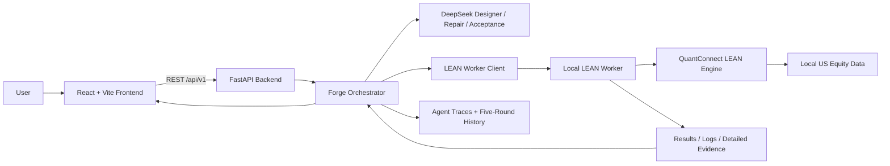

# AlphaForge Project Architecture and AI Agent Design

> English version | 中文版：[PROJECT_ARCHITECTURE_zh.md](PROJECT_ARCHITECTURE_zh.md)

## 1. Project Positioning

AlphaForge is a local web platform for financial AI education and strategy
experimentation. A user creates a Human Strategy under a shared Experiment Contract.
The system runs four public baselines and asks three independent DeepSeek-powered
Designers to create Traditional, Machine Learning, and Hybrid candidates. Every strategy
must then execute inside the same QuantConnect LEAN environment before an independent
Acceptance Agent audits whether its behavior matches its declared track. Deterministic
Backend guards cover report coherence and hard A1/A5 facts.

The objective is not to let a language model announce that it has found an “optimal
strategy.” AlphaForge builds an auditable process:

1. freeze public experiment conditions;
2. generate a structured strategy design and complete source code;
3. apply narrow syntax and dangerous-capability preflight;
4. execute it in LEAN;
5. derive evidence from the real run;
6. repair failures under a bounded revision budget;
7. compare return, risk, cost, and robustness;
8. explain why results differ and what the user should test next.

Historical backtests are educational evidence, not investment advice or a guarantee of
future returns.

## 2. High-Level Architecture

The application contains three Docker services:

| Service | Default local port | Responsibility |
|---|---:|---|
| Frontend | `8501` | Experiment creation, AI Forge, results, learning, robustness, and PK history |
| Backend | `8000` | Request validation, orchestration, acceptance guards, and analysis |
| LEAN Worker | `18081` | Job management, local LEAN execution, logs, summaries, and detailed evidence |

The frontend reaches the Backend through a Vite proxy. The Backend calls the Worker over
the internal Docker network. The LEAN Worker binds to `127.0.0.1` and protects job
endpoints with a local token.

## 3. Technology Stack

### 3.1 Frontend

- React 18
- Vite 6
- Recharts for equity, drawdown, and metric visualizations
- Lucide React for icons
- Vitest, Testing Library, and jsdom for component testing
- Native Fetch API for FastAPI requests

### 3.2 Backend and Agents

- Python 3.11
- FastAPI and Uvicorn
- Pydantic v2 for requests, the Experiment Contract, and parameter boundaries
- OpenAI Python SDK for DeepSeek through an OpenAI-compatible API
- Requests for Backend-to-Worker communication
- Python `ast` for static checks and semantic hashes
- `ThreadPoolExecutor` for three parallel Designer requests

### 3.3 Backtesting Runtime

- QuantConnect LEAN built from a pinned Git commit
- .NET 10 Runtime
- Python 3.11.11
- NumPy, Pandas, and SciPy
- scikit-learn, XGBoost, and LightGBM
- Local US equity daily data, with a Tiingo-based preparation path
- Docker `linux/amd64` to reduce Windows/macOS host differences

### 3.4 Engineering and Deployment

- Docker Compose
- Pinned Python dependencies and LEAN commit
- Persistent Worker jobs, results, logs, models, and data
- Persistent Backend Agent traces and five-round PK history
- Pytest and Vitest

## 4. Main Code Modules

| Path | Responsibility |
|---|---|
| `frontend/` | React single-page application and user workspaces |
| `backend/app/main.py` | FastAPI entry point and REST endpoints |
| `backend/app/services/baseline_service.py` | Forge orchestration, analysis, history, and robustness |
| `backend/app/services/acceptance_policy.py` | Acceptance JSON-envelope normalization |
| `agent/designer.py` | Designs and complete source for three AI tracks |
| `agent/repair.py` | Repairs code from static, LEAN, and acceptance evidence |
| `agent/acceptance.py` | Independently audits A1–A5 and decides accept/revise |
| `agent/validation.py` | Narrow syntax and dangerous-capability preflight |
| `agent/prompts.py` | Versioned capability contract, recipes, and output protocol |
| `lean_worker/app/` | Worker HTTP service, job management, and data status |
| `lean_worker/worker/` | LEAN launch, result parsing, and runtime file management |
| `lean_worker/runtime_support/alphaforge_base.py` | Shared execution and evidence base class |
| `lean_worker/strategies/` | Four public baselines and their registry |

## 5. Experiment Contract

Every comparable strategy in one Forge Run shares:

- 5–30 stocks selected from a fixed 30-stock whitelist;
- start and end dates;
- initial cash;
- benchmark;
- transaction fees;
- slippage.

Signals, models, features, rebalance cadence, Top K, weighting, and risk controls remain
part of each strategy design. The benchmark is not a candidate stock and cannot be
traded as an ordinary portfolio asset.

The four public baselines are:

1. Momentum Rank;
2. Mean Reversion;
3. Gradient Boosting;
4. Hybrid ML + Minimum Variance.

Human and AI strategies must use the same market, capital, and execution assumptions for
the comparison to be meaningful.

## 6. End-to-End Workflow

### 6.1 Create the Human Strategy

The user can choose:

- Guided Mode: select signal, lookback, rebalance cadence, and number of holdings;
- Complete Python Code: start from a runnable template and edit the full
  `UserStrategy`.

The Backend validates public settings such as stocks, benchmark, dates, and capital.
The Human Strategy is sent to the same LEAN Worker. Its code and results are never sent
to an AI Agent.

### 6.2 Run Four Public Baselines

The Backend runs four registered baselines under the shared settings and collects:

- CAGR, Sharpe, maximum drawdown, and ending equity;
- Sortino, annualized volatility, and total return;
- turnover, fees, and filled orders;
- equity, benchmark, and drawdown curves;
- rebalance, exposure, model-training, and prediction evidence.

This public evidence becomes the Designer reference. Human code and results are excluded.

### 6.3 Generate Three AI Candidates in Parallel

Traditional, ML, and Hybrid Designer API requests start in parallel. Each Designer
returns:

- a structured `design`;
- complete `source_code`;
- named baseline references;
- a falsifiable improvement hypothesis;
- two bounded differences from the anchor;
- expected benefits and trade-offs.

The current approach is a minimal-delta challenger: preserve a mechanism demonstrated
by a strong same-track baseline and change only two dimensions instead of replacing the
model, signal, horizon, Top K, weighting, and cadence at once.

### 6.4 Narrow Static Preflight

Before LEAN submission, the validator checks only:

- valid Python syntax;
- valid Python syntax;
- `open`, `exec`, and clear file, network, or subprocess capabilities.

The report still includes source and AST semantic SHA-256 values, but keyword checks do
not replace LEAN executability or the Acceptance Agent's causal and track judgment.

### 6.5 LEAN Backtest

The Worker creates an isolated job directory, places candidate source and
`alphaforge_base.py` into the LEAN project, and launches the local LEAN engine.

The shared base class only:

- provides fee, slippage, leverage, and benchmark helpers;
- tracks allowed stocks;
- records orders, fills, positions, exposure, signals, training, predictions, and
  rebalance events;
- writes `alphaforge_details.json`.

Strategies use the standard QuantConnect lifecycle and standard order APIs. A Daily
basket that depends on proceeds from reductions may opt into
`af_rebalance_daily_weights`; the base imposes no cash buffer, gross-exposure cap, or
mandatory execution path. The Worker instruments callbacks only in the job copy.

The Worker returns a normal summary, the complete console log, and structured details.
The Backend determines whether trading occurred from Worker facts, not Agent prose.

### 6.6 Acceptance and Repair Loop

After a completed run, the independent Acceptance Agent audits the evidence and owns the
semantic decision:

| Check | Purpose |
|---|---|
| A1 | Filled orders, real holdings, and positive exposure |
| A2 | Connected market-data → signal/feature → model/prediction → rank → target/order → fill path |
| A3 | Runtime behavior matches the declared Traditional, ML, or Hybrid track |
| A4 | Time integrity and training-before-prediction evidence |
| A5 | Shared settings and the permitted stock universe are respected |

The Agent returns A1–A5, `decision`, and `repair_request`. The Backend checks report
coherence and enforces A1 activity facts and A5 traded-universe facts, but does not
generate or overwrite A2–A4.

When narrow preflight, LEAN, or Acceptance revise occurs, the Repair Agent receives:

- the complete submitted source;
- exact static diagnostics or LEAN errors;
- failed orders and related OrderEvents;
- the last portfolio snapshot before failure;
- the first interrupted causal stage;
- existing valid training, prediction, target, and fill facts;
- the current CandidateDesign.

Worker failures never call Acceptance and still enter Repair when details are
unavailable. Runtime failures and Acceptance revise share at most three source changes,
and every change reruns Worker. Acceptance API/format retries do not consume that source
budget.

## 7. How AlphaForge Improves LEAN Pass Probability

The system uses layered controls instead of trying to enumerate every possible error in
one prompt.

### 7.1 Bounded Capability Contract

Prompts expose only LEAN APIs, models, signals, rebalance frequencies, lookbacks, label
horizons, Top K values, and weighting methods that the project supports. The Agent does
not need to guess across the entire LEAN API surface.

### 7.2 Runnable Template

Designer and Repair share one AlphaForge LEAN template containing:

- parameter mapping;
- stock and benchmark configuration;
- valid Schedule patterns;
- supported `History` and `af_split_history_frames` forms;
- real `af_record_*` signatures;
- standard order APIs and the boundary for optional `af_rebalance_daily_weights`.

### 7.3 JSON and Semantic Retry

- Empty or invalid JSON is retried once by the client.
- Parseable JSON with invalid fields or incomplete source is regenerated once with the
  exact validation error.
- Lossless scalar/string-list shapes are normalized before another model call.
- A Repair response with unchanged source, missing change summary, or missing interrupted
  stage receives one semantic retry.
- JSON and semantic retries share one two-call model budget and cannot multiply to four.
- Authentication, network, and configuration failures are not retried blindly.

### 7.4 History Cardinality and Time Integrity

ML and Hybrid strategies must account for row losses from `pct_change`, rolling windows,
shift, and `dropna`, ensuring the History request exceeds the true minimum training
cardinality. Training and inference feature orders must match. Labels may represent
future returns, but future labels cannot be filled back into current features.

### 7.5 Real Runtime Evidence

A model name in source does not prove that a model ran. AlphaForge separately records:

- `ml_training_run_count`;
- `ml_prediction_count`;
- `transparent_signal_event_count`;
- prediction/signal-to-target or order evidence;
- `staged_rebalance_completed_count`;
- `filled_order_count`.

For example, predictions and fills with zero training runs produce
`PREDICTIONS_WITHOUT_TRAINING`; fallback returns cannot qualify as valid ML or Hybrid
evidence.

### 7.6 Revision Effectiveness and Regression Protection

The Backend compares semantic source hashes, runtime behavior, metrics, and resolved
checks, then supplies that information and the prior Acceptance report to the independent
Agent. It is explanatory evidence; the Backend does not rewrite A2–A4.

If a later Repair regresses to zero activity, the system retains the best prior runnable
`best_observed_attempt` for audit and display while keeping the truthful Rejected state.

These controls improve executability, auditability, and stability. They do not guarantee
that an AI candidate will outperform a baseline.

## 8. Results, Scoring, and Robustness

### 8.1 Results

The Results workspace presents:

- strategy status and revision count;
- CAGR, Sharpe, maximum drawdown, and ending equity;
- portfolio and benchmark curves;
- drawdown curves;
- volatility, Sortino, turnover, fees, and execution evidence;
- the deterministic Battle Judge;
- acceptance and revision history.

The Battle Judge uses public fixed weights for risk-adjusted return, drawdown/volatility,
robustness, cost/turnover, and explainability. An LLM does not determine the winner.

### 8.2 Robustness Lab

Robustness testing is an optional workflow, separate from the normal Forge Run. It
freezes either the best accepted AI source or the Human source and runs:

1. a recent-regime slice;
2. delayed-start sensitivity;
3. double-friction stress;
4. deterministic universe dropout when more than five stocks are available.

`deterministic-robustness-v1` checks completion, real activity, CAGR retention, positive
Sharpe, and a drawdown ceiling, then returns Robust, Mixed, Fragile, or Insufficient.

This is a pseudo-out-of-sample stress battery, not a strict blind test. See
[ROBUSTNESS_TESTING_V1_zh.md](ROBUSTNESS_TESTING_V1_zh.md) for the current detailed
protocol.

## 9. User-Facing Features

| Workspace | Function |
|---|---|
| Build | Select 5–30 stocks, dates, costs, and a Human strategy |
| AI Forge | Inspect candidate designs, baseline hypotheses, preflight, tokens, and repairs |
| Results | Review statistics, curves, risk/cost evidence, verdict, and audit history |
| Robustness | Run independent stress tests on frozen source |
| Learning | Read best-strategy explanations, trade-offs, next-step guidance, metric lessons, and Baseline Classroom |
| PK Arena | Review up to five Human-vs-AI rounds and their revisions |
| Strategy Code | Inspect the complete Human and AI source actually submitted |

## 10. Educational Value

AlphaForge turns “generate plausible strategy code” into a complete learning process.

### 10.1 Fair Experiments

Users see why all strategies must share the stock universe, period, capital, benchmark,
fees, and slippage, and why changing these conditions breaks comparability.

### 10.2 Return Versus Strategy Quality

High CAGR does not automatically mean a better strategy. Users inspect Sharpe, Sortino,
volatility, maximum drawdown, turnover, and fees to understand the return path and
execution cost.

### 10.3 The Causal Chain

An AI cannot merely claim to use machine learning in source. AlphaForge requires runtime
training, prediction, ranking, target, and fill evidence, teaching that model presence,
model participation, and real trading are separate facts.

### 10.4 Baselines and Controlled Improvement

Baseline Classroom explains the intuition, strengths, and limitations of Momentum, Mean
Reversion, Gradient Boosting, and Hybrid strategies. Every AI candidate states what
strength it preserves, what it changes, and what trade-off it may introduce.

### 10.5 Overfitting Awareness

Learning and Robustness emphasize that:

- repeated revisions on one period may fit historical noise;
- greater model complexity does not guarantee better performance;
- changes in cost, start date, or stock universe may remove an apparent advantage;
- strong conclusions still require a Final Blind Challenge unseen by the design process.

## 11. Information Boundaries, Persistence, and Reproducibility

### Information Boundary

- Designer, Repair, and Acceptance can see public settings, public baselines, and their
  own candidate evidence.
- Human source, settings, results, and educational output are excluded from AI context.
- The frontend explicitly states `User Strategy Hidden From AI`.

### Persistence

- Worker jobs, results, logs, and models are stored under `lean_worker/workspace/`.
- Agent call traces are stored under `backend/workspace/forge_traces/`.
- The latest five lightweight PK records are stored under
  `backend/workspace/run_history/`.
- Active ordinary Run state is currently held mainly in Backend process memory.

### Reproducibility

- The LEAN commit, runtime image, and Python dependencies are pinned.
- `PYTHONHASHSEED=0`, and numeric library thread counts are fixed to one.
- ML recipes require deterministic random seeds.
- The Experiment Contract, full source, Worker Run ID, and Agent Trace are auditable.

## 12. Current Boundaries and Future Evolution

The course demonstration path is implemented, while the following remain future
extensions:

- a production relational database and long-term StrategyVersion lineage;
- independent users, permissions, and team collaboration;
- a truly unseen Final Blind Challenge;
- broader walk-forward evaluation with data-leakage controls;
- a deterministic CandidateDesign-to-LEAN compiler;
- a job queue, multiple Workers, and production monitoring.

The most accurate current description of AlphaForge is a runnable, explainable, and
auditable prototype for AI-assisted financial strategy education and experimentation.
