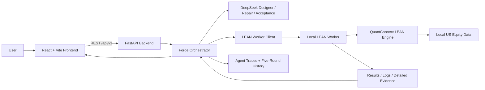

# AlphaForge 项目架构与 AI Agent 设计说明

> 中文版｜English version: [PROJECT_ARCHITECTURE_en.md](PROJECT_ARCHITECTURE_en.md)

## 1. 项目定位

AlphaForge 是一个面向金融 AI 教学与策略实验的本地 Web 平台。用户在统一的
Experiment Contract 下创建 Human Strategy；系统同时运行四个公共基线，并由
DeepSeek 驱动三个相互独立的 AI Designer 生成 Traditional、Machine Learning 和
Hybrid 策略。所有策略最终都必须进入同一个 QuantConnect LEAN 环境完成真实回测，
再以确定性规则判断代码是否真正执行、是否属于声明的策略轨道，以及结果是否可以
比较。

项目的重点不是让大模型直接宣称“找到最优策略”，而是建立一条可以审计的流程：

1. 冻结公共实验条件；
2. 生成结构化策略设计与完整代码；
3. 确定性检查代码；
4. 在 LEAN 中执行；
5. 从真实运行结果建立证据；
6. 修复失败代码但限制修改次数；
7. 比较收益、风险、成本和鲁棒性；
8. 向用户解释为什么结果不同，以及下一步应该验证什么。

历史回测仅用于课程实验和教育，不构成投资建议，也不保证未来收益。

## 2. 总体架构

系统由三个 Docker 服务组成：

| 服务 | 默认本地端口 | 主要职责 |
|---|---:|---|
| Frontend | `8501` | 创建实验、显示 AI Forge、结果、教学、鲁棒性和 PK 历史 |
| Backend | `8000` | 校验请求、编排 Agent 与 Worker、确定性验收和结果分析 |
| LEAN Worker | `18081` | 管理策略任务、调用本地 LEAN、输出日志、摘要和详细证据 |

Frontend 通过 Vite Proxy 访问 Backend。Backend 通过 Docker 内部网络调用 Worker。
LEAN Worker 绑定在 `127.0.0.1`，并使用本地 Token 保护任务接口。

## 3. 技术栈

### 3.1 前端

- React 18
- Vite 6
- Recharts：资产曲线、回撤曲线和指标图表
- Lucide React：界面图标
- Vitest、Testing Library、jsdom：组件测试
- 原生 Fetch API：访问 FastAPI

### 3.2 Backend 与 Agent

- Python 3.11
- FastAPI、Uvicorn
- Pydantic v2：请求、Experiment Contract 和参数边界
- OpenAI Python SDK：使用 OpenAI-compatible API 调用 DeepSeek
- Requests：Backend 与 LEAN Worker 通信
- Python `ast`：静态代码检查与语义哈希
- `ThreadPoolExecutor`：并行发起三个 Designer 请求

### 3.3 回测运行环境

- QuantConnect LEAN，固定 Git Commit 构建
- .NET 10 Runtime
- Python 3.11.11
- NumPy、Pandas、SciPy
- scikit-learn、XGBoost、LightGBM
- 本地美国股票日线数据，可通过 Tiingo 数据流程准备
- Docker `linux/amd64`：减少 Windows/macOS 主机差异

### 3.4 工程与部署

- Docker Compose
- 固定 Python 依赖版本与 LEAN Commit
- 持久化 Worker 任务、结果、日志、模型和数据目录
- Backend Agent Trace 与五轮 PK History 持久化
- Pytest、Vitest

## 4. 核心代码模块

| 目录 | 作用 |
|---|---|
| `frontend/` | React 单页应用与全部用户工作区 |
| `backend/app/main.py` | FastAPI 入口和 REST API |
| `backend/app/services/baseline_service.py` | Forge 主编排、分析、历史与鲁棒性 |
| `backend/app/services/acceptance_policy.py` | Backend 权威 A1–A5 验收规则 |
| `agent/designer.py` | 三条 AI 策略的设计与完整代码生成 |
| `agent/repair.py` | 基于静态诊断、LEAN 错误和验收事实修复代码 |
| `agent/acceptance.py` | 对运行证据进行解释并给出 advisory |
| `agent/validation.py` | AST 安全、API、轨道和共享参数预检 |
| `agent/prompts.py` | 版本化能力契约、策略配方和输出协议 |
| `lean_worker/app/` | Worker HTTP 服务、任务管理和数据状态 |
| `lean_worker/worker/` | LEAN 启动、结果解析和运行文件管理 |
| `lean_worker/runtime_support/alphaforge_base.py` | 统一交易执行与证据记录基类 |
| `lean_worker/strategies/` | 四个公共基线和策略注册表 |

## 5. Experiment Contract

一轮 Forge Run 中，所有可比较策略共享：

- 5–30 只股票，来自固定 30 股票白名单；
- 开始日期与结束日期；
- 初始资金；
- Benchmark；
- 交易费用；
- 滑点。

股票调仓频率、信号、模型、特征、Top K、权重方法和风险控制属于策略自身设计。
Benchmark 不属于候选股票，不能作为普通资产买入。

四个公共基线为：

1. Momentum Rank；
2. Mean Reversion；
3. Gradient Boosting；
4. Hybrid ML + Minimum Variance。

Human 和 AI 策略必须使用相同市场、资金和交易成本条件，否则比较没有意义。

## 6. 端到端运行流程

### 6.1 创建 Human Strategy

用户可以选择：

- Guided Mode：选择信号、Lookback、调仓周期和持仓数量；
- Complete Python Code：从可运行模板开始编写完整 `UserStrategy`。

Backend 验证股票、Benchmark、日期和资金等公共设置。Human 策略直接进入同一个
LEAN Worker，结果不会发送给任何 AI Agent。

### 6.2 运行四个公共基线

Backend 按统一参数运行四个注册基线，收集：

- CAGR、Sharpe、最大回撤、期末资产；
- Sortino、年化波动和总收益；
- 换手率、费用、成交数量；
- 资产曲线、Benchmark 曲线和回撤曲线；
- 调仓、敞口、模型训练和预测证据。

这些公共信息构成 Designer 的基线参考。Human 代码和结果不在其中。

### 6.3 并行生成三个 AI 候选

Traditional、ML、Hybrid 三个 Designer API 请求并行发出。Designer 输出：

- 结构化 `design`；
- 完整 `source_code`；
- 参考基线；
- 可证伪的改进假设；
- 与基线的两个有界差异；
- 预期收益与代价。

当前采用 minimal-delta challenger：优先保留同轨道强基线已经证明有效的机制，
只改变两个维度，避免一次重写模型、信号、期限、Top K、权重和调仓频率。

### 6.4 确定性静态预检

AI 代码不会直接交给 LEAN。AST Validator 首先检查：

- Python 是否可解析；
- 是否存在 `UserStrategy`；
- 是否继承 `AlphaForgeBaseAlgorithm`；
- 是否使用允许的 Import；
- 是否调用 `open`、`exec`、网络、子进程等禁止能力；
- 是否覆盖基类保留的 `af_*` 方法；
- 七项共享设置是否被读取；
- 是否绕过 `af_rebalance_to_weights`；
- History DataFrame 用法是否属于支持形式；
- ML 标签是否存在明显前视填充；
- Traditional、ML、Hybrid 是否满足各自轨道能力。

预检输出源码 SHA-256、AST 语义 SHA-256 和结构化诊断。只有通过后才提交 Worker。

### 6.5 LEAN 回测

Worker 为每个任务创建隔离目录，将候选源码与
`alphaforge_base.py` 放入 LEAN 项目，再启动本地 LEAN Launcher。

共享基类负责：

- 统一费用、滑点、杠杆和 Benchmark；
- 追踪允许股票；
- 分阶段执行目标权重，先卖后买；
- 保留现金缓冲；
- 记录订单、成交、持仓、敞口、信号、训练、预测和调仓事件；
- 输出 `alphaforge_details.json`。

Worker 返回普通摘要、完整控制台日志和结构化明细。Backend 不依据 Agent 的文字
判断“是否交易”，而依据 Worker 事实判断。

### 6.6 Acceptance 与 Repair 闭环

运行完成后，Acceptance Agent 解释证据；最终结论由 Backend 决定：

| 检查 | 目的 |
|---|---|
| A1 | 是否有成交、实际持仓和正敞口 |
| A2 | 市场数据→信号/特征→模型/预测→排名→目标→完成调仓→成交是否连通 |
| A3 | 实际行为是否符合 Traditional、ML 或 Hybrid 声明 |
| A4 | 是否存在时间完整性和训练先于预测的证据 |
| A5 | 是否使用共享设置且未交易白名单外股票或 Benchmark |

Agent 只能提供 `agent_advisory`。`decision`、A1–A5 和权威
`repair_request` 由 `deterministic-acceptance-v2` 生成。

若静态预检、LEAN 执行或 Acceptance 失败，Repair Agent 会收到：

- 原始完整源码；
- 精确静态诊断或 LEAN 错误；
- 失败订单与 OrderEvent；
- 失败前组合快照；
- 首个缺失因果阶段；
- 已存在的有效训练、预测、目标和成交事实；
- 当前 CandidateDesign。

每个候选最多修复三次。每次必须返回完整代码，不能只返回 Patch。

## 7. 如何提高 AI 代码通过 LEAN 的概率

系统使用多层防线，而不是尝试在 Prompt 中枚举所有错误。

### 7.1 有界能力契约

Prompt 只开放项目实际支持的 LEAN API、模型、信号、调仓频率、Lookback、Label
Horizon、Top K 和权重方法。Agent 不需要在完整 LEAN API 空间中自由猜测。

### 7.2 可运行模板

Designer 和 Repair 都获得同一份 AlphaForge LEAN 模板，包含：

- 参数读取；
- 股票与 Benchmark 配置；
- 正确的 Schedule 形式；
- `History` 和 `af_split_history_frames` 用法；
- `af_record_*` 的真实函数签名；
- `af_rebalance_to_weights` 调用方式。

### 7.3 JSON 与语义重试

- 空响应或无效 JSON：客户端自动重试一次；
- JSON 可解析但字段或完整源码不合法：携带精确错误再生成一次；
- scalar 与单元素字符串列表等无损形态先规范化，不浪费模型调用；
- Repair 返回原源码、缺失变更摘要或缺失中断阶段时进行一次语义重试；
- 网络、鉴权和配置错误不会盲目重试。

### 7.4 History 行数与时间完整性

ML/Hybrid 必须计算 `pct_change`、rolling、shift 和 `dropna` 的行数损失，保证
History 请求大于实际最小训练行数。训练特征顺序与预测特征顺序必须一致；标签必须
来自未来收益，但不能把未来标签填回当前特征。

### 7.5 真实运行证据

仅仅在源码中出现模型不代表模型真的运行。系统分别记录：

- `ml_training_run_count`
- `ml_prediction_count`
- `transparent_signal_event_count`
- prediction/signal 与 target 的同时间连接
- `staged_rebalance_completed_count`
- `filled_order_count`

例如，有预测和成交但训练次数为零，会分类为
`PREDICTIONS_WITHOUT_TRAINING`，不能把 fallback 收益当成有效 ML/Hybrid。

### 7.6 修订有效性与防退化

Backend 比较前后源码语义哈希、行为事实、指标和已解决检查。只有注释变化或没有
解决失败阶段的修订不会被视为有效。

如果后续 Repair 退化为零交易，系统保留此前有成交且指标最好的
`best_observed_attempt` 用于审计和展示，但候选仍保持 Rejected，不能伪装成通过。

这些机制提高的是可运行性、可审计性和稳定性，不能保证 AI 策略一定战胜基线。

## 8. 结果、评分与鲁棒性

### 8.1 Results

Results 页面展示：

- 策略状态与修订次数；
- CAGR、Sharpe、最大回撤和期末资产；
- 总资产与 Benchmark 曲线；
- 回撤曲线；
- 波动、Sortino、换手、费用和执行证据；
- Backend 确定性 Battle Judge；
- 每次验收和修订历史。

Battle Judge 使用公开固定权重比较风险调整收益、回撤/波动、稳健性、成本/换手和
可解释性。LLM 不决定最终胜负。

### 8.2 Robustness Lab

鲁棒性测试是独立、按需触发的额外流程，不拖慢普通 Forge Run。用户可以冻结最佳
已接受 AI 或 Human 源码，再执行：

1. Recent-regime slice；
2. Delayed-start sensitivity；
3. Double-friction stress；
4. 股票数大于 5 时的 deterministic universe dropout。

`deterministic-robustness-v1` 检查场景是否完成、是否仍有真实交易、CAGR 是否
保留、Sharpe 是否为正以及回撤是否超过压力上限，并输出 Robust、Mixed、Fragile
或 Insufficient。

这是 pseudo-out-of-sample 压力测试，不是严格盲测。完整规则见
[ROBUSTNESS_TESTING_V1_zh.md](ROBUSTNESS_TESTING_V1_zh.md)。

## 9. 用户功能

| 页面 | 功能 |
|---|---|
| Build | 选择 5–30 只股票、日期、成本和 Human 策略 |
| AI Forge | 查看三个候选的设计、基线假设、预检、Token 和修复状态 |
| Results | 查看统计、曲线、风险成本、确定性胜负和审计历史 |
| Robustness | 对冻结策略运行独立压力测试 |
| Learning | 查看最优策略解释、代价、改进建议、指标知识和 Baseline Classroom |
| PK Arena | 最多查看五轮 Human vs AI 比赛与修订过程 |
| Strategy Code | 查看本轮实际提交的完整 Human 和 AI 源码 |

## 10. 用户教育意义

AlphaForge 把“生成一段看起来合理的策略代码”转化为完整学习过程。

### 10.1 理解公平实验

用户可以看到为什么所有策略必须共享股票集合、日期、资金、Benchmark、费用和
滑点，以及改变实验条件会如何破坏比较。

### 10.2 区分收益与质量

高 CAGR 不一定意味着更好的策略。用户同时观察 Sharpe、Sortino、波动、最大回撤、
换手和费用，理解收益路径与交易代价。

### 10.3 理解因果链

AI 不能只在源码里声明“使用机器学习”。系统要求训练、预测、排名、目标和成交的
运行证据，帮助用户认识模型存在、模型参与决策和策略真正交易是三件不同的事。

### 10.4 学习基线与改进

Baseline Classroom 解释 Momentum、Mean Reversion、Gradient Boosting 和 Hybrid
的经济直觉、优点和局限。AI 候选必须说明保留了哪个强项、修改了什么，以及可能
付出什么代价。

### 10.5 建立不过拟合意识

Learning 和 Robustness 页面提醒用户：

- 同一区间上反复修订可能只是适应历史噪声；
- 更复杂的模型不自动带来更好结果；
- 费用、开始日期和股票集合变化可能让优势消失；
- 严格结论仍需要未参与设计的 Final Blind Challenge。

## 11. 信息边界、持久化与可复现性

### 信息边界

- Designer、Repair、Acceptance 只能访问公共设置、公共基线和自己的候选证据；
- Human 源码、设置、结果和教学输出不会进入 AI 上下文；
- 前端明确显示 `User Strategy Hidden From AI`。

### 持久化

- Worker 任务、结果、日志和模型保存在 `lean_worker/workspace/`；
- Agent 调用 Trace 保存在 `backend/workspace/forge_traces/`；
- 最近五轮轻量 PK History 保存在 `backend/workspace/run_history/`；
- 普通活动 Run 状态当前仍主要保存在 Backend 进程内存。

### 可复现性

- LEAN Commit、运行镜像和 Python 依赖固定；
- `PYTHONHASHSEED=0`，数值库线程数固定为 1；
- ML 配方要求固定随机种子；
- Experiment Contract、策略源码、Worker Run ID 和 Agent Trace 可审计。

## 12. 当前边界与后续演进

当前已经实现完整课程演示主线，但以下内容仍属于未来扩展：

- 正式关系数据库和长期 StrategyVersion Lineage；
- 独立用户、权限和团队协作；
- 真正未泄露给设计过程的 Final Blind Challenge；
- 更大规模但防止数据窥探的 Walk-forward Evaluation；
- 确定性的 CandidateDesign → LEAN 编译器；
- 任务队列、多 Worker 并行与生产级监控。

因此，AlphaForge 当前最准确的定位是：一个可运行、可解释、可审计的 AI 金融策略
教学与实验平台原型。
