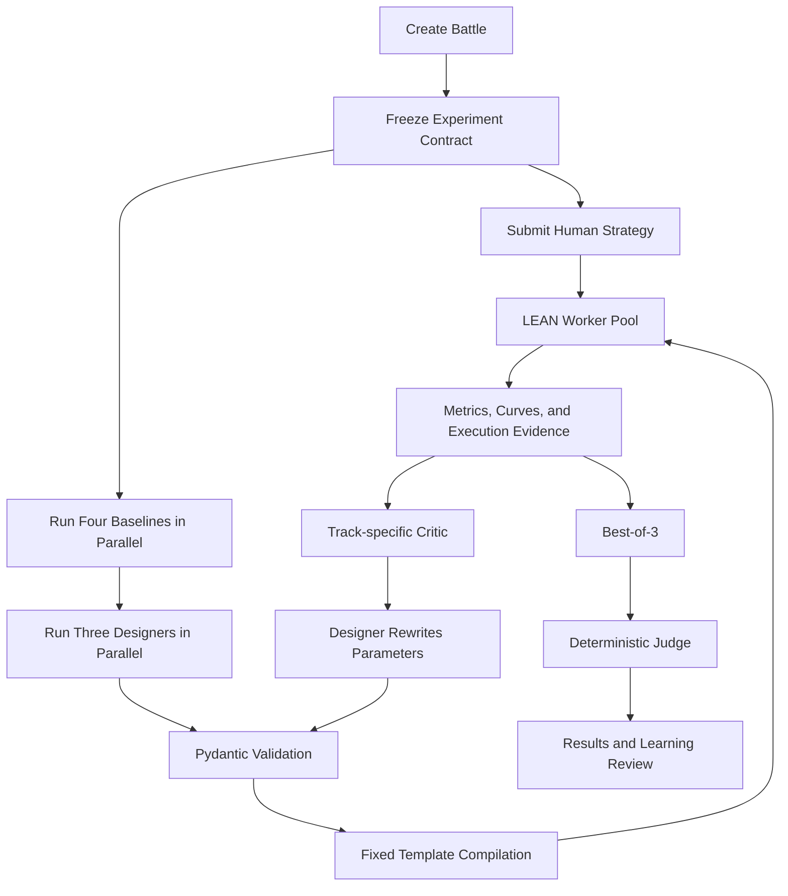
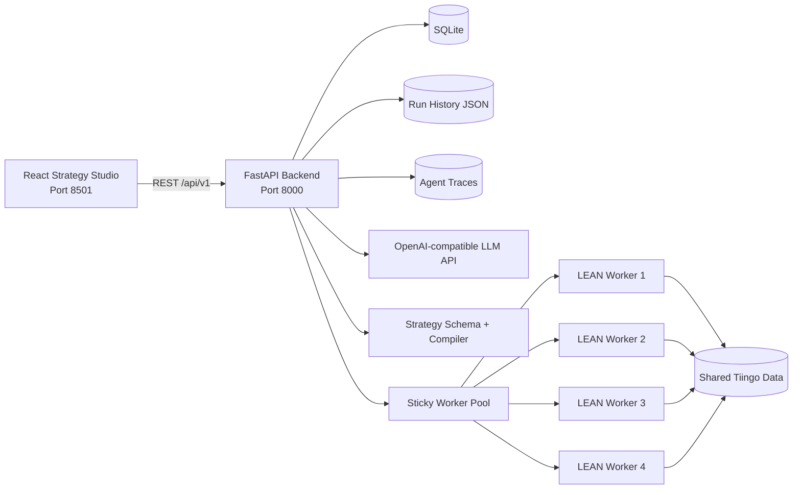

# AlphaForge Project Introduction

> **Project:** AlphaForge
> **Positioning:** A risk-aware, auditable, education-first Human-vs-AI quantitative strategy experimentation arena
> **Course:** SWS3022 — AI/ML in Financial Services
> **Current form:** A locally deployable course MVP orchestrated with Docker Compose
> **Audience:** Instructors, students, reviewers, technical collaborators, and open-source visitors
> **Risk disclaimer:** AlphaForge is for coursework, research, and financial education only. It does not provide investment advice, and historical backtests do not guarantee future performance.

---

## 1. Executive Overview

AlphaForge does not merely ask an LLM to produce a trading strategy with an attractive historical return. It addresses a more fundamental question:

> **How can Human and AI participants design quantitative strategies under fair, consistent, executable, and reproducible conditions, and turn real backtest evidence into financial learning?**

A user can build a strategy through a guided interface or submit complete QuantConnect/LEAN Python. Independently, AI develops candidates along three tracks: Traditional, Machine Learning, and Hybrid. Before the results are frozen, the AI is not allowed to inspect the Human strategy, parameters, metrics, orders, or personalized recommendations.

The Human strategy, three AI candidates, and four public baselines all run under the same frozen experiment contract and are executed by QuantConnect LEAN. An explicit deterministic judge—not an LLM—calculates the official risk-aware score. AI Forge, Learning Review, PK Arena, and Robustness Lab then explain what changed, what improved, what remained fragile, and what should be tested next.

The complete loop is:

```text
Independent strategy design
          ↓
Structured strategy parameters
          ↓
Constrained template compilation
          ↓
Real LEAN backtest
          ↓
Evidence-based Critic review
          ↓
Bounded parameter iteration
          ↓
Deterministic selection and champion retention
          ↓
Education, robustness analysis, and the next round
```

---

## 2. Course Context and Project Positioning

The SWS3022 project requires each team to design, implement, and evaluate an innovative AI-powered financial application that addresses a real financial-services problem. It evaluates more than programming:

- financial-domain knowledge;
- AI/ML methodology;
- software engineering and full-stack delivery;
- research and innovation;
- user-experience design;
- experimental evaluation;
- professional presentation.

The 100-point rubric is:

| Assessment category | Marks |
|---|---:|
| Problem Significance | 10 |
| Literature Review | 15 |
| Innovation & Originality | 20 |
| AI/ML Methodology | 15 |
| Technical Implementation | 15 |
| Frontend & User Experience | 10 |
| Experimental Evaluation | 10 |
| Presentation & Demonstration | 5 |

The course also identifies Multi-Agent AI, Explainable AI, Serious Games, Financial Education, Docker, GitHub, User Studies, cloud deployment, and open-source release as potential bonus directions.

AlphaForge spans three project categories:

1. **AI decision support:** comparing, refining, and reviewing quantitative strategies;
2. **Financial education:** teaching Sharpe ratio, CAGR, drawdown, turnover, costs, and overfitting;
3. **Serious game:** organizing Human-vs-AI strategy development as a best-of-five learning match.

Its research contribution is therefore an integrated and auditable workflow, rather than a claim that it has invented a universally superior return-prediction model.

---

## 3. Background

### 3.1 Generative AI lowers the entry barrier but introduces reliability problems

An LLM can quickly propose trading logic or write Python. A financial strategy, however, must correctly handle:

- temporal ordering and look-ahead leakage;
- historical-data windows;
- model training and inference;
- rebalance scheduling;
- position and risk constraints;
- transaction costs and slippage;
- QuantConnect/LEAN APIs;
- runtime failures;
- reproducibility.

Free-form code generation expands both the expressive space and the failure surface. A plausible answer may still contain invalid APIs, incorrect scheduling, unavailable data, or a mechanism that never actually executes.

### 3.2 Learners often mistake high return for strategy quality

New learners typically notice ending equity or CAGR first, while overlooking:

- whether the Sharpe ratio compensates for volatility;
- whether maximum drawdown is tolerable;
- whether the strategy trades excessively;
- whether fees and slippage erase the advantage;
- whether performance depends on one market regime;
- whether repeated testing has created backtest selection bias.

A high-CAGR strategy with severe drawdown or extreme parameter sensitivity may be less useful than a more stable strategy with a lower raw return.

### 3.3 Human-vs-AI comparisons often lack a fair information boundary

If the AI can read a Human strategy or its results before designing its response, an “AI victory” has weak experimental meaning. A fair comparison requires:

- independent Human and AI development;
- the same universe and dates;
- the same capital, benchmark, fees, and slippage;
- the same backtest engine;
- result comparison only after both sides are frozen;
- a public and deterministic judging rule.

### 3.4 Execution, comparison, and education are usually disconnected

Some tools backtest, others generate strategies, and others teach financial concepts. A learner needs the complete causal chain:

```text
What did I design?
→ What did the engine execute?
→ Why did this result occur?
→ What did the AI change?
→ Did risk improve as well?
→ What should be tested next?
```

AlphaForge is designed to connect these steps.

---

## 4. Problem Definition

### 4.1 Core problem

> Existing financial agents, backtesting tools, and educational platforms lack a unified workflow that is fair, reliable, executable, explainable, and reviewable.

### 4.2 Specific pain points

| Pain point | Common weakness | AlphaForge response |
|---|---|---|
| Unstable AI code | The LLM generates large LEAN programs with format, API, and runtime errors | The Agent returns parameters; a fixed template produces code |
| Unfair comparison | AI can optimize after observing the Human solution | Backend DTOs and allowlisted contexts enforce isolation |
| Inconsistent experiments | Strategies use different universes, periods, or costs | Frozen Experiment Contract |
| Return-only thinking | Risk, volatility, and trading friction are ignored | Risk-aware deterministic score |
| Subjective LLM judge | Results can change with prompting | Code calculates official metrics and winners |
| Iterative degradation | The last revision is not necessarily the best | Best-of-3 and cross-round champion retention |
| Poor auditability | It is unclear what the AI saw and what actually ran | Specs, code, hashes, traces, Run IDs, and evidence |
| Weak next-step guidance | Metrics are displayed without actionable learning | Learning Review and bounded parameter suggestions |
| Overfitting risk | Only the best historical result is shown | All trials, limitations, and stress scenarios are exposed |

### 4.3 Project objectives

AlphaForge aims to:

1. improve the reliability of AI strategies entering LEAN;
2. establish a fair protocol for Human, AI, and baseline comparison;
3. compare three AI strategy families under the same conditions;
4. optimize parameters through a bounded number of evidence-backed iterations;
5. preserve an auditable lineage for every candidate;
6. convert strategy evidence into understandable financial education.

### 4.4 Non-goals

The current system does not claim to:

- predict future markets reliably;
- guarantee profit;
- replace a professional adviser;
- prove that AI is always superior to Human participants;
- provide strict out-of-sample investment evidence;
- execute arbitrary user Python safely in an unrestricted environment.

---

## 5. Literature Review

### 5.1 Review method

The project uses a structured narrative review rather than claiming an exhaustive systematic review. A paper had to address at least one of:

- financial ML and strategy comparison;
- risk-aware portfolio management and backtesting;
- financial multi-agent systems;
- explainable or self-reflective LLMs;
- backtest overfitting;
- serious games and financial education.

The final review contains ten peer-reviewed papers:

- seven were published between 2023 and 2025;
- two are formal survey papers;
- venues and publishers include Oxford University Press, Springer Nature, AAAI, ACM, NeurIPS, ACL, Elsevier, and *The Journal of Computational Finance*;
- the corpus satisfies the course requirements for paper count, recent work, reputable publishers, and survey literature.

### 5.2 Six research streams

#### Financial machine learning

Gu, Kelly, and Xiu show that nonlinear and regularized methods can identify useful structures in financial predictors, while emphasizing out-of-sample economic performance rather than in-sample fit alone.

Implications for AlphaForge:

- prediction error alone is insufficient;
- evaluation should include portfolio-level Sharpe, CAGR, and drawdown;
- Traditional, ML, and Hybrid methods require a common experiment.

#### Risk-aware portfolios and backtesting

DeepTrader and the systematic review of stock-market deep learning emphasize market conditions, downside risk, maximum drawdown, transaction-sensitive evaluation, and reproducibility.

Implications:

- return cannot be the only objective;
- risk and cost assumptions must be visible;
- universe, dates, benchmark, fees, and slippage should be frozen.

#### Financial multi-agent systems

FinVision, FinCon, and QuantAgents use specialized analysts, manager-agent coordination, reflection, memory, risk control, and simulated trading. They support role specialization, but mainly study autonomous AI teams rather than an information-isolated Human-vs-AI experiment.

AlphaForge therefore separates:

- Parameter Designer;
- Performance Critic;
- Cross-round AI Coach;
- Teaching Explainer;
- backend-owned deterministic Judge.

#### Explainable and self-reflective financial LLMs

Prior work shows that LLMs can produce accessible financial narratives and use reflection to improve outputs. A readable explanation, however, is not necessarily faithful to the executed mechanism.

AlphaForge follows a strict principle:

> The LLM may explain and recommend, but it does not calculate official metrics or determine the winner.

#### Backtest overfitting

Bailey and colleagues show why selecting the best strategy from repeated trials can create a statistical mirage. A course project cannot implement every PBO procedure, but AlphaForge applies several principles:

- at most three trials per AI track;
- all trials remain visible;
- failed and degraded attempts are retained;
- Robustness Lab exposes historical sensitivity;
- Best-of-3 selection bias is explicitly disclosed;
- a strict final blind test remains future work.

#### Financial education and serious games

Randomized multi-country evidence suggests that online game-based financial education can improve short-term financial literacy. Existing studies, however, rarely connect game mechanics to real strategy execution and risk-adjusted evidence.

AlphaForge connects the match outcome to real backtests, risk explanations, and next-round parameter decisions.

### 5.3 Consolidated research gap

The literature separately provides:

- forecasting models;
- risk-aware portfolio methods;
- agent coordination;
- natural-language explanation;
- backtest-reliability methods;
- game-based education.

Within the reviewed corpus, these capabilities are not integrated into one system that simultaneously provides:

1. Human-AI information isolation;
2. constrained executable strategy generation;
3. a frozen real-backtest contract;
4. deterministic risk-aware judging;
5. auditable strategy lineage;
6. evidence-based cross-round education.

AlphaForge addresses this as an integration and workflow innovation.

### 5.4 Literature-to-design traceability

| Research stream | Adopted design | Role in AlphaForge |
|---|---|---|
| Financial ML | Four baselines and three AI tracks | Compare inductive biases |
| Risk-aware evaluation | Sharpe, CAGR, MDD, volatility, and costs | Avoid return-only ranking |
| Multi-Agent systems | Designer, Critic, Coach, and Explainer | Separate design, evaluation, memory, and teaching |
| Explainable AI | Learning Review, Critic feedback, and Strategy DNA | Translate evidence into understandable feedback |
| Backtest reliability | Frozen contract, all trials, lineage, and robustness | Improve reproducibility and expose selection risk |
| Serious games | Best-of-five match and cross-round adjustment | Organize experimentation as a learning loop |

### 5.5 Research questions

| Research question | Required comparison | Primary evidence |
|---|---|---|
| RQ1: Does parameter-constrained multi-agent generation improve executability over free-form code generation? | Free-form LEAN Python vs StrategyTemplateSpec + compiler | Schema, compilation, LEAN completion, repair count, latency, and token cost |
| RQ2: Under one frozen contract, how do Traditional, ML, and Hybrid AI compare with public baselines? | Four baselines, Human, and three AI tracks | Sharpe, CAGR, MDD, volatility, costs, equity, and robustness |
| RQ3: Does the information-isolated serious game improve understanding of risk-adjusted performance? | Pre/post knowledge and user-experience comparison | Knowledge change, task completion, usability, transparency, and interviews |

The current implementation preserves template-execution evidence for RQ1 and historical results for RQ2. The complete free-form comparison for RQ1 and the formal user study for RQ3 remain unfinished.

---

## 6. User Personas

### 6.1 Primary persona: quantitative-finance beginner

**Background**

- basic Python or finance knowledge;
- familiarity with momentum or machine learning at a conceptual level;
- limited understanding of risk-adjusted metrics or LEAN.

**Needs**

- create a real strategy with simple controls;
- understand why it won or lost;
- receive bounded and testable suggestions;
- learn Sharpe ratio, drawdown, costs, and overfitting.

**Relevant features**

- Basic Guided Template;
- Baseline Classroom;
- Strategy Comparison;
- Learning Review;
- PK Arena.

### 6.2 Advanced persona: finance or data-science student

**Background**

- understands features, model training, and portfolio construction;
- wants to compare Traditional, ML, and Hybrid mechanisms.

**Needs**

- edit signals, windows, Top-K, and weighting;
- inspect all AI trials and Critic feedback;
- verify training and prediction evidence;
- run cost, date, and universe perturbations.

**Relevant features**

- Advanced Multi-factor Template;
- AI Forge;
- Strategy DNA;
- Robustness Lab;
- Agent Trace.

### 6.3 Technical persona: strategy developer or researcher

**Background**

- can write QuantConnect/LEAN Python;
- values reproducibility, auditability, and architecture.

**Needs**

- submit complete source code;
- inspect Run IDs, hashes, logs, and evidence;
- reproduce scoring and selection;
- extend templates and experiments.

### 6.4 Showcase persona: instructor, student, or Expo visitor

This user may have only a few minutes. The system should allow them to:

- understand the problem quickly;
- launch a round with safe defaults;
- see a real Human/AI/baseline comparison;
- recognize one risk-return trade-off;
- receive understandable errors rather than raw backend logs.

---

## 7. User Journey

### 7.1 Complete battle

1. Register or log in.
2. Create a Battle in the lobby.
3. Select 5–30 stocks.
4. Set dates, capital, benchmark, fees, and slippage.
5. Submit a Human strategy through Guided Setup or complete Python.
6. Start Round 1.
7. Run four baselines, the Human strategy, and three AI tracks.
8. Inspect three-trial AI evolution in AI Forge.
9. Compare scores, metrics, and curves in Results.
10. Read next-round guidance in Learning Review.
11. Optionally run Robustness Lab.
12. Adjust the Human strategy and begin the next round.
13. Continue for up to five rounds; the first side to three wins takes the match.
14. Review R1–R5 in PK Arena.

### 7.2 Frozen conditions within a Battle

Round 1 freezes:

- stock universe;
- start and end dates;
- initial cash;
- benchmark;
- transaction costs;
- slippage.

Later rounds cannot change them. This keeps cross-round improvement attributable to strategy changes rather than a more favorable dataset.

### 7.3 Baseline reuse

Because the baseline algorithms and experiment contract remain unchanged, later rounds reuse the Round 1 baseline results. This:

- reduces redundant computation;
- improves responsiveness;
- preserves a consistent reference;
- reserves workers for new Human and AI candidates.

---

## 8. Implemented Functions

### 8.0 Functions and rubric mapping

| Function | User value | Main rubric alignment |
|---|---|---|
| Battle Lobby and recovery | Persistent, reviewable application workflow | Technical Implementation; Frontend & UX |
| Human Strategy Studio | Lowers the barrier to real strategy design | Problem Significance; Frontend & UX |
| Baseline Classroom | Builds strategy and financial-concept references | Literature Review; Financial Education |
| AI Forge | Exposes multi-agent trials, changes, and failures | AI/ML Methodology; Innovation; Explainability |
| Strategy Results | Presents comparable risk-return evidence | Experimental Evaluation; Frontend & UX |
| Learning Review | Converts evidence into learning actions | Serious Game; Financial Education; Innovation |
| PK Arena | Supports a five-round Human-vs-AI learning loop | Serious Game; Frontend & UX |
| Robustness Lab | Tests sensitivity to historical assumptions | Experimental Evaluation; AI/ML Methodology |
| Run History and Traces | Supports reproduction and auditing | Technical Implementation; Explainability |

### 8.1 Authentication and battle history

- SQLite registration, login, sessions, and logout;
- create, continue, inspect, and delete Battles;
- restore completed Runs after backend restarts;
- persist R1–R5 status, scores, and results;
- switch between rounds rather than viewing only the current Run.

### 8.2 Human Strategy Studio

#### Basic Guided Template

A simplified interface for signal, lookback, holdings, and rebalance frequency.

#### Advanced Multi-factor Template

Supports:

- primary and secondary signals;
- two lookback windows;
- signal weights;
- Top-K;
- equal and risk-aware weighting;
- gross exposure;
- position caps;
- rebalance threshold;
- market-regime filter.

#### Complete Python Code

Experienced users can submit QuantConnect/LEAN Python. The editor provides a runnable starting template, syntax highlighting, instructions, final-code display, and copy action.

The current release does not yet provide a complete AST, dependency, and API allowlist for arbitrary Python. Custom code should therefore be used in a controlled course environment.

### 8.3 Baseline Classroom

| Baseline | Category | Purpose |
|---|---|---|
| Momentum Rank | Traditional | Tests medium-term relative strength |
| Mean Reversion | Traditional | Tests short-term reversal |
| Gradient Boosting | ML | Predicts future excess return from lagged features |
| Hybrid ML + Minimum Variance | Hybrid | Combines ML ranking with covariance-aware allocation |

The classroom explains principles, suitable conditions, limitations, and risk-return trade-offs—not only performance.

### 8.4 AI Forge

The three tracks are structurally distinct:

- **Traditional:** transparent signals; no ML model;
- **ML:** fitted model; no additional transparent signal blend;
- **Hybrid:** both transparent signals and model predictions in the final decision.

For each track, AI Forge displays:

- investment thesis;
- referenced public baselines;
- structured parameters;
- up to three real backtest trials;
- Critic strengths, weaknesses, and warnings;
- exact parameter changes;
- round-best trial;
- whether a cross-round champion was replaced;
- compiled strategy code.

### 8.5 Strategy Results

The page includes:

- universe and backtest settings;
- comparable strategy table;
- deterministic score;
- CAGR, Sharpe, maximum drawdown, and ending equity;
- equity and drawdown curves;
- risk-return map;
- fees and turnover;
- concise generated-strategy reviews.

### 8.6 Learning Review

Learning Review explains:

- why the leading strategy won;
- whether return required greater drawdown;
- Strategy DNA;
- recommended Human parameter values;
- target metric and rationale;
- a relevant quantitative concept;
- overfitting cautions;
- an explanation of the selected strategy.

If the LLM educator fails, deterministic fallback content keeps the page usable.

### 8.7 PK Arena

- best of five, first to three wins;
- full R1–R5 switching;
- Human strategy adjustment after each round;
- AI Coach guidance from prior AI evidence;
- continued Human-AI information isolation;
- complete cross-round evolution.

### 8.8 Robustness Lab

Current scenarios include:

- time slices;
- start-date perturbation;
- doubled transaction friction;
- universe perturbation.

These are historical sensitivity checks, not strict out-of-sample proof.

### 8.9 Audit evidence

Each AI candidate preserves:

- normalized StrategyTemplateSpec;
- compiled LEAN Python;
- specification SHA-256;
- Experiment Contract;
- Worker Run ID;
- metrics, curves, and behavior evidence;
- Critic feedback;
- trial-selection reason;
- champion ancestry;
- Agent Trace.

---

## 9. Product Highlights

| Highlight | Observable evidence | Rubric alignment |
|---|---|---|
| Parameters to real execution | Source, LEAN Run ID, orders, and curves | Technical Implementation |
| Unified design-execute-compare-learn journey | Connected product workspaces | Frontend & UX; Problem Significance |
| Beginner and advanced entry points | Basic, Advanced, and Complete Python | Frontend & UX |
| Failures and degradation remain visible | All trials, errors, Critic, and retention reason | Experimental Evaluation; Explainable AI |
| Four-worker parallelism | Four isolated LEAN services in Compose | Technical Implementation; Docker bonus |
| Restart recovery | SQLite, Run Snapshot, and Trace | Technical Implementation |

### 9.1 Complete path from decision to execution

The system shows what LEAN actually executed rather than an LLM's description of an imagined strategy.

### 9.2 One product connects experimentation and education

Battle Lobby, Strategy Studio, AI Forge, Results, Learning Review, Robustness Lab, and PK Arena form one coherent journey.

### 9.3 Progressive complexity

Beginners use guided controls, advanced learners use multi-factor parameters, and technical users can inspect or submit code.

### 9.4 Honest failure visibility

A revision may improve, remain unchanged, degrade, or fail. These outcomes are evidence about AI optimization rather than content to hide.

### 9.5 Parallel LEAN execution

Four isolated workers support parallel baselines and strategy tracks while preserving sequential causality inside each Designer–LEAN–Critic track.

### 9.6 Recoverable demonstration

Persistent users, Battles, Runs, and traces provide a stable fallback for a live course demonstration.

---

## 10. Innovations and Rubric Alignment

### 10.1 Information-isolated Human-vs-AI experiment

**Rubric:** Problem Significance, Innovation & Originality, Experimental Evaluation.

Designer, Critic, and Coach cannot access Human code, parameters, metrics, orders, holdings, or personalized recommendations. Backend DTOs and allowlisted contexts enforce this boundary rather than relying only on prompting.

### 10.2 Parameter-only Multi-Agent generation

**Rubric:** Innovation & Originality, AI/ML Methodology, Technical Implementation.

Agents return `StrategyTemplateSpec` JSON instead of writing large programs:

```text
Agent chooses investment logic
Schema validates the decision space
Compiler produces code
LEAN determines whether it executes
```

The constrained DSL still supports six feature families, four model types, five portfolio weighting methods, multiple schedules, and risk controls.

### 10.3 Auditable Spec-to-Code-to-Evidence chain

**Rubric:** Innovation & Originality, Technical Implementation, Explainable AI bonus.

```text
Canonical parameters
→ fixed template
→ SHA-256
→ LEAN Worker Run
→ metrics and execution evidence
→ Critic diagnosis
→ selection or retention reason
```

Natural-language explanations can therefore be traced back to actual parameters and execution.

### 10.4 Critic review, Designer rewrite, and champion retention

**Rubric:** AI/ML Methodology, Experimental Evaluation.

The Critic does not edit JSON or decide the official winner. It identifies evidence-backed strengths and weaknesses and proposes at most three bounded directions. The Designer rewrites the complete parameter object; Best-of-3 and cross-round retention prevent a worse final rewrite from replacing a better candidate.

### 10.5 Deterministic judging separated from generative explanation

**Rubric:** AI/ML Methodology, Technical Implementation, Frontend & UX.

`deterministic_weighted_score_v2` uses:

| Component | Weight |
|---|---:|
| Sharpe Ratio | 35% |
| CAGR | 30% |
| Drawdown Control | 15% |
| Volatility Control | 5% |
| Cost Efficiency | 5% |
| Execution Evidence | 5% |
| Explainability | 5% |

The LLM explains; deterministic code calculates and judges.

### 10.6 Evidence-based serious game and cross-round learning

**Rubric:** Frontend & UX, Innovation & Originality, Serious Game and Financial Education bonuses.

Each round creates a real learning event. The Human receives evidence-based suggestions; the AI Coach chooses whether to refine, rotate, or rebuild; champion retention prevents regression; PK Arena exposes the evolution.

---

## 11. AI/ML Methodology

### 11.1 Public baselines

Momentum, mean reversion, gradient boosting, and a hybrid minimum-variance strategy provide different inductive biases and shared public evidence.

### 11.2 Three AI tracks

The schema enforces semantic integrity:

- Traditional requires a signal and forbids a model;
- ML requires a model and forbids a transparent signal blend;
- Hybrid requires both and combines them in the final ranking.

### 11.3 StrategyTemplateSpec

The DSL supports:

- return, volatility, SMA gap, relative return, volume change, and RSI;
- gradient boosting, random forest, extra trees, and ridge;
- absolute-return and excess-return targets;
- Top-K selection and Hybrid model weight;
- equal, inverse-volatility, score, minimum-variance, and blended weighting;
- weekly or monthly scheduling;
- trend filters, stop loss, drawdown limits, and cooldown.

Pydantic rejects unknown fields, invalid ranges, repeated features, track-contract violations, and portfolio-capacity contradictions.

### 11.4 Performance Critic

The Critic reads the current AI spec, LEAN metrics, execution evidence, public baselines, and prior trials from the same track. It does not read Human information, return Python, or recalculate authoritative metric differences.

### 11.5 Cross-round Coach

The Coach selects one of:

- `refine_parameters`;
- `rotate_mechanism`;
- `rebuild_track`.

This allows it to escape a plateau instead of endlessly enumerating small parameter mistakes.

### 11.6 Teaching Explainer

The Explainer creates user-facing strategy analysis, trade-offs, actions, concepts, and overfitting warnings after evidence is frozen. It cannot change the winner, score, or AI optimization context.

---

## 12. Internal Workflow

### 12.1 Round 1



### 12.2 Three trials inside one track

```text
Trial 1: Designer → Validate → Compile → LEAN → Critic
Trial 2: Designer(previous spec + Critic) → Validate → Compile → LEAN → Critic
Trial 3: Designer(previous spec + Critic) → Validate → Compile → LEAN → Critic

Selection priority:
higher Sharpe → higher CAGR → lower maximum drawdown
```

### 12.3 Later rounds

```text
Reuse Frozen Contract and four baselines
        +
Carry forward the Human strategy and Human-only suggestions
        +
Read AI champion lineage and Coach memory
        ↓
Create new Human and AI challengers
        ↓
Compare challengers with historical champions
        ↓
Retain the stronger evidence-backed strategy
```

---

## 13. System Architecture



### 13.1 React Strategy Studio

Provides authentication, Battle Lobby, experiment setup, Human Strategy, AI Forge, Results, Learning Review, Robustness Lab, and PK Arena.

### 13.2 FastAPI backend

Owns authentication, Battle state, experiment contracts, Agent orchestration, schema validation, compilation, worker scheduling, scoring, champion selection, and persistence.

### 13.3 Multi-Agent layer

Uses an OpenAI-compatible JSON API with Pydantic-validated outputs and backend-controlled context:

- Parameter Designer;
- Performance Critic;
- Cross-round Coach;
- Teaching Explainer.

### 13.4 Strategy compiler

```text
StrategyTemplateSpec
→ canonical JSON
→ SHA-256
→ parameterized_strategy.py.tmpl
→ complete LEAN Python
```

The fixed template owns LEAN APIs, history handling, model training, inference, rebalancing, and evidence recording.

### 13.5 LEAN Worker Pool

Four `linux/amd64` workers:

- share read-only market data;
- have isolated job, result, model, and lock directories;
- execute one task per worker;
- use least-active allocation with round-robin tie-breaking;
- preserve sticky polling for a Run.

### 13.6 Persistence

| Store | Content |
|---|---|
| SQLite | Users, sessions, Battles, Rounds, scores, and Coach memory |
| Run History JSON | Complete Runs, curves, strategies, scores, and champion lineage |
| Agent Trace | Allowlisted input, output, errors, and replay evidence |
| LEAN Workspace | Data, jobs, logs, models, and raw results |

---

## 14. Data and Experiment Protocol

### 14.1 Market data

- Tiingo End-of-Day Prices API;
- daily OHLCV;
- frozen whitelist of 30 U.S. stocks;
- SPY and QQQ dependencies;
- default data start in 2014;
- 5–30 user-selected stocks per experiment.

Real market data is not redistributed in the repository. Users must provide their own Tiingo token and comply with the applicable license.

### 14.2 Frozen Experiment Contract

Every strategy in one Round shares:

- symbols;
- start and end dates;
- initial cash;
- benchmark;
- transaction cost;
- slippage.

These fields are backend-owned and cannot be changed by an Agent.

### 14.3 Eligibility and execution evidence

A comparable result must complete, contain core metrics, avoid failed data requests, close normally, and produce required exposure evidence.

The system records filled orders, invested snapshots, gross exposure, rebalances, signal events, ML training runs, predictions, and Hybrid decision links. This verifies that the intended mechanism actually executed.

### 14.4 Robustness and overfitting boundary

Robustness Lab checks historical sensitivity to time, cost, and universe assumptions. It does not replace:

- strict holdout evaluation;
- walk-forward analysis;
- a final blind test;
- full PBO or CSCV;
- live trading evidence.

---

## 15. Technology Stack and Resources

### 15.1 Technology stack

| Layer | Technology |
|---|---|
| Frontend | React 18, Vite 6, Recharts, Lucide React |
| Backend | FastAPI, Pydantic v2, Uvicorn, Requests |
| Agent | OpenAI-compatible JSON API and structured outputs |
| ML | scikit-learn, pandas, NumPy, SciPy |
| Models | Gradient Boosting, Random Forest, Extra Trees, Ridge |
| Backtesting | QuantConnect LEAN, Python 3.11, .NET Runtime |
| Persistence | SQLite WAL, JSON Run Snapshots, Agent Traces |
| Infrastructure | Docker Compose and four isolated LEAN workers |
| Testing | pytest, Vitest, Testing Library |
| Market Data | Tiingo daily OHLCV |
| Version Control | Git and GitHub |
| License | MIT |

### 15.2 Required and optional resources

| Resource | Classification | Purpose |
|---|---|---|
| Git | Required | Source and version control |
| Docker Desktop or Engine + Compose | Required | Full application runtime |
| `linux/amd64` support | Required | Fixed LEAN environment |
| Local disk space | Required | Images, data, and results |
| Tiingo API token | Required for data sync | Real daily data |
| OpenAI-compatible JSON API key | Required for live Agent mode | Designer, Critic, Coach, and Explainer |
| External display | Optional | Expo presentation |
| Cloud server | Optional / not implemented | Not required by the local MVP |

---

## 16. Current Experimental Evidence

The source is:

```text
backend/workspace/run_history/*.json
```

The full methodology is documented in [Poster Results Evidence](POSTER_RESULTS_EVIDENCE_zh.md).

### 16.1 Does AI iteration improve a strategy?

The current snapshot contains:

- 23 readable Runs;
- 2 excluded legacy Schema 2.0 Runs;
- 21 current Schema 3.0 Runs;
- 61 AI strategy tracks;
- 58 tracks with at least two valid trials.

Comparing Trial 1 with the selected round-best trial:

| Metric | Mean change |
|---|---:|
| Sharpe Ratio | **+0.083** |
| CAGR | **+1.79 percentage points** |
| Maximum Drawdown | **-1.36 percentage points** |
| Ending Equity | **+10.04%** |

Of the 58 tracks:

- 32 selected Trial 2 or Trial 3;
- 29 met the predefined meaningful-improvement threshold;
- the meaningful-improvement rate was 50.0%.

### 16.2 Why are the Critic and selector necessary?

Across 114 valid Trial 2/3 attempts relative to Trial 1:

- 53 were better;
- 12 were effectively unchanged;
- 49 were worse.

An Agent rewrite is not guaranteed to improve performance. The system benefit comes from evidence review, constrained revision, Best-of-3 selection, and champion retention.

### 16.3 Does the best AI outperform all four baselines?

Under `deterministic_weighted_score_v2`:

- the AI champion beat all four baselines in 9 of 21 valid Runs, or 42.9%;
- after deduplicating repeated rounds, AI finished ahead in 4 of 8 independent Battles, or 50.0%.

For individual metrics:

- Sharpe above every baseline: 10/21;
- CAGR above every baseline: 5/21;
- lower maximum drawdown than every baseline: 2/21;
- simultaneous leadership in all three: 0/21.

The defensible claim is that AI achieved a higher composite score than all baselines in some experiments—not that it dominated every baseline on every metric.

### 16.4 Claim boundary

These results show that:

- the system can discover candidates better than the initial trial in historical backtests;
- selection and champion retention reduce regression risk;
- AI can lead four baselines under some frozen contracts.

They do not prove future outperformance, eliminate Best-of-3 selection bias, or establish strict out-of-sample significance.

---

## 17. Alignment with the Course Rubric

| Rubric category | AlphaForge response | Current evidence |
|---|---|---|
| Problem Significance | Unreliable AI code, unfair comparison, weak risk literacy, poor auditability | Problem definition and implemented workflow |
| Literature Review | Ten peer-reviewed papers across six research streams | Final literature-review report |
| Innovation & Originality | Information isolation, parameter-only Agents, evidence chain, champion retention, education | Architecture, schema, traces, and results |
| AI/ML Methodology | Four baselines, three AI tracks, Multi-Agent loop, deterministic scoring | Code, prompts, template, and backtests |
| Technical Implementation | React, FastAPI, LEAN, SQLite, four workers, Docker | Working local MVP and tests |
| Frontend & UX | Guided strategy, progress, AI Forge, Results, Learning, PK Arena | React application |
| Experimental Evaluation | Shared contract, multiple trials, cross-round analysis, robustness, failure cases | Run History and Results report |
| Presentation & Demo | Interactive application and supporting documentation | Final poster, video, and live-showcase preparation remain |

### 17.1 Implemented bonus directions

- Multi-Agent AI;
- Explainable AI;
- Serious Game;
- Financial Education Platform;
- Docker;
- GitHub repository;
- open-source release.

### 17.2 Incomplete or insufficiently evaluated directions

- cloud deployment;
- formal user study;
- pre/post learning measurement;
- strict final blind challenge;
- complete Agent-architecture ablation;
- quantitative free-form-code vs parameter-template comparison.

---

## 18. Software Engineering

### 18.1 Modular responsibility boundaries

| Module | Responsibility |
|---|---|
| Designer | Strategy decisions |
| Schema | Structural and range validation |
| Compiler | Fixed-template source generation |
| LEAN | Execution |
| Critic | Evidence review |
| Judge | Scores and winner |
| Coach | Cross-round AI learning |
| Explainer | User education |

### 18.2 Error handling

- bounded retries for Agent JSON and schema failures;
- deterministic fallback for Teaching Explainer;
- Run state in JSON and SQLite;
- Worker health, job, result, log, and details APIs;
- user-readable frontend errors;
- historical Run recovery after restart.

### 18.3 Testing

The repository includes:

- backend tests for schemas, Agents, scoring, persistence, and game logic;
- worker tests for registry, result parsing, runtime, data sync, and API compatibility;
- frontend tests with Vitest and Testing Library;
- a Docker/LEAN end-to-end workflow using real data.

Static tests do not replace real LEAN execution; official strategy results must come from the Docker/Linux workers.

### 18.4 Open-source governance

- MIT License;
- separate third-party notices;
- no `.env`, API keys, market data, databases, or local Run History in Git;
- architecture, prompts, schemas, data, and experiments documented;
- Git history used to support contribution attribution.

---

## 19. Ethics, Academic Integrity, and Risk

### 19.1 Data ethics

- no sensitive brokerage or personal financial account data;
- login data remains in local SQLite;
- market data is not redistributed;
- users must follow Tiingo licensing;
- the current whitelist introduces survivorship-selection risk.

### 19.2 Responsible AI boundary

- Agent outputs are schema constrained;
- official metrics are programmatically calculated;
- the deterministic Judge decides the result;
- LLM explanations cannot overwrite execution evidence;
- Agent traces support audit.

### 19.3 Academic integrity

The project uses or references QuantConnect LEAN, Tiingo, peer-reviewed research, open-source Python/JavaScript libraries, and AI-assisted development tools. External work must be cited, and the team must be able to explain its final code, experiment protocol, scoring, information boundaries, and limitations.

---

## 20. Limitations and Roadmap

### Current limitations

1. The present-day ticker whitelist creates survivorship selection when projected backward.
2. Best-of-3 introduces multiple-testing bias.
3. Robustness Lab is not strict out-of-sample validation.
4. Arbitrary Human Python does not yet have a complete security sandbox.
5. The current deployment is a local course application, not a cloud multi-tenant service.
6. No formal learning-effectiveness user study has been completed.
7. Results from different Battles are not perfectly independent and identically distributed.
8. LLM prompts, model versions, and historical regimes still influence outcomes.

### Roadmap

1. Training/Validation/Final Blind Test contract;
2. walk-forward and stronger parameter-sensitivity evaluation;
3. Agent and template-generation ablations;
4. custom-code AST and API allowlist;
5. pre/post quantitative-knowledge user study;
6. strategy, report, and hash-chain export;
7. cloud deployment and mature task queue;
8. more complete historical Security Master.

---

## 21. Team Contributions

| Team member | Primary responsibility | Representative contribution |
|---|---|---|
| Zihan Zhou | Traditional baselines, baseline education, coordination, presentation | Traditional comparison, Baseline Classroom, risk evaluation, presentation materials |
| Zhanlin Chen | Data, ML/Hybrid baselines, strategy research | Data catalog, ML/Hybrid stability, trading friction, portfolio execution |
| Zetong Li | Backend, LEAN, Docker, integration, product workflow | Local LEAN runtime, Human Strategy, scoring, robustness, parameter template, four workers, SQLite Battle, Run recovery, architecture |
| Jingze Liu | Agent pipeline, frontend architecture, runtime evidence, integration | Agent backtest loop, React Strategy Studio, replayable traces, rebalance stability, branch integration |

Final attribution should be supported by Git history, code review, documentation, and the team presentation.

---

## 22. Conclusion

AlphaForge contributes an integrated, executable financial-AI workflow combining:

- fair information isolation;
- parameter-only multi-agent design;
- constrained Spec-to-Code compilation;
- real QuantConnect LEAN backtesting;
- deterministic risk-aware evaluation;
- auditable strategy evolution;
- cross-round champion retention;
- user-facing financial education and robustness analysis.

Its central educational message is:

> **A strong quantitative strategy is not merely one with a high historical return. It should execute under a common contract, expose its risks, remain explainable and reproducible, and withstand further questioning.**

---

## 23. References

[1] Gu, S., Kelly, B., & Xiu, D. (2020). Empirical asset pricing via machine learning. *The Review of Financial Studies*, 33(5), 2223–2273. https://doi.org/10.1093/rfs/hhaa009

[2] Olorunnimbe, K., & Viktor, H. (2023). Deep learning in the stock market: A systematic survey of practice, backtesting, and applications. *Artificial Intelligence Review*, 56, 2057–2109. https://doi.org/10.1007/s10462-022-10226-0

[3] Wang, Z., Huang, B., Tu, S., Zhang, K., & Xu, L. (2021). DeepTrader: A deep reinforcement learning approach for risk-return balanced portfolio management with market conditions embedding. *Proceedings of the AAAI Conference on Artificial Intelligence*, 35(1), 643–650. https://doi.org/10.1609/aaai.v35i1.16144

[4] Fatemi, S., & Hu, Y. (2024). FinVision: A multi-agent framework for stock market prediction. *Proceedings of the 5th ACM International Conference on AI in Finance*, 582–590. https://doi.org/10.1145/3677052.3698688

[5] Koa, K. J. L., Ma, Y., Ng, R., & Chua, T.-S. (2024). Learning to generate explainable stock predictions using self-reflective large language models. *Proceedings of the ACM Web Conference 2024*, 4304–4315. https://doi.org/10.1145/3589334.3645611

[6] Yu, Y., et al. (2024). FinCon: A synthesized LLM multi-agent system with conceptual verbal reinforcement for enhanced financial decision making. *Advances in Neural Information Processing Systems*, 37, 137010–137045.

[7] Dong, Y., et al. (2025). Large language model agents in finance: A survey bridging research, practice, and real-world deployment. *Findings of ACL: EMNLP 2025*, 17889–17907. https://doi.org/10.18653/v1/2025.findings-emnlp.972

[8] Li, X., Zeng, Y., Xing, X., Xu, J., & Xu, X. (2025). QuantAgents: Towards multi-agent financial system via simulated trading. *Findings of ACL: EMNLP 2025*, 17438–17464. https://doi.org/10.18653/v1/2025.findings-emnlp.945

[9] Bailey, D. H., Borwein, J. M., Lopez de Prado, M., & Zhu, Q. J. (2017). The probability of backtest overfitting. *The Journal of Computational Finance*, 20(4). https://doi.org/10.21314/jcf.2016.322

[10] Cannistra, M., et al. (2024). The impact of an online game-based financial education course: Multi-country experimental evidence. *Journal of Comparative Economics*, 52(4), 825–847. https://doi.org/10.1016/j.jce.2024.08.001

---

## 24. Further Reading

- [Project README](../README.md)
- [Project Architecture](PROJECT_ARCHITECTURE_en.md)
- [Agent Prompt Engineering](AGENT_PROMPT_ENGINEERING_zh.md)
- [Strategy Template DSL](STRATEGY_TEMPLATE_V1_zh.md)
- [Battle System](BATTLE_SYSTEM_zh.md)
- [Scoring and Learning Review](UX_SCORING_UPDATE_zh.md)
- [Robustness Testing](ROBUSTNESS_TESTING_V1_zh.md)
- [Poster Results Evidence](POSTER_RESULTS_EVIDENCE_zh.md)
- [Research Library](research/README.md)
- [LEAN Worker Documentation](../lean_worker/README_zh.md)
