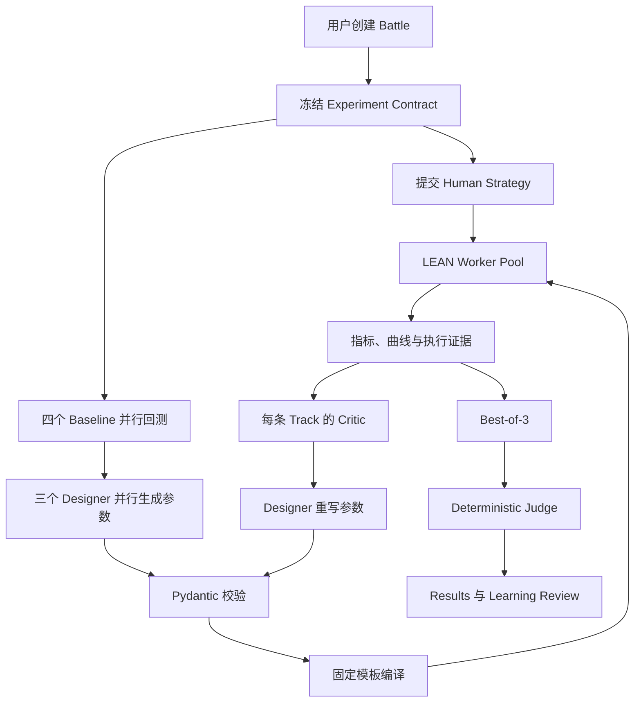
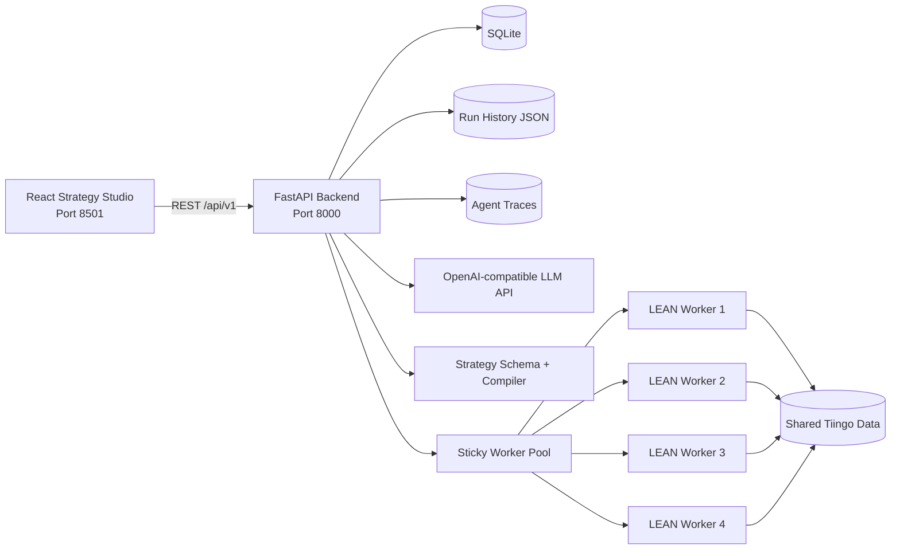

# AlphaForge 项目介绍

> **项目名称：** AlphaForge
> **项目定位：** 风险感知、可审计、教育优先的 Human-vs-AI 量化策略实验与竞技平台
> **课程：** SWS3022 — AI/ML in Financial Services
> **当前形态：** 可通过 Docker Compose 在本地完整运行的课程 MVP
> **用途：** 课程评审、项目展示、同学理解、技术交流与开源说明
> **风险声明：** 本项目仅用于课程、研究和金融教育，不构成投资建议。历史回测结果不代表未来表现。

---

## 1. 项目概览

AlphaForge 希望解决的并不是“再生成一个看起来收益很高的交易策略”，而是一个更基础、更现实的问题：

> **怎样让人类和 AI 在公平、统一、可执行、可复现的实验条件下设计量化策略，并将真实回测证据转化为风险意识和学习反馈？**

在 AlphaForge 中，用户可以使用引导式参数模板或完整 QuantConnect/LEAN Python 编写自己的策略。AI 在看不到 Human 策略、参数和结果的条件下，分别沿 Traditional、Machine Learning 和 Hybrid 三条路线独立设计候选策略。

所有 Human 策略、AI 策略和四个公共 Baseline 都必须共享同一个冻结实验合同，并由 QuantConnect LEAN 执行真实回测。胜负不是由 LLM 主观决定，而是由确定性评分器依据收益、风险、成本和执行证据计算。赛后，系统通过 AI Forge、Learning Review、PK Arena 和 Robustness Lab，解释策略为什么变化、哪里得到改善、哪里仍然脆弱，以及下一轮可以怎样调整。

项目形成的完整闭环是：

```text
独立设计
   ↓
结构化策略参数
   ↓
受控模板编译
   ↓
真实 LEAN 回测
   ↓
Critic 证据评价
   ↓
多轮参数迭代
   ↓
确定性评分与冠军保留
   ↓
教学解释、鲁棒性分析与下一轮学习
```

---

## 2. 课程背景与项目定位

SWS3022 项目要求团队设计、开发并评估一个由 AI 驱动的创新金融应用，以解决真实的金融服务问题。课程不只考察代码实现，还同时要求：

- 金融领域知识；
- AI/ML 方法；
- 软件工程与完整应用开发；
- 文献研究和创新论证；
- 用户体验设计；
- 实验评估；
- 专业展示。

课程评分共100分：

| 评分项目 | 分值 |
|---|---:|
| Problem Significance | 10 |
| Literature Review | 15 |
| Innovation & Originality | 20 |
| AI/ML Methodology | 15 |
| Technical Implementation | 15 |
| Frontend & User Experience | 10 |
| Experimental Evaluation | 10 |
| Presentation & Demonstration | 5 |

课程还鼓励 Multi-Agent AI、Explainable AI、Serious Games、Financial Education、Docker、GitHub、User Study 和 Open-source Release 等扩展能力。

AlphaForge 对应以下项目类别：

1. **AI 决策支持：** 帮助用户比较、优化和审查量化策略；
2. **金融教育：** 教授 Sharpe、CAGR、Maximum Drawdown、Turnover、交易成本和过拟合等概念；
3. **严肃游戏：** 将 Human 与 AI 的量化策略比较组织为最多五轮、五局三胜的学习型对战。

因此，AlphaForge 的研究定位不是提出一个全新的收益预测模型，而是构建一个把多种已有研究能力整合起来的、可执行且可审计的金融 AI 工作流。

---

## 3. 项目背景

### 3.1 生成式 AI 降低了策略开发门槛，也带来了新的可靠性问题

LLM 可以快速提出交易逻辑或生成 Python 代码，但金融策略不是只要“代码看起来合理”就可以使用。策略必须正确处理：

- 时间顺序和未来数据泄漏；
- 历史数据窗口；
- 模型训练与预测；
- 调仓日程；
- 仓位和风险约束；
- 手续费与滑点；
- QuantConnect/LEAN API；
- 运行时异常；
- 回测结果的可复现性。

自由代码生成扩大了 Agent 的表达空间，也扩大了 API 调用错误、字段格式错误、运行时失败和不可审计行为的范围。

### 3.2 量化学习者容易把高收益误认为好策略

初学者通常最先关注 Ending Equity 或 CAGR，却可能忽略：

- Sharpe Ratio 是否足以补偿波动；
- Maximum Drawdown 是否超过可承受范围；
- 交易是否过于频繁；
- 手续费和滑点是否侵蚀收益；
- 策略是否只在某一市场阶段有效；
- 多次试验后挑选最好结果是否造成回测过拟合。

一个高 CAGR、但回撤巨大或对参数极度敏感的策略，未必比收益稍低但更稳定的策略更有教育价值。

### 3.3 Human-vs-AI 比较经常缺少公平边界

如果 AI 可以先看到用户策略、用户回测结果或个性化建议，再针对性调整自己的策略，那么“AI 战胜 Human”不能被视为公平实验。

公平比较至少需要：

- Human 和 AI 独立设计；
- 相同股票池和回测时间；
- 相同资金、Benchmark、手续费和滑点；
- 相同回测引擎；
- 结果冻结后再进行比较；
- 胜负由公开、确定的规则计算。

### 3.4 普通策略平台往往把执行、比较和教学分开

一些平台负责回测，一些工具负责 AI 生成，一些课程负责解释金融指标。但对初学者而言，真正有价值的是把以下内容连接起来：

```text
我设计了什么
→ 系统实际执行了什么
→ 为什么得到这个结果
→ AI 改了哪些参数
→ 风险是否同步变化
→ 下一次应该验证什么
```

AlphaForge 正是针对这一断裂进行设计。

---

## 4. 项目要解决的问题

### 4.1 核心问题

AlphaForge 的核心问题可以概括为：

> 现有金融 Agent、回测工具和教育平台之间缺少一个公平、可靠、可执行、可解释、可复盘的策略优化闭环。

### 4.2 具体痛点

| 痛点 | 传统做法中的问题 | AlphaForge 的应对 |
|---|---|---|
| AI 代码不稳定 | LLM 从零生成大段 LEAN Python，容易出现格式、API 和运行错误 | Agent 只输出受约束参数，后端使用固定模板编译 |
| 比较不公平 | AI 可能看到 Human 方案后再优化 | 后端实施字段白名单和独立 Agent 上下文 |
| 实验条件不一致 | 不同策略使用不同股票池、时间和成本 | Frozen Experiment Contract |
| 只看收益 | 忽略风险、成本、波动和执行有效性 | 风险感知的确定性综合评分 |
| LLM 主观裁判 | 解释和胜负可能随 Prompt 改变 | LLM 只解释，官方分数由代码计算 |
| 后续优化可能退化 | 最后一次生成不一定最好 | Best-of-3 与跨轮历史冠军保留 |
| 过程不可审计 | 无法确认 Agent 输入、策略版本和实际执行 | 保存 Spec、源码、哈希、Trace、Run ID 和回测证据 |
| 用户不知道如何改进 | 指标展示后缺少可操作建议 | Learning Review 与下一轮参数建议 |
| 高分策略可能过拟合 | 重复回测后只展示最佳结果 | 展示全部 Trial、风险声明和鲁棒性实验 |

### 4.3 项目目标

项目设定了六个主要目标：

1. 提高 AI 策略生成进入 LEAN 回测的稳定性；
2. 建立 Human、AI 和 Baseline 的公平实验协议；
3. 让三类 AI 策略在相同条件下可比较；
4. 通过真实回测和 Critic 反馈进行有限次数的参数优化；
5. 保存完整策略谱系，使每个结果可以追踪和复核；
6. 将策略比较转化为用户能够理解和应用的金融教育反馈。

### 4.4 非目标

AlphaForge 当前不声称：

- 能预测未来市场；
- 能保证策略盈利；
- 能替代专业投资顾问；
- 已经证明 AI 长期优于 Human；
- 已经完成严格的样本外投资研究；
- 可以安全执行任意用户提交的 Python。

这些边界对于金融 AI 项目的可信度非常重要。

---

## 5. 文献调查

### 5.1 调研方法

项目采用结构化叙述性综述，而不是声称完成穷尽式系统综述。文献需要直接关联以下至少一个问题：

- 金融机器学习和策略比较；
- 风险感知投资组合与回测；
- 金融 Multi-Agent 系统；
- Explainable 或 Self-reflective LLM；
- 回测过拟合与选择偏差；
- 严肃游戏和金融教育。

最终综述包含10篇同行评审论文：

- 7篇发表于2023–2025年；
- 包含2篇正式综述论文；
- 出版机构和会议包括 Oxford University Press、Springer Nature、AAAI、ACM、NeurIPS、ACL、Elsevier 和 The Journal of Computational Finance；
- 满足课程关于论文数量、近期论文、信誉出版机构和综述论文的最低要求。

### 5.2 六条研究主线

#### 金融机器学习

Gu、Kelly 与 Xiu 的研究表明，树模型、神经网络和正则化方法能够捕捉金融变量中的非线性关系，并强调应使用样本外经济表现而非只看样本内拟合。

对 AlphaForge 的启示是：

- 不能只比较模型预测误差；
- 应比较组合层面的 Sharpe、CAGR 和回撤；
- Traditional、ML 和 Hybrid 必须在同一实验合同下比较。

#### 风险感知组合与金融回测

DeepTrader 和股票市场深度学习综述强调市场状态、下行风险、最大回撤、交易成本、领域指标和可复现回测的重要性。

对 AlphaForge 的启示是：

- 原始收益不足以判断策略；
- 必须公开风险和成本；
- 股票池、时间、费用与回测假设必须冻结。

#### 金融 Multi-Agent 系统

FinVision、FinCon 和 QuantAgents 使用专业化 Agent、Manager–Analyst 协作、反思、记忆、风险控制和模拟交易。

这些研究证明了角色分工与反馈循环的价值，但大多研究自治 AI 团队，并没有建立严格的 Human-vs-AI 信息隔离。

AlphaForge 因此采用：

- Parameter Designer；
- Performance Critic；
- Cross-round AI Coach；
- Teaching Explainer；
- 后端拥有的确定性 Judge。

#### 可解释与自反思金融 LLM

相关研究表明，LLM 可以生成易于理解的金融叙述，并通过反思改进输出。但“解释听起来合理”不等于解释真实对应了执行路径。

AlphaForge 的设计原则是：

> LLM 可以负责解释和建议，但不能负责计算官方指标或决定胜负。

#### 回测过拟合

Bailey 等人的 Probability of Backtest Overfitting 研究指出，从大量试验中选择历史表现最好的策略，可能产生统计幻觉。

AlphaForge 无法在课程规模内完整实现所有 PBO 方法，但采用了以下原则：

- 限制每条 AI 赛道最多三次回测；
- 展示全部 Trial，而不是只展示冠军；
- 保存失败和退化记录；
- 提供 Robustness Lab；
- 明确说明 Best-of-3 仍会引入多重试验偏差；
- 将严格 Final Blind Test 列为后续工作。

#### 金融教育与严肃游戏

跨国随机实验表明，合理设计的在线金融教育游戏可以改善短期金融素养，但现有研究更关注一般金融知识，而不是基于真实策略执行证据的风险调整学习。

AlphaForge 将对战结果与真实回测、风险解释和下一轮参数建议结合，尝试把游戏性与量化金融教育连接起来。

### 5.3 文献中的研究空白

现有研究分别提供了：

- 金融预测模型；
- 风险感知组合；
- 多智能体协作；
- LLM 解释；
- 回测可靠性方法；
- 游戏化金融教育。

但在本次调研覆盖的文献中，这些能力通常相互分离。没有一个被调研系统同时完成：

1. Human 与 AI 的信息隔离；
2. 受约束的可执行策略生成；
3. 冻结的真实回测合同；
4. 确定性的风险感知裁判；
5. 可审计的策略演化谱系；
6. 基于真实证据的跨轮金融教育。

AlphaForge 的创新机会因此是**系统集成和工作流创新**，而不是简单声称某个模型预测更准。

### 5.4 文献到设计的对应关系

| 文献方向 | 采用的设计 | AlphaForge 中的作用 |
|---|---|---|
| 金融 ML 比较 | 四个 Baseline、三条 AI Track | 比较不同归纳偏置 |
| 风险感知评价 | Sharpe、CAGR、MDD、Volatility、Cost | 防止只追求收益 |
| Multi-Agent | Designer、Critic、Coach、Explainer | 分离设计、评价、记忆和教学职责 |
| Explainable AI | Learning Review、Critic 诊断、Strategy DNA | 将结果转化为可理解反馈 |
| 回测可靠性 | Frozen Contract、全部 Trial、冠军谱系、鲁棒性测试 | 提高可复现性并暴露选择偏差 |
| Serious Game | 五局三胜、跨轮策略调整、PK Arena | 将实验组织为学习循环 |

### 5.5 研究问题

文献空白进一步形成三个可评价的研究问题：

| 研究问题 | 需要比较的对象 | 主要证据 |
|---|---|---|
| RQ1：参数约束式 Multi-Agent 是否比自由代码生成更容易产生可执行策略？ | Free-form LEAN Python vs StrategyTemplateSpec + Compiler | Schema通过率、编译率、LEAN完成率、修复次数、延迟和Token成本 |
| RQ2：在相同实验合同下，Traditional、ML和Hybrid AI相对公共Baseline表现如何？ | 四Baseline、Human、三AI Track | Sharpe、CAGR、MDD、波动率、成本、期末资产和鲁棒性 |
| RQ3：信息隔离式Human-vs-AI游戏能否帮助用户理解风险调整表现？ | 使用前后知识与体验比较 | Pre/Post Knowledge、任务完成、可用性、透明度和访谈反馈 |

当前实现已经为RQ1保存了参数模板运行证据，并为RQ2保存了历史回测结果；RQ1所需的完整Free-form对照实验尚未完成，RQ3也仍需要正式用户研究。

---

## 6. 用户画像

### 6.1 核心用户：量化金融初学者

**典型背景：**

- 具备基础 Python 或金融知识；
- 听说过动量、均值回归和机器学习；
- 能看懂收益率，但不熟悉风险调整指标；
- 不熟悉 LEAN API 或完整量化研究流程。

**主要需求：**

- 用简单参数构建一个真实可运行策略；
- 理解自己的策略为什么输或赢；
- 获得具体、有限、可验证的下一步建议；
- 学习 Sharpe、回撤、成本和过拟合。

**适合功能：**

- Basic Guided Template；
- Baseline Classroom；
- Strategy Comparison；
- Learning Review；
- PK Arena。

### 6.2 进阶用户：金融或数据科学学生

**典型背景：**

- 了解特征工程、模型训练和投资组合；
- 希望比较 Traditional、ML 和 Hybrid；
- 需要观察参数变化如何影响风险收益。

**主要需求：**

- 修改信号、窗口、Top-K 和组合权重；
- 查看 AI 三次迭代及 Critic 反馈；
- 查看模型训练和预测的运行证据；
- 进行费用、日期和股票池扰动实验。

**适合功能：**

- Advanced Multi-factor Template；
- AI Forge；
- Strategy DNA；
- Robustness Lab；
- Agent Trace。

### 6.3 技术用户：策略开发者和课程研究者

**典型背景：**

- 能编写完整 QuantConnect/LEAN Python；
- 关注实验复现、代码审计和系统架构；
- 需要验证 AI 生成流程是否真正执行。

**主要需求：**

- 提交完整策略源码；
- 获取 Run ID、源码、哈希、日志和行为证据；
- 验证评分和策略选择逻辑；
- 复现实验或进一步扩展模板。

**适合功能：**

- Complete Python Code；
- Run History；
- Worker Logs；
- Compiled Strategy Code；
- JSON Snapshot 和 Agent Trace。

### 6.4 展示用户：教授、同学和 Expo 访客

这类用户通常只有几分钟体验系统，因此需要：

- 快速理解项目解决什么问题；
- 使用默认值启动一轮；
- 看到 Human、AI 和 Baseline 的真实比较；
- 理解一个明显的风险—收益权衡；
- 在失败时获得清晰反馈，而不是阅读后端日志。

---

## 7. 用户使用流程

### 7.1 一场完整对战

1. 用户注册或登录；
2. 在 Battle Lobby 创建新对战；
3. 选择5–30只股票；
4. 设置回测日期、初始资金、Benchmark、手续费和滑点；
5. 使用 Guided Setup 或完整 Python 提交 Human Strategy；
6. 启动 Round 1；
7. 系统并行运行四个 Baseline、Human Strategy 和三条 AI Track；
8. 用户在 AI Forge 查看 AI 的三次试验和参数变化；
9. 用户在 Results 查看综合评分、指标和曲线；
10. 用户在 Learning Review 获取下一轮参数建议；
11. 用户可运行 Robustness Lab；
12. 用户进入下一轮并调整 Human Strategy；
13. 最多进行五轮，任一方先取得三胜即结束；
14. 用户可在 PK Arena 切换 R1–R5 并复盘整场演化。

### 7.2 为什么同一 Battle 固定实验条件

Round 1 创建后，以下内容被冻结：

- 股票池；
- 开始和结束日期；
- 初始资金；
- Benchmark；
- Transaction Cost；
- Slippage。

后续 Round 不允许改变这些条件。这样用户和 AI 的跨轮变化主要来自策略本身，而不是偷偷更换更有利的数据区间。

### 7.3 为什么后续 Round 不重复运行 Baseline

同一 Battle 中，Baseline 的策略和实验合同均未改变，因此后续轮次复用 Round 1 的 Baseline 结果：

- 减少重复计算；
- 提高响应速度；
- 保证参考基准一致；
- 将 Worker 资源集中到 Human 和 AI 新候选。

---

## 8. 具体功能

### 8.0 功能与评分项总览

| 功能模块 | 给用户的价值 | 主要对应评分点 |
|---|---|---|
| Battle Lobby与历史恢复 | 形成可持续、可复盘的完整应用 | Technical Implementation、Frontend & UX |
| Human Strategy Studio | 降低量化策略设计门槛 | Problem Significance、Frontend & UX |
| Baseline Classroom | 建立策略比较和金融概念参照 | Literature Review、Financial Education |
| AI Forge | 展示多Agent试验、参数变化和失败证据 | AI/ML Methodology、Innovation、Explainable AI |
| Strategy Results | 在统一协议下展示风险收益证据 | Experimental Evaluation、Frontend & UX |
| Learning Review | 把回测转化为下一轮学习 | Serious Game、Financial Education、Innovation |
| PK Arena | 支持最多五轮的Human-vs-AI学习循环 | Serious Game、Frontend & UX |
| Robustness Lab | 暴露策略对数据和成本假设的敏感性 | Experimental Evaluation、AI/ML Methodology |
| Run History与Agent Trace | 支持复现、审计和失败定位 | Technical Implementation、Explainability |

### 8.1 用户与历史对战

- SQLite 用户注册、登录、会话和退出；
- 创建、继续、查看和删除 Battle；
- 后端重启后恢复历史 Run；
- 每场 Battle 保存 R1–R5 的状态、比分和结果；
- 可切换查看不同轮次，而不是只展示当前 Run。

### 8.2 Human Strategy Studio

系统提供三种人类策略入口：

#### Basic Guided Template

面向初学者，只暴露少量关键参数，让用户理解信号、窗口、持仓数量和调仓频率。

#### Advanced Multi-factor Template

支持：

- 主信号和辅助信号；
- 双回看窗口；
- 信号权重；
- Top-K；
- Equal 或风险感知权重；
- Gross Exposure；
- Maximum Position Weight；
- Rebalance Threshold；
- Market Regime Filter。

#### Complete Python Code

允许有经验的用户提交完整 QuantConnect/LEAN Python。代码编辑区提供：

- 默认可运行模板；
- 语法高亮；
- 使用说明；
- 最终策略源码展示；
- 一键复制。

当前版本仍未实现针对任意 Python 的完整 AST、依赖和 API Allowlist，因此自定义代码功能应在受控课程环境中使用。

### 8.3 Baseline Classroom

系统提供四个公共 Baseline：

| Baseline | 类别 | 作用 |
|---|---|---|
| Momentum Rank | Traditional | 检验中期相对强度 |
| Mean Reversion | Traditional | 检验短期反转 |
| Gradient Boosting | ML | 使用滞后特征预测未来超额收益 |
| Hybrid ML + Minimum Variance | Hybrid | 融合 ML 排名和协方差感知配置 |

Baseline Classroom 不只展示结果，还解释：

- 策略原理；
- 适合的市场环境；
- 可能的优势；
- 典型风险；
- 与其他 Baseline 的差异。

### 8.4 AI Forge

AI Forge 展示三条 AI Track：

- **Traditional：** 必须使用透明信号，禁止 ML 模型；
- **ML：** 必须使用训练模型，不允许混入透明信号；
- **Hybrid：** 必须同时包含透明信号和 ML 预测。

每条 Track 最多进行三次真实回测。页面展示：

- 策略 Thesis；
- 参考了哪些公共 Baseline；
- 参数结构；
- 每次 Trial 的回测指标；
- Critic 的优点、弱点和风险判断；
- 参数具体改动；
- 本轮最佳 Trial；
- 跨轮冠军是否被新候选替代；
- 编译后的 Strategy Code。

### 8.5 Strategy Results

Results 页面提供：

- 本次股票池与回测参数；
- 全策略比较表；
- 综合评分；
- CAGR、Sharpe、Maximum Drawdown 和 Ending Equity；
- Equity Curve；
- Drawdown Curve；
- Risk–Return Map；
- 费用与换手率；
- Generated Strategy Review 的简明总结。

页面将总体数据比较与 AI Forge 的详细试验谱系分开，减少信息重复。

### 8.6 Learning Review

Learning Review 将回测证据转化为教育内容：

- 最佳策略为什么领先；
- 领先是否伴随更大回撤；
- Strategy DNA；
- Human 下一轮的推荐参数值；
- 推荐修改所针对的指标；
- Quant Concept；
- 过拟合提醒；
- 对最优策略的可解释总结。

Teaching Explainer 负责生成自然语言教学内容；如果 LLM 调用失败，系统使用确定性 fallback，避免整个页面不可用。

### 8.7 PK Arena

- 最多五轮；
- 五局三胜；
- 每轮显示 Human 和 AI 的比分与关键结果；
- 可以切换查看 R1–R5；
- 每轮结束后，Human 可以调整策略；
- AI Coach 使用先前 AI 证据指导下一轮；
- AI 不会读取 Human 的策略或针对性建议。

### 8.8 Robustness Lab

当前鲁棒性实验包括：

- 时间切片；
- 起始日期扰动；
- 双倍手续费与滑点；
- 股票池扰动。

系统比较压力情景与原回测中的表现变化，并生成确定性鲁棒性结论。该功能用于历史敏感性分析，不等同于严格样本外证明。

### 8.9 审计与可复现证据

每个 AI Candidate 保存：

- 规范化 StrategyTemplateSpec；
- 编译后的 LEAN Python；
- Strategy Spec SHA-256；
- Experiment Contract；
- Worker Run ID；
- 指标、曲线和行为证据；
- Critic 反馈；
- Trial 选择原因；
- 跨轮冠军来源；
- Agent Trace。

---

## 9. 产品亮点

“亮点”强调用户或系统能够直接感知的价值，不等同于学术创新声明。

| 产品亮点 | 可观察证据 | 主要对应评分点 |
|---|---|---|
| 参数到真实执行的闭环 | 编译源码、LEAN Run ID、订单和曲线 | Technical Implementation |
| 设计—执行—比较—学习的一体化流程 | 七个连续产品工作区 | Frontend & UX、Problem Significance |
| 初学者与进阶用户双层入口 | Basic、Advanced、Complete Python | Frontend & UX |
| 失败和退化也可见 | 全部Trial、错误、Critic和保留原因 | Experimental Evaluation、Explainable AI |
| 四Worker并行 | Compose中的四个隔离LEAN服务 | Technical Implementation、Docker Bonus |
| 重启后可恢复 | SQLite、Run Snapshot和Trace | Technical Implementation |

### 9.1 从参数到真实执行的完整闭环

用户看到的不是 LLM 对策略的文字想象，而是实际进入 LEAN 的策略、实际订单和标准化回测结果。

### 9.2 同一页面体系连接设计、执行、比较和学习

AlphaForge 将 Battle Lobby、Strategy Studio、AI Forge、Results、Learning Review、Robustness Lab 和 PK Arena 连接为完整用户旅程。

### 9.3 兼顾初学者与进阶用户

- 初学者可使用 Basic Guided Template；
- 进阶用户可配置多因子策略；
- 技术用户可提交完整 LEAN Python；
- 教学解释和原始证据同时保留。

### 9.4 真实展示失败与退化

系统不会假设每一次 Agent 修改都会变好。Trial 可能：

- 改善；
- 基本不变；
- 退化；
- 运行失败。

页面保留这些结果，帮助用户理解 AI 优化是实验过程，而不是收益承诺。

### 9.5 四 Worker 并行执行

四个隔离 LEAN Worker 允许：

- 四个 Baseline 并行；
- Human 与 AI 任务并行；
- Traditional、ML 和 Hybrid 三条流水线并行；
- 单 Track 内仍严格保持 Designer—LEAN—Critic 的顺序。

### 9.6 可恢复的课程演示

SQLite、JSON Run Snapshot 和 Agent Trace 共同保证：

- 用户和对战记录持久化；
- Backend 重启后可恢复已完成 Run；
- 历史结果可重新打开；
- 展示时可以使用已有对战作为备用。

---

## 10. 创新点与评分点对应

“创新点”强调 AlphaForge 相对现有研究和普通工具的差异，并需要由架构或实验结果支撑。

### 10.1 创新一：公平的信息隔离式 Human-vs-AI 实验

**对应评分项：** Problem Significance、Innovation & Originality、Experimental Evaluation。

AI Designer、Critic 和 Coach 不能读取：

- Human 策略代码；
- Human 参数；
- Human 回测指标；
- Human 订单与持仓；
- Human 个性化改进建议。

这不是只依赖 Prompt，而是通过后端 DTO、字段白名单和不同上下文构造实现。Human 与 AI 只有在结果冻结后，才由确定性 Judge 进行比较。

创新价值在于把“公平性”从文字承诺转化为系统接口边界。

### 10.2 创新二：Parameter-only Multi-Agent + 固定策略模板

**对应评分项：** Innovation & Originality、AI/ML Methodology、Technical Implementation。

Agent 不再从零生成大段 Python，只返回 `StrategyTemplateSpec` JSON：

```text
Agent 决定投资逻辑
Schema 决定参数是否合法
Compiler 决定代码怎样生成
LEAN 决定策略是否真实执行
```

这种责任边界缩小了 LLM 的错误面，同时保留了策略灵活度：

- 6类特征；
- 4类 ML 模型；
- 5类组合权重；
- 多种调仓和风险控制；
- Traditional、ML 和 Hybrid 三种结构。

### 10.3 创新三：Spec-to-Code-to-Evidence 可审计链

**对应评分项：** Innovation & Originality、Technical Implementation、Explainable AI Bonus。

每次策略演化都有：

```text
规范化参数
→ 固定模板源码
→ SHA-256
→ LEAN Worker Run
→ 指标与执行证据
→ Critic 诊断
→ 入选或保留理由
```

自然语言解释能够回到具体参数和实际回测，而不是成为无法验证的叙事。

### 10.4 创新四：Critic 评价、Designer 重写、冠军保留

**对应评分项：** AI/ML Methodology、Experimental Evaluation。

Critic 不直接修改 JSON，也不决定最终胜负。它只：

- 比较当前 Trial 与 Baseline 和先前 Trial；
- 识别保留项；
- 指出弱点；
- 给出最多三个受约束的参数方向；
- 提醒多重试验和过拟合。

Designer 再根据 Critic 反馈重写完整参数。本轮 Best-of-3 选择器和跨轮冠军机制负责防止退化。

### 10.5 创新五：确定性裁判与生成式解释分离

**对应评分项：** AI/ML Methodology、Technical Implementation、Frontend & UX。

项目采用 `deterministic_weighted_score_v2`：

| 指标 | 权重 |
|---|---:|
| Sharpe Ratio | 35% |
| CAGR | 30% |
| Maximum Drawdown Control | 15% |
| Volatility Control | 5% |
| Cost Efficiency | 5% |
| Execution Evidence | 5% |
| Explainability | 5% |

LLM 负责解释，代码负责计算。这降低了 Prompt 变化对官方结果的影响。

### 10.6 创新六：基于真实证据的严肃游戏与跨轮学习

**对应评分项：** Frontend & UX、Innovation & Originality、Serious Game 和 Financial Education Bonus。

游戏不是简单把分数加上动画，而是要求每一轮产生真实学习：

- Human 根据自己的结果调整参数；
- AI Coach 根据先前 AI 轨道证据选择 Refine、Rotate 或 Rebuild；
- 历史冠军防止新一轮退化；
- PK Arena 展示五轮演化；
- Learning Review 解释量化概念和风险。

---

## 11. AI/ML 方法设计

### 11.1 四个公共 Baseline

四个 Baseline 提供不同的归纳偏置：

1. Momentum Rank：透明的趋势延续假设；
2. Mean Reversion：透明的短期反转假设；
3. Gradient Boosting：非线性监督学习；
4. Hybrid ML + Minimum Variance：预测与风险配置结合。

它们既是比较对象，也是 Agent 可以读取的公共参考证据。

### 11.2 三条 AI Track

#### Traditional

- 必须有透明 Signal；
- `model` 必须为空；
- 信号直接产生排名和目标权重。

#### ML

- `signal` 必须为空；
- 必须使用支持的 sklearn 模型；
- 预测直接决定排名和目标权重。

#### Hybrid

- Signal 和 Model 均必须存在；
- 透明信号和模型预测必须共同进入最终决策。

三条 Track 的严格结构要求防止出现“名为 Hybrid、实际只运行 Momentum”等语义漂移。

### 11.3 StrategyTemplateSpec

Schema 支持：

- Feature：Return、Volatility、SMA Gap、Relative Return、Volume Change、RSI；
- Model：Gradient Boosting、Random Forest、Extra Trees、Ridge；
- Target：Absolute Return 或 Excess Return；
- Selection：Top-K、正分过滤、Hybrid Model Weight；
- Portfolio：Equal、Inverse Volatility、Score、Minimum Variance、Blend；
- Schedule：Weekly 或 Monthly；
- Risk：Market Trend Filter、Stop Loss、Maximum Drawdown、Cooldown。

Pydantic 还检查：

- 未知字段禁止进入；
- 类型和数值范围；
- Feature 不可重复；
- Track 结构合法；
- `top_k × max_position_weight` 必须能够覆盖 `gross_exposure`。

### 11.4 Performance Critic

Critic 的输入包含：

- 当前 AI 参数；
- 当前 LEAN 指标；
- 执行证据；
- 公共 Baseline；
- 同 Track 的先前 Trial。

Critic 不读取 Human 信息，不返回 Python，也不直接替换参数。关键指标差值由后端预先计算，LLM 不负责重新做官方算术。

### 11.5 Cross-round Coach

Coach 使用跨轮 AI 证据判断下一轮应：

- `refine_parameters`：保留机制，只调整少量参数；
- `rotate_mechanism`：更换一个主要信号、模型或组合机制；
- `rebuild_track`：在 Track 合同内构建明显不同的假设。

当参数微调已经进入平台期时，Coach 可以建议更换策略机制，而不是无限枚举旧错误。

### 11.6 Teaching Explainer

Teaching Explainer 在赛后使用已冻结结果生成：

- 最优策略解释；
- 风险—收益权衡；
- 下一轮行动；
- Quant Concept；
- 过拟合和鲁棒性提醒。

它不能修改策略冠军、官方分数或 AI 下一轮上下文。

---

## 12. 内部流程

### 12.1 Round 1



### 12.2 单条 AI Track 的三次试验

```text
Trial 1:
Designer → Validate → Compile → LEAN → Critic

Trial 2:
Designer(previous spec + Critic) → Validate → Compile → LEAN → Critic

Trial 3:
Designer(previous spec + Critic) → Validate → Compile → LEAN → Critic

Selection:
更高 Sharpe → 更高 CAGR → 更低 Maximum Drawdown
```

### 12.3 后续 Round

```text
复用 Frozen Contract
        +
复用四个 Baseline
        +
带入 Human 上轮策略和用户建议
        +
读取 AI 历史冠军与 Coach Memory
        ↓
产生本轮 Human 与 AI 挑战者
        ↓
新候选 vs 历史冠军
        ↓
保留更优策略
```

---

## 13. 系统架构



### 13.1 React Strategy Studio

负责：

- 登录和 Battle Lobby；
- Experiment Contract 配置；
- Human Strategy；
- AI Forge；
- Results；
- Learning Review；
- Robustness Lab；
- PK Arena。

### 13.2 FastAPI Backend

负责：

- 身份验证；
- Battle 与 Round 状态；
- Experiment Contract；
- Agent 编排；
- Schema 校验；
- 策略模板编译；
- Worker 调度；
- 指标标准化；
- 确定性评分；
- Champion 选择；
- Run 和 Trace 持久化。

### 13.3 Multi-Agent Layer

Agent 层使用 OpenAI-compatible JSON API，包括：

- Parameter Designer；
- Performance Critic；
- Cross-round Coach；
- Teaching Explainer。

所有 Agent 使用结构化 Pydantic 输出，并由后端控制可见字段。

### 13.4 Strategy Compiler

Compiler 将规范化 JSON 注入不可变 `template-v1`：

```text
StrategyTemplateSpec
→ Canonical JSON
→ SHA-256
→ parameterized_strategy.py.tmpl
→ Complete LEAN Python
```

LEAN API、历史数据处理、模型训练、预测、调仓和运行证据由模板实现，而不是由 Agent 每次重新生成。

### 13.5 LEAN Worker Pool

四个 `linux/amd64` Worker：

- 共享只读行情数据；
- 使用独立 Job、Result、Model 和 Lock 目录；
- 单 Worker 同时执行一个任务；
- 使用 least-active 和 round-robin 进行分配；
- 保持同一 Run 的轮询粘性。

### 13.6 持久化

| 存储 | 保存内容 |
|---|---|
| SQLite | Users、Sessions、Battles、Rounds、Score、Coach Memory |
| Run History JSON | 完整 Run、曲线、策略、评分、冠军谱系 |
| Agent Trace | Agent 输入白名单、输出、错误与重放证据 |
| LEAN Workspace | 数据、Job、Log、Model 和原始结果 |

---

## 14. 数据与实验协议

### 14.1 市场数据

- 数据源：Tiingo End-of-Day Prices API；
- 频率：Daily OHLCV；
- 股票范围：30只冻结美股白名单；
- 额外依赖：SPY、QQQ；
- 默认数据起点：2014-01-01；
- 用户每次选择5–30只股票。

仓库不分发真实市场数据。使用者必须使用自己的 Tiingo Token，并遵守相应数据许可。

### 14.2 Frozen Experiment Contract

同一 Round 的所有策略共享：

- Symbols；
- Start Date；
- End Date；
- Initial Cash；
- Benchmark；
- Transaction Cost；
- Slippage。

这些参数由 Backend 拥有，Agent 不能修改。

### 14.3 进入比较的资格

策略需要满足：

- 回测完成；
- 核心指标完整；
- 数据请求没有失败；
- 正常关闭；
- 产生符合要求的持仓和执行证据。

系统记录：

- Filled Orders；
- Invested Snapshots；
- Maximum Gross Exposure；
- Rebalance Count；
- Signal Events；
- ML Training Runs；
- ML Predictions；
- Hybrid Decision Links。

这些证据用于确认策略不是“指标存在但目标机制没有真正运行”。

### 14.4 鲁棒性与过拟合边界

当前 Robustness Lab 是历史敏感性测试。它能回答：

- 时间区间轻微变化后是否仍稳定；
- 交易摩擦提高后是否仍有基本表现；
- 股票池扰动后是否完全失效。

它不能替代：

- 严格 Hold-out；
- Walk-forward；
- Final Blind Test；
- 完整 PBO 或 CSCV；
- 真实交易验证。

---

## 15. 技术栈

| 层级 | 技术 |
|---|---|
| Frontend | React 18、Vite 6、Recharts、Lucide React |
| Backend | FastAPI、Pydantic v2、Uvicorn、Requests |
| Agent | OpenAI-compatible JSON API、Structured Output、Designer/Critic/Coach/Explainer |
| ML | scikit-learn、pandas、NumPy、SciPy |
| Supported Models | Gradient Boosting、Random Forest、Extra Trees、Ridge |
| Backtest | QuantConnect LEAN、Python 3.11、.NET Runtime |
| Persistence | SQLite WAL、JSON Run Snapshot、Agent Trace |
| Infrastructure | Docker Compose、4个隔离 LEAN Worker |
| Testing | pytest、Vitest、Testing Library |
| Market Data | Tiingo Daily OHLCV |
| Version Control | Git、GitHub |
| License | MIT License |

### 15.1 运行资源

课程要求团队区分必需和可选资源。AlphaForge 当前的资源需求如下：

| 资源 | Required / Optional | 用途 |
|---|---|---|
| Git | Required | 获取代码和版本管理 |
| Docker Desktop，或Docker Engine + Compose | Required | 启动前端、Backend和四个LEAN Worker |
| `linux/amd64`容器支持 | Required | 运行固定版本LEAN环境 |
| 本地磁盘空间 | Required | 保存LEAN镜像、市场数据和回测结果 |
| Tiingo API Token | Required for data sync | 首次准备真实Daily OHLCV数据 |
| OpenAI-compatible JSON LLM API Key | Required for live Agent mode | 运行Designer、Critic、Coach和Explainer |
| 大屏幕或外接显示器 | Optional | Expo现场展示 |
| 云服务器 | Optional / not implemented | 当前版本不依赖云部署 |

---

## 16. 当前实验结果

本节数据来自：

```text
backend/workspace/run_history/*.json
```

详细统计口径与复算方法见：

- [Poster Results 数据统计与证据](POSTER_RESULTS_EVIDENCE_zh.md)

### 16.1 AI 迭代是否改善策略

在当前历史快照中：

- 23份可读取 Run；
- 排除2份旧 Schema 2.0；
- 21份当前 Schema 3.0 Run；
- 61条 AI 策略轨道；
- 58条至少包含两次有效 Trial，可进行优化前后比较。

将每条轨道 Trial 1 与系统最终选择的本轮最佳 Trial 比较：

| 指标 | 平均变化 |
|---|---:|
| Sharpe Ratio | **+0.083** |
| CAGR | **+1.79个百分点** |
| Maximum Drawdown | **降低1.36个百分点** |
| Ending Equity | **+10.04%** |

58条轨道中：

- 32条选择了 Trial 2 或 Trial 3；
- 29条出现预先定义的实质性改善；
- 实质性改善比例为50.0%。

### 16.2 为什么需要 Critic 和选择器

所有114次有效 Trial 2/3 相对于 Trial 1：

- 53次更好；
- 12次基本相同；
- 49次更差。

这说明 Agent 的每次修改并不保证改善。系统价值来自：

- Critic 提供证据评价；
- Designer 进行受约束重写；
- Best-of-3 选择更好 Trial；
- 跨轮冠军防止退化。

### 16.3 AI 是否超过四个 Baseline

按照项目真实的 `deterministic_weighted_score_v2`：

- 最优 AI 在21个有效 Run 中有9次超过全部四个 Baseline，占42.9%；
- 对同一 Battle 的重复轮次去重后，AI 在8场独立 Battle 中有4场最终领先，占50.0%。

按原始单项指标：

- Sharpe 高于全部 Baseline：10/21；
- CAGR 高于全部 Baseline：5/21；
- Maximum Drawdown 低于全部 Baseline：2/21；
- 三项同时全面领先：0/21。

因此，项目应表述为“部分 Run 中 AI 的综合表现超过全部 Baseline”，而不能表述为“AI 在所有指标上全面优于 Baseline”。

### 16.4 结果解释

这些数据证明的是：

- 系统能够在历史回测中发现优于初始 Trial 的候选；
- 策略选择和冠军保留能够降低退化风险；
- AI 在部分实验合同下能够取得高于四个 Baseline 的综合评分。

这些数据不能证明：

- AI 在未来市场中持续超额；
- Best-of-3 没有选择偏差；
- 当前结果具有严格样本外显著性。

---

## 17. 与课程评分要求的对应

| 评分项 | AlphaForge 的对应内容 | 当前证据 |
|---|---|---|
| Problem Significance | AI策略不可执行、Human-AI不公平、风险意识不足、结果不可审计 | 问题定义、用户流程和产品实现 |
| Literature Review | 10篇同行评审论文，覆盖六条研究主线 | 完整 Literature Review Report |
| Innovation & Originality | 信息隔离、参数型Agent、Spec-to-Code-to-Evidence、冠军保留、真实证据教育 | 架构、Schema、Trace和历史结果 |
| AI/ML Methodology | 四Baseline、三AI Track、Multi-Agent、确定性评分 | 代码、Prompt、模板和回测结果 |
| Technical Implementation | React、FastAPI、LEAN、SQLite、四Worker、Docker | 可运行本地MVP与测试 |
| Frontend & UX | Guided Strategy、进度、AI Forge、Results、Learning、PK Arena | React应用 |
| Experimental Evaluation | 统一合同、多Trial、跨轮统计、鲁棒性、失败案例 | Run History与Results报告 |
| Presentation & Demo | 可交互应用、README、架构图、Results材料 | 仍需最终Poster、视频和现场准备 |

### 17.1 已具备的加分方向

- Multi-Agent AI；
- Explainable AI；
- Serious Game；
- Financial Education Platform；
- Docker；
- GitHub Repository；
- Open-source Release。

### 17.2 尚未完成或证据不足的方向

- Cloud Deployment；
- 正式 User Study；
- Pre/Post Learning Measurement；
- 严格 Final Blind Challenge；
- 完整 Agent 架构消融；
- 完整自由代码生成 vs 参数模板的定量对照实验。

---

## 18. 软件工程设计

### 18.1 模块化责任边界

项目避免让单一模块同时负责“生成、验证、执行、解释和裁判”：

| 模块 | 责任 |
|---|---|
| Designer | 设计策略参数 |
| Schema | 检查结构与范围 |
| Compiler | 生成固定模板源码 |
| LEAN | 执行策略 |
| Critic | 评价证据 |
| Judge | 计算分数和胜负 |
| Coach | 跨轮 AI 学习 |
| Explainer | 用户教学 |

### 18.2 错误处理

- Agent JSON 解析和 Pydantic 校验失败可有限重试；
- Teaching Explainer 失败时有确定性 fallback；
- Run 状态保存到 JSON 与 SQLite；
- Worker 提供 Health、Job、Result、Log 和 Details 接口；
- 前端将错误转换为用户可理解提示；
- 历史 Run 可以在后端重启后恢复。

### 18.3 测试

仓库包括：

- Backend Schema、Agent、Scoring、Persistence 和 Game Tests；
- LEAN Registry、Result Parser、Runtime、Data Sync 和 API Compatibility Tests；
- Frontend Vitest 与 Testing Library；
- Docker/LEAN 真实数据端到端测试流程。

静态测试不能替代真实 LEAN 回测，因此最终策略结果必须来自 Docker/Linux Worker。

### 18.4 开源与协作

- 项目采用 MIT License；
- 第三方组件保留独立许可和声明；
- `.env`、API Key、市场数据、数据库和本地 Run History 不进入 Git；
- 架构、Prompt、Schema、数据和实验均有专题文档；
- Git 历史用于追踪团队实际贡献。

---

## 19. 数据伦理、学术诚信与风险

### 19.1 数据伦理

- 项目使用市场数据，不收集敏感金融账户信息；
- 登录数据保存在本地 SQLite；
- 市场数据不随开源仓库分发；
- 使用者需要自行遵守 Tiingo 许可；
- 当前白名单存在 Survivorship Selection 风险。

### 19.2 AI 使用边界

- Agent 输出受 Schema 限制；
- 官方指标由程序计算；
- 最终胜负由确定性 Judge 决定；
- LLM 解释不能覆盖真实回测结果；
- 系统保存 Agent Trace，便于审计。

### 19.3 学术诚信

项目使用或参考：

- QuantConnect LEAN；
- Tiingo；
- 开源 Python 和 JavaScript 库；
- 同行评审论文；
- AI 辅助开发工具。

团队需要正确引用外部来源，理解并能够解释最终代码、实验协议、评分规则和限制。

---

## 20. 当前限制与后续路线

### 当前已知限制

1. 股票白名单按当前 ticker 回溯，存在幸存者选择；
2. Best-of-3 会引入多重试验偏差；
3. Robustness Lab 不是严格样本外验证；
4. Human 自定义 Python 尚无完整安全沙箱；
5. 当前主要是本地课程部署，不是云端多租户产品；
6. 当前没有正式完成用户学习效果研究；
7. 不同 Battle 的结果不能简单当作完全同分布独立样本；
8. LLM Prompt、模型版本和历史市场环境仍可能影响策略表现。

### 后续优先级

1. Training / Validation / Final Blind Test 三段式合同；
2. Walk-forward 和更严格参数敏感性实验；
3. Agent 架构与模板化生成的消融实验；
4. Human 自定义代码 AST 和 API Allowlist；
5. Pre/Post Quant Knowledge 用户研究；
6. 策略、报告与哈希链导出；
7. 云部署与更成熟的任务队列；
8. 更完整的历史 Security Master。

---

## 21. 团队分工

| 团队成员 | 主要职责 | 代表性贡献 |
|---|---|---|
| Zihan Zhou | 传统基线、基线教学、进度协调、PPT | 传统策略比较框架、Baseline Classroom、风险评价与展示材料 |
| Zhanlin Chen | 数据、ML/Hybrid基线、策略研究 | 数据目录、ML与Hybrid稳定性、交易摩擦和组合执行优化 |
| Zetong Li | Backend、LEAN、Docker、系统集成与产品主流程 | 本地LEAN Runtime、Human Strategy、评分、鲁棒性、参数模板、四Worker、SQLite Battle、Run恢复和架构文档 |
| Jingze Liu | Agent主链、前端架构、运行证据与分支集成 | Agent回测循环、React Strategy Studio、可重放Trace、调仓稳定性和分支合并 |

具体贡献以 Git 历史、代码审查、文档和最终答辩说明为准。

---

## 22. 结论

AlphaForge 的核心贡献不是单独发明一个更高收益的交易模型，而是把以下能力整合为一个实际可运行的金融 AI 产品：

- 公平的信息隔离；
- 参数型 Multi-Agent 策略设计；
- 受控的 Spec-to-Code 编译；
- 真实 QuantConnect LEAN 回测；
- 风险感知的确定性评价；
- 可审计的策略演化；
- 跨轮冠军保留；
- 面向用户的金融教育与鲁棒性分析。

它希望向用户传达的最终观念是：

> **好的量化策略不只是历史收益高，而是在统一条件下能够执行、能够解释、风险可见、结果可复核，并经得起进一步质疑。**

---

## 23. 参考文献

[1] Gu, S., Kelly, B., & Xiu, D. (2020). Empirical asset pricing via machine learning. *The Review of Financial Studies*, 33(5), 2223–2273. https://doi.org/10.1093/rfs/hhaa009

[2] Olorunnimbe, K., & Viktor, H. (2023). Deep learning in the stock market: A systematic survey of practice, backtesting, and applications. *Artificial Intelligence Review*, 56, 2057–2109. https://doi.org/10.1007/s10462-022-10226-0

[3] Wang, Z., Huang, B., Tu, S., Zhang, K., & Xu, L. (2021). DeepTrader: A deep reinforcement learning approach for risk-return balanced portfolio management with market conditions embedding. *Proceedings of the AAAI Conference on Artificial Intelligence*, 35(1), 643–650. https://doi.org/10.1609/aaai.v35i1.16144

[4] Fatemi, S., & Hu, Y. (2024). FinVision: A multi-agent framework for stock market prediction. *Proceedings of the 5th ACM International Conference on AI in Finance*, 582–590. https://doi.org/10.1145/3677052.3698688

[5] Koa, K. J. L., Ma, Y., Ng, R., & Chua, T.-S. (2024). Learning to generate explainable stock predictions using self-reflective large language models. *Proceedings of the ACM Web Conference 2024*, 4304–4315. https://doi.org/10.1145/3589334.3645611

[6] Yu, Y., et al. (2024). FinCon: A synthesized LLM multi-agent system with conceptual verbal reinforcement for enhanced financial decision making. *Advances in Neural Information Processing Systems*, 37, 137010–137045.

[7] Dong, Y., et al. (2025). Large language model agents in finance: A survey bridging research, practice, and real-world deployment. *Findings of ACL: EMNLP 2025*, 17889–17907. https://doi.org/10.18653/v1/2025.findings-emnlp.972

[8] Li, X., Zeng, Y., Xing, X., Xu, J., & Xu, X. (2025). QuantAgents: Towards multi-agent financial system via simulated trading. *Findings of ACL: EMNLP 2025*, 17438–17464. https://doi.org/10.18653/v1/2025.findings-emnlp.945

[9] Bailey, D. H., Borwein, J. M., Lopez de Prado, M., & Zhu, Q. J. (2017). The probability of backtest overfitting. *The Journal of Computational Finance*, 20(4). https://doi.org/10.21314/jcf.2016.322

[10] Cannistra, M., et al. (2024). The impact of an online game-based financial education course: Multi-country experimental evidence. *Journal of Comparative Economics*, 52(4), 825–847. https://doi.org/10.1016/j.jce.2024.08.001

---

## 24. 进一步阅读

- [项目 README](../README.md)
- [项目架构](PROJECT_ARCHITECTURE_zh.md)
- [Agent Prompt Engineering](AGENT_PROMPT_ENGINEERING_zh.md)
- [Strategy Template DSL](STRATEGY_TEMPLATE_V1_zh.md)
- [Battle System](BATTLE_SYSTEM_zh.md)
- [Scoring 与 Learning Review](UX_SCORING_UPDATE_zh.md)
- [Robustness Testing](ROBUSTNESS_TESTING_V1_zh.md)
- [Poster Results 数据统计](POSTER_RESULTS_EVIDENCE_zh.md)
- [研究论文目录](research/README.md)
- [LEAN Worker 文档](../lean_worker/README_zh.md)
