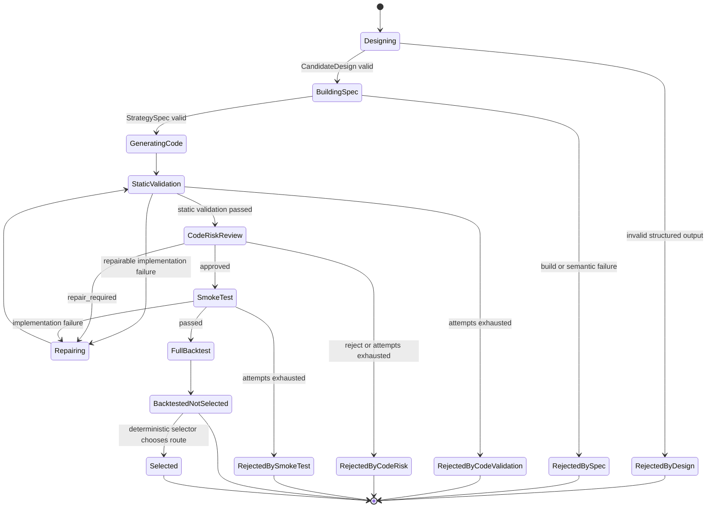

# Agent Architecture

## Agent interfaces

```text
StrategyDesigner.design(DesignRequest) → CandidateDesign
QCCodeAgent.generate(QCCodeGenerationRequest) → GeneratedCode
CodeRiskAgent.review(CodeRiskReviewRequest) → CodeRiskReview
RepairAgent.repair(RepairRequest) → GeneratedCode
PostBacktestAnalysisAgent.analyze(PostBacktestAnalysisRequest) → PostBacktestAnalysis
```

Each interface has one responsibility and an exact Pydantic input/output contract.

## Route state machine



## Code Risk isolation

`CodeRiskReviewRequest` contains:

- immutable StrategySpec;
- generated source and digests;
- deterministic static validation result;
- LEAN environment manifest.

It has no field for smoke-test output, full BacktestResult, return, volatility, drawdown or fees. Risk findings therefore describe implementation defects rather than observed strategy performance.

## Repair invariants

- The same immutable StrategySpec is supplied on every attempt.
- `spec_sha256` must remain unchanged.
- Static validation and Code Risk review repeat after every repair.
- Smoke-test repairs also repeat static and risk checks before another smoke test.
- The total repair count is shared across static, risk and smoke failures.

## Unified analysis

The Post-Backtest Analysis Agent is called once after all routes terminate. It compares the parent, four baselines and all successful candidate results in one evidence set. Failed routes remain visible through structured route outcomes.

Its ranking is explanatory. The CandidateSelector independently applies hard checks and selects the eligible candidate with the highest Sharpe, then lower drawdown and lower fees as tie-breakers.
