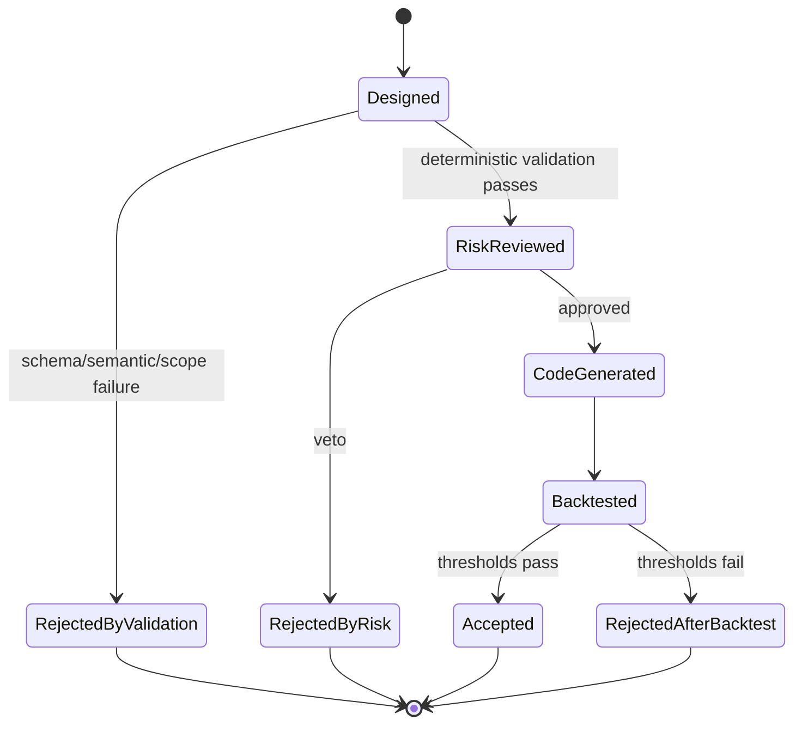

# Agent Architecture

## Roles represented in Phase 1

The mock provider simulates four semantic capabilities behind one provider boundary:

1. Baseline Analyst reads exactly five normalised validation results.
2. Traditional, ML and Hybrid Designers create three distinct canonical specs.
3. Risk Reviewer can veto a proposal before code generation.
4. Decision Agent accepts or rejects only after a provider result exists.

Code generation and backtesting remain separate providers because they have different security, reliability and ownership constraints.

## State machine

## Stop conditions

- Phase 1 runs one round; the contract permits at most two.
- Exactly one primary candidate per route is produced each round.
- Validation or risk rejection stops that route before code generation.
- Missing, failed or Test-set evidence stops the entire optimisation.
- Zero accepted routes is a valid result: `No robust improvement found under the current constraints.`

## Audit and evidence rules

- Analysis stores evidence `run_id` values.
- Every transition appends an ordered audit event.
- Mock backtest results carry `SIMULATED_RESULT_NOT_FINANCIAL_EVIDENCE`.
- Explanations must eventually reference a spec diff and real run IDs; this Phase 1 mock makes no causal or investment claim.
- Future LLM prompts, model names and response digests must be versioned in provider metadata.

## Replacing mocks

- Replace `MockAgentProvider` with an LLM adapter implementing `AgentProvider`.
- Replace `DeterministicCodeGenerator` with a validated LEAN template/LLM adapter.
- Replace `MockBacktestProvider` with Member C's `LocalLeanProvider`.
- Keep the schemas, validator and orchestrator unchanged unless an interface review explicitly changes the contract.
