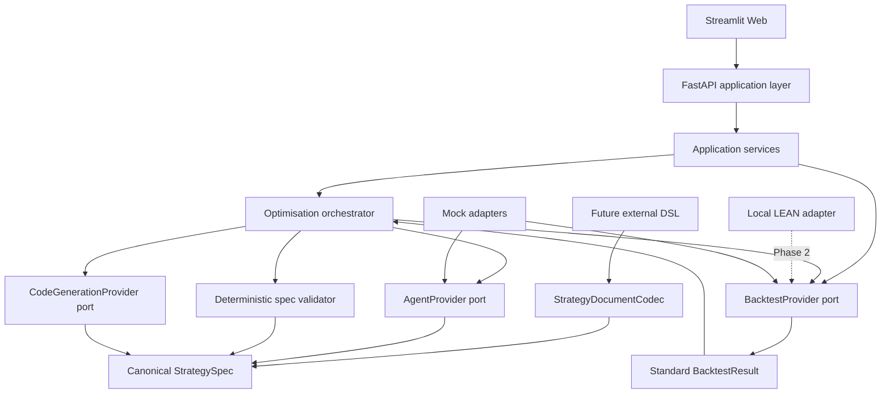

# System Architecture

## Boundary view



## Allowed dependencies

```text
Web → API → Services
Services → Orchestrator / Backtest port / Repository port
Orchestrator → ports / schemas / deterministic validators
Adapters → ports / schemas / external systems
```

Disallowed dependencies:

- UI → LEAN;
- Agent → market data directory;
- Agent → Test results;
- code generator → mutable StrategySpec;
- Repair Agent → strategy semantics;
- raw LEAN result → Web or Agent without normalisation;
- notebook → production service.

## Ownership boundaries

- Members A/B own strategy semantics and baseline code.
- Member C owns LEAN execution and raw-result normalisation.
- Member D owns Agent orchestration, codecs, deterministic policy and codegen architecture.
- Cross-module schemas require review from the producer and consumer.

## Current vertical slice

The Phase 1 vertical slice uses deterministic Agent, generator and backtest adapters. It proves object flow, route separation, policy rejection, state transitions and auditability. It does not validate strategy profitability or LEAN compatibility.
