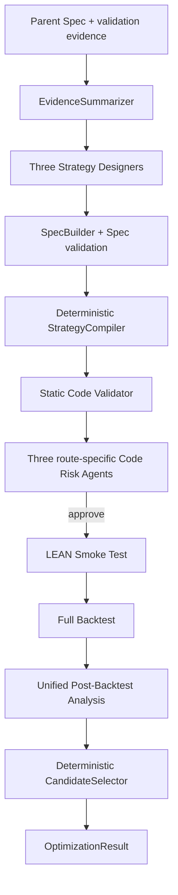

# System Architecture



Traditional, ML and Hybrid pipelines execute in a fixed three-worker pool. Each route terminates immediately on Spec, compilation, static validation, Code Risk or Smoke failure. All three outcomes are joined before the single analysis request is built.

## Dependency direction

```text
entrypoints → orchestrator → ports, schemas, deterministic services
model adapters → structured client, context assembler, schemas
strategy compiler → template renderer, StrategySpec
schemas → Pydantic
```

## Trust boundaries

- `SpecBuilder` is the only component that constructs candidate Specs.
- `DeterministicStrategyCompiler` is the only runtime component that produces strategy source.
- Lifecycle, scheduling, liquidation, position caps and route semantics are versioned code, not model output.
- Generated source binds the exact Spec, template, semantics and compiler digests.
- Static validation checks syntax, imports, QC API use, lifecycle methods and obvious lookahead patterns.
- Code Risk can block a route but cannot edit source or receive backtest results.
- Post-backtest analysis can explain and rank evidence but cannot override selection rules.
- Context bundles can read only registered English prompt files.
- Credentials and provider configuration remain runtime-only.

`LeanEnvironmentManifest` declares the target environment, allowed imports, Python dependencies, QC API profile and compatible templates. Unsupported combinations fail compilation explicitly; the compiler never substitutes another strategy.
