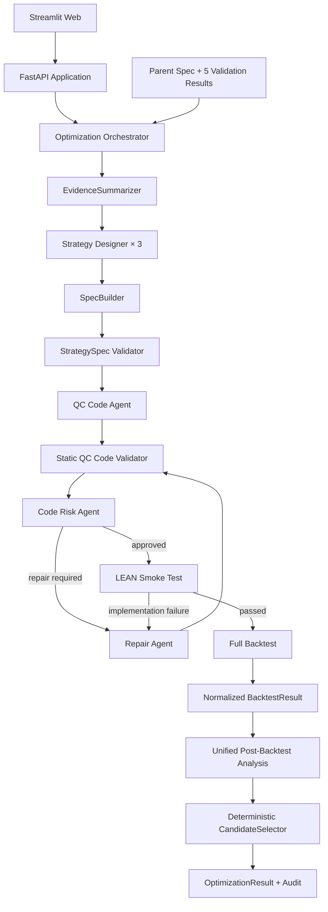

# System Architecture

## Component flow



## Dependency direction

```text
Web → API → Orchestrator
Orchestrator → ports + schemas + deterministic services
Agent implementations → structured model client + schemas
Execution implementations → BacktestProvider + schemas
Schemas → Pydantic only
```

## Trust boundaries

- Model output is untrusted until its exact Pydantic target validates.
- CandidateDesign contains only fields the Designer owns.
- SpecBuilder is the only component that creates a candidate StrategySpec.
- StrategySpec and source digests bind design, code, review and repair artefacts.
- Code Risk review receives no BacktestResult or performance metrics.
- Backtest results are normalized before unified analysis.
- Candidate selection is deterministic and independent of Agent ranking.

## Data ownership

| Data | Owner |
|---|---|
| CandidateDesign | Strategy Designer |
| Strategy identity and frozen protocol | Orchestrator and SpecBuilder |
| Canonical strategy semantics | StrategySpec |
| QC implementation | QC Code Agent |
| Code-risk findings | Code Risk Agent |
| Raw execution output | LEAN provider |
| Normalized metrics | BacktestResult parser/provider |
| Comparative interpretation | Post-Backtest Analysis Agent |
| Final eligibility and selection | CandidateSelector |

## Runtime configuration

Agent providers read `API_KEY`, `MODEL` and `BASE_URL` from the runtime environment file. The client sends a target JSON Schema with every request, validates the response and permits one schema-directed correction attempt.

LEAN environment details are carried in `LeanEnvironmentManifest`; local paths and credentials do not enter public contracts.
